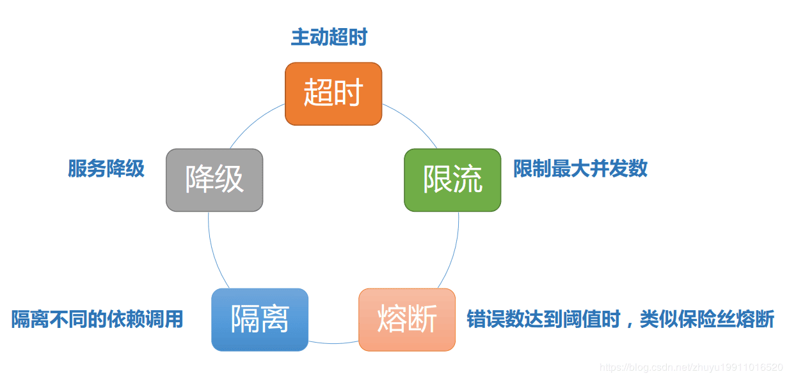

### 架构
#### 架构

##### Q1. 架构中有哪些技术点？
所谓网站架构模式即为了解决大型网站面临的高并发访问、海量数据、高可靠运行灯一系列问题与挑战。为此，在实践中提出了许多解决方案，以实现网站高性能、高可靠性、易伸缩、可扩展、安全等各种技术架构目标。
1. 分层
2. 分隔
3. 分布式
4. 集群
5. 缓存
6. 异步
7. 冗余
8. 自动化
9. 安全
10. 敏捷性

#### 缓存
##### Q1. 谈谈架构中的缓存应用？
1. 本地缓存：指的是在应用中的缓存组件，其最大的优点是应用和cache是在同一个进程内部，请求缓存非常快速，没有过多的网络开销等，在单应用不需要集群支持或者集群情况下各节点无需互相通知的场景下使用本地缓存较合适；同时，它的缺点也是应为缓存跟应用程序耦合，多个应用程序无法直接的共享缓存，各应用或集群的各节点都需要维护自己的单独缓存，对内存是一种浪费。
2. 分布式缓存：指的是与应用分离的缓存组件或服务，其最大的优点是自身就是一个独立的应用，与本地应用隔离，多个应用可直接的共享缓存。

##### Q2. 在开发中缓存具体如何实现？
1. 本地缓存
   - 成员变量或局部变量实现， 比如map
   - 静态变量实现
   - Ehcache
   - Guava Cache
2. 分布式缓存
   - Redis集群+ Spring Cache注解方式

##### Q. 使用缓存的经验？
不合理使用缓存非但不能提高系统的性能，还会成为系统的累赘，甚至风险。
1. 频繁修改的数据
   - 如果缓存中保存的是频繁修改的数据，就会出现数据写入缓存后，应用还来不及读取缓存，数据就已经失效，徒增系统负担。一般来说，数据的读写比在2：1（写入一次缓存，在数据更新前至少读取两次）以上，缓存才有意义。
2. 没有热点的访问
   - 如果应用系统访问数据没有热点，不遵循二八定律，那么缓存就没有意义。
3. 数据不一致与脏读
   - 一般会对缓存的数据设置失效时间，一旦超过失效时间，就要从数据库中重新加载。因此要容忍一定时间的数据不一致，如卖家已经编辑了商品属性，但是需要过一段时间才能被买家看到。还有一种策略是数据更新立即更新缓存，不过这也会带来更多系统开销和事务一致性问题。
4. 缓存可用性
   - 缓存会承担大部分数据库访问压力，数据库已经习惯了有缓存的日子，所以当缓存服务崩溃时，数据库会因为完全不能承受如此大压力而宕机，导致网站不可用。
   - 这种情况被称作缓存雪崩，发生这种故障，甚至不能简单地重启缓存服务器和数据库服务器来恢复
   - 实践中，有的网站通过缓存热备份等手段提高缓存可用性：当某台缓存服务器宕机时，将缓存访问切换到热备服务器上。
   - 通过分布式缓存服务器集群，将缓存数据分布到集群多台服务器上可在一定程度上改善缓存的可用性。当一台缓存服务器宕机时，只有部分缓存数据丢失，重新从数据库加载这部分数据不会产生很大的影响。
5. 缓存预热warm up
   - 缓存中存放的是热点数据，热点数据又是缓存系统利用LRU（最近最久未用算法）对不断访问的数据筛选淘汰出来，这个过程需要花费较长的时间
   - 新系统的缓存系统如果没有任何数据，在重建缓存数据的过程中，系统的性能和数据库负载都不太好，那么最好在缓存系统启动时就把热点数据加载好，这个缓存预加载手段叫缓存预热
   - 对于一些元数据如城市地名列表、类目信息，可以在启动时加载数据库中全部数据到缓存进行预热。
6. 避免缓存穿透
   - 如果因为不恰当的业务、或者恶意攻击持续高并发地请求某个不存在的数据，由于缓存没有保存该数据，所有的请求都会落到数据库上，会对数据库造成压力，甚至崩溃。
   - 一个简单的对策是将不存在的数据也缓存起来(其value为null)。

#### 限流
##### Q1. 什么是限流？三种限流的算法？
每个系统都有服务的上线，所以当流量超过服务极限能力时，系统可能会出现卡死、崩溃的情况，所以就有了降级和限流。限流其实就是：当高并发或者瞬时高并发时，为了保证系统的稳定性、可用性，系统以牺牲部分请求为代价或者延迟处理请求为代价，保证系统整体服务可用。

令牌桶(Token Bucket)、漏桶(leaky bucket)和计数器算法是最常用的三种限流的算法:

1. 令牌桶方式(Token Bucket)
   - Guava RateLimiter
   - 令牌桶算法是网络流量整形（Traffic Shaping）和速率限制（Rate Limiting）中最常使用的一种算法
   - 先有一个木桶，系统按照固定速度，往桶里加入Token，如果桶已经满了就不再添加。
   - 当有请求到来时，会各自拿走一个Token，取到Token 才能继续进行请求处理，没有Token 就拒绝服务
   - 这里如果一段时间没有请求时，桶内就会积累一些Token，下次一旦有突发流量，只要Token足够，也能一次处理，所以令牌桶算法的特点是允许突发流量。
2. 漏桶
   - 水(请求)先进入到漏桶里,漏桶以一定的速度出水(接口有响应速率),当水流入速度过大会直接溢出（访问频率超过接口响应速率),然后就拒绝请求,可以看出漏桶算法能强行限制数据的传输速率。
   - 可见这里有两个变量,一个是桶的大小,支持流量突发增多时可以存多少的水(burst),另一个是水桶漏洞的大小(rate)。
   - 因为漏桶的漏出速率是固定的参数,所以,即使网络中不存在资源冲突(没有发生拥塞),漏桶算法也不能使流突发(burst)到端口速率.因此,漏桶算法对于存在突发特性的流量来说缺乏效率.
3. 计数器
   - 计数器限流算法也是比较常用的，主要用来限制总并发数，比如数据库连接池大小、线程池大小、程序访问并发数等都是使用计数器算法。也是最简单粗暴的算法
   - 采用AtomicInteger
     - 使用AtomicInteger来进行统计当前正在并发执行的次数，如果超过域值就简单粗暴的直接响应给用户，说明系统繁忙，请稍后再试或其它跟业务相关的信息。
     - 弊端：使用 AtomicInteger 简单粗暴超过域值就拒绝请求，可能只是瞬时的请求量高，也会拒绝请求。
   - 采用令牌Semaphore:
     - 使用Semaphore信号量来控制并发执行的次数，如果超过域值信号量，则进入阻塞队列中排队等待获取信号量进行执行。如果阻塞队列中排队的请求过多超出系统处理能力，则可以在拒绝请求。
     - 相对Atomic优点：如果是瞬时的高并发，可以使请求在阻塞队列中排队，而不是马上拒绝请求，从而达到一个流量削峰的目的。
   - 采用ThreadPoolExecutor java线程池:
     - 固定线程池大小,超出固定先线程池和最大的线程数,拒绝线程请求;

##### Q2. 限流令牌桶和漏桶对比？
1. 令牌桶是按照固定速率往桶中添加令牌，请求是否被处理需要看桶中令牌是否足够，当令牌数减为零时则拒绝新的请求；
2. 漏桶则是按照常量固定速率流出请求，流入请求速率任意，当流入的请求数累积到漏桶容量时，则新流入的请求被拒绝；
3. 令牌桶限制的是平均流入速率（允许突发请求，只要有令牌就可以处理，支持一次拿3个令牌，4个令牌），并允许一定程度突发流量；
4. 漏桶限制的是常量流出速率（即流出速率是一个固定常量值，比如都是1的速率流出，而不能一次是1，下次又是2），从而平滑突发流入速率；
5. 令牌桶允许一定程度的突发，而漏桶主要目的是平滑流入速率；
6. 两个算法实现可以一样，但是方向是相反的，对于相同的参数得到的限流效果是一样的

##### Q3. 在单机情况下如何实现限流？
应用级限流方式只是单应用内的请求限流，不能进行全局限流。

1. 限流总资源数
2. 限流总并发/连接/请求数
3. 限流某个接口的总并发/请求数
4. 限流某个接口的时间窗请求数
5. 平滑限流某个接口的请求数
6. Guava RateLimiter

##### Q4. 在分布式环境下如何实现限流？
我们需要分布式限流和接入层限流来进行全局限流。

1. redis+lua实现中的lua脚本
2. 使用Nginx+Lua实现的Lua脚本

#### 降级和熔断
##### Q1. 为什么会有容错？一般有哪些方式解决容错相关问题？
服务之间的依赖关系，如果有被依赖的服务挂了以后，造成其它服务也会出现请求堆积、资源占用，慢慢扩散到所有服务，引发雪崩效应。

而容错就是要解决这类问题，常见的方式：
1. 主动超时：Http请求主动设置一个超时时间，超时就直接返回，不会造成服务堆积
2. 限流：限制最大并发数
3. 熔断：当错误数超过阈值时快速失败，不调用后端服务，同时隔一定时间放几个请求去重试后端服务是否能正常调用，如果成功则关闭熔断状态，失败则继续快速失败，直接返回。（此处有个重试，重试就是弹性恢复的能力）
4. 隔离：把每个依赖或调用的服务都隔离开来，防止级联失败引起整体服务不可用
5. 降级：服务失败或异常后，返回指定的默认信息

##### Q2. 谈谈你对服务降级的理解？
由于爆炸性的流量冲击，对一些服务进行有策略的放弃，以此缓解系统压力，保证目前主要业务的正常运行。它主要是针对非正常情况下的应急服务措施：当此时一些业务服务无法执行时，给出一个统一的返回结果。

1. 降级服务的特征
   - 原因：整体负荷超出整体负载承受能力。
   - 目的：保证重要或基本服务正常运行，非重要服务延迟使用或暂停使用
   - 大小：降低服务粒度，要考虑整体模块粒度的大小，将粒度控制在合适的范围内
   - 可控性：在服务粒度大小的基础上增加服务的可控性，后台服务开关的功能是一项必要配置（单机可配置文件，其他可领用数据库和缓存），可分为手动控制和自动控制。
   - 次序：一般从外围延伸服务开始降级，需要有一定的配置项，重要性低的优先降级，比如可以分组设置等级1-10，当服务需要降级到某一个级别时，进行相关配置
2. 降级方式
   - 延迟服务：比如发表了评论，重要服务，比如在文章中显示正常，但是延迟给用户增加积分，只是放到一个缓存中，等服务平稳之后再执行。
   - 在粒度范围内关闭服务（片段降级或服务功能降级）：比如关闭相关文章的推荐，直接关闭推荐区
   - 页面异步请求降级：比如商品详情页上有推荐信息/配送至等异步加载的请求，如果这些信息响应慢或者后端服务有问题，可以进行降级；
   - 页面跳转（页面降级）：比如可以有相关文章推荐，但是更多的页面则直接跳转到某一个地址
   - 写降级：比如秒杀抢购，我们可以只进行Cache的更新，然后异步同步扣减库存到DB，保证最终一致性即可，此时可以将DB降级为Cache。
   - 读降级：比如多级缓存模式，如果后端服务有问题，可以降级为只读缓存，这种方式适用于对读一致性要求不高的场景。
3. 降级预案: 在进行降级之前要对系统进行梳理，看看系统是不是可以丢卒保帅；从而梳理出哪些必须誓死保护，哪些可降级；比如可以参考日志级别设置预案
   - 一般：比如有些服务偶尔因为网络抖动或者服务正在上线而超时，可以自动降级；
   - 警告：有些服务在一段时间内成功率有波动（如在95~100%之间），可以自动降级或人工降级，并发送告警；
   - 错误：比如可用率低于90%，或者数据库连接池被打爆了，或者访问量突然猛增到系统能承受的最大阀值，此时可以根据情况自动降级或者人工降级；
   - 严重错误：比如因为特殊原因数据错误了，此时需要紧急人工降级。
4. 服务降级分类
   - 降级按照是否自动化可分为：自动开关降级（超时、失败次数、故障、限流）和人工开关降级（秒杀、电商大促等）。
   - 降级按照功能可分为：读服务降级、写服务降级。
   - 降级按照处于的系统层次可分为：多级降级。
5. 自动降级分类
   - 超时降级：主要配置好超时时间和超时重试次数和机制，并使用异步机制探测回复情况
   - 失败次数降级：主要是一些不稳定的api，当失败调用次数达到一定阀值自动降级，同样要使用异步机制探测回复情况
   - 故障降级：比如要调用的远程服务挂掉了（网络故障、DNS故障、http服务返回错误的状态码、rpc服务抛出异常），则可以直接降级。降级后的处理方案有：默认值（比如库存服务挂了，返回默认现货）、兜底数据（比如广告挂了，返回提前准备好的一些静态页面）、缓存（之前暂存的一些缓存数据）
6. 限流降级
   - 限流降级: 当我们去秒杀或者抢购一些限购商品时，此时可能会因为访问量太大而导致系统崩溃，此时开发者会使用限流来进行限制访问量，当达到限流阀值，后续请求会被降级；降级后的处理方案可以是：排队页面（将用户导流到排队页面等一会重试）、无货（直接告知用户没货了）、错误页（如活动太火爆了，稍后重试）

##### Q3. 什么是服务熔断？和服务降级有什么区别？
熔断机制是应对雪崩效应的一种微服务链路保护机制，当扇出链路的某个微服务不可用或者响应时间太长时，会进行服务的降级，进而熔断该节点微服务的调用，快速返回”错误”的响应信息。

1. 和服务降级有什么区别？
   - 服务熔断对服务提供了proxy，防止服务不可能时，出现串联故障（cascading failure），导致雪崩效应。
   - 服务熔断一般是某个服务（下游服务）故障引起，而服务降级一般是从整体负荷考虑。
   - 共性：
     - 目的 -> 都是从可用性、可靠性出发，提高系统的容错能力。
     - 最终表现->使某一些应用不可达或不可用，来保证整体系统稳定。
     - 粒度 -> 一般都是服务级别，但也有细粒度的层面：如做到数据持久层、只许查询不许增删改等。
     - 自治 -> 对其自治性要求很高。都要求具有较高的自动处理机制。
   - 区别:
     - 触发原因 -> 服务熔断通常是下级服务故障引起；服务降级通常为整体系统而考虑。
     - 管理目标 -> 熔断是每个微服务都需要的，是一个框架级的处理；而服务降级一般是关注业务，对业务进行考虑，抓住业务的层级，从而决定在哪一层上进行处理：比如在IO层，业务逻辑层，还是在外围进行处理。
     - 实现方式 -> 代码实现中的差异。

##### Q4. 如何设计服务的熔断？
1. 异常处理：调用受熔断器保护的服务的时候，我们必须要处理当服务不可用时的异常情况
2. 异常的类型：请求失败的原因可能有很多种。一些原因可能会比其它原因更严重。
3. 日志：熔断器应该能够记录所有失败的请求，以及一些可能会尝试成功的请求，使得的管理员能够监控使用熔断器保护的服务的执行情况
4. 手动重置：在系统中对于失败操作的恢复时间是很难确定的，提供一个手动重置功能能够使得管理员可以手动的强制将熔断器切换到闭合状态。
5. 加快熔断器的熔断操作:有时候，服务返回的错误信息足够让熔断器立即执行熔断操作并且保持一段时间
6. 重复失败请求：当熔断器在断开状态的时候，熔断器可以记录每一次请求的细节，而不是仅仅返回失败信息，这样当远程服务恢复的时候，可以将这些失败的请求再重新请求一次

##### Q5.服务熔断有哪些实现方案？
1. Hystrix
   - Spring Cloud Netflix Hystrix就是隔离措施的一种实现,可以设置在某种超时或者失败情形下断开依赖调用或者返回指定逻辑,从而提高分布式系统的稳定性.
2. Sentinel
   - Sentinel 以流量为切入点，从流量控制、熔断降级、系统负载保护等多个维度保护服务的稳定性。分为两个部分:
     - 核心库（Java 客户端）不依赖任何框架/库，能够运行于所有 Java 运行时环境，同时对 Dubbo / Spring Cloud 等框架也有较好的支持
     - 控制台（Dashboard）基于 Spring Boot 开发，打包后可以直接运行，不需要额外的 Tomcat 等应用容器。
