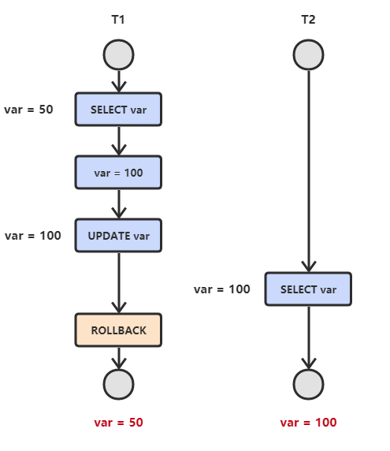

### 数据库
#### 原理和SQL 
##### Q1. 什么是事务？事务基本特性ACID？
事务指的是满足 ACID 特性的一组操作，可以通过 Commit 提交一个事务，也可以使用 Rollback 进行回滚。

事务的基本特性ACID:
- A原子性(atomicity) 指的是一个事务中的操作要么全部成功，要么全部失败。
- C一致性(consistency) 指的是数据库总是从一个一致性的状态转换到另外一个一致性的状态。比如A转账给B100块钱，假设中间sql执行过程中系统崩溃A也不会损失100块，因为事务没有提交，修改也就不会保存到数据库。
- I隔离性(isolation) 指的是一个事务的修改在最终提交前，对其他事务是不可见的。
- D持久性(durability) 指的是一旦事务提交，所做的修改就会永久保存到数据库中

##### Q2. 数据库中并发一致性问题？
在并发环境下，事务的隔离性很难保证，因此会出现很多并发一致性问题。

1. 丢失修改
   - T1 和 T2 两个事务都对一个数据进行修改，T1 先修改，T2 随后修改，T2 的修改覆盖了 T1 的修改。
   
2. 读脏数据
   -  T1 修改一个数据，T2 随后读取这个数据。如果 T1 撤销了这次修改，那么 T2 读取的数据是脏数据。
   
3. 不可重复读
   - T2 读取一个数据，T1 对该数据做了修改。如果 T2 再次读取这个数据，此时读取的结果和第一次读取的结果不同。
   
4. 幻影读
   - T1 读取某个范围的数据，T2 在这个范围内插入新的数据，T1 再次读取这个范围的数据，此时读取的结果和和第一次读取的结果不同。
   

##### Q3. 事务的隔离等级？
- 未提交读(READ UNCOMMITTED) 事务中的修改，即使没有提交，对其它事务也是可见的。
- 提交读(READ COMMITTED) 一个事务只能读取已经提交的事务所做的修改。换句话说，一个事务所做的修改在提交之前对其它事务是不可见的。
- 可重复读(REPEATABLE READ) 保证在同一个事务中多次读取同样数据的结果是一样的。
- 可串行化(SERIALIZABLE) 强制事务串行执行。

| 隔离级别 | 脏读  | 不可重复读 | 幻影读 |
|------|-----|-------|-----|
| 未提交读 | √   | √     | √   |
| 提交读  | ×   | √     | √   |
| 可重复读 | ×   | ×     | √   |
| 可串行读 | ×   | ×     | ×   |

##### Q4. ACID靠什么保证的呢？
1. A原子性(atomicity) 由undo log日志保证，它记录了需要回滚的日志信息，事务回滚时撤销已经执行成功的sql
2. C一致性(consistency) 一般由代码层面来保证
3. I隔离性(isolation) 由MVCC来保证
4. D持久性(durability) 由内存+redo log来保证，mysql修改数据同时在内存和redo log记录这次操作，事务提交的时候通过redo log刷盘，宕机的时候可以从redo log恢复#

##### Q5. SQL 优化的实践经验？
1. 对查询进行优化，要尽量避免全表扫描，首先应考虑在 where 及 order by 涉及的列上建立索引。
2. 应尽量避免在 where 子句中对字段进行 null 值判断，否则将导致引擎放弃使用索引而进行全表扫描，如：
3. 应尽量避免在 where 子句中使用 != 或 <> 操作符，否则将引擎放弃使用索引而进行全表扫描。
4. 应尽量避免在 where 子句中使用 or 来连接条件，如果一个字段有索引，一个字段没有索引，将导致引擎放弃使用索引而进行全表扫描
5. in 和 not in 也要慎用，否则会导致全表扫描，
6. 应尽量避免在where子句中对字段进行函数操作，这将导致引擎放弃使用索引而进行全表扫描
7. 不要在 where 子句中的“=”左边进行函数、算术运算或其他表达式运算，否则系统将可能无法正确使用索引

##### Q6. Buffer Pool、Redo Log Buffer 和undo log、redo log、bin log 概念以及关系？
1. Buffer Pool 是 MySQL 的一个非常重要的组件，因为针对数据库的增删改操作都是在 Buffer Pool 中完成的
2. Undo log记录的是数据操作后前的样子
3. redo log 记录的是数据被操作后的样子（redo log 是 Innodb 存储引擎特有）
4. bin log 记录的是整个操作记录（这个对于主从复制具有非常重要的意义）

##### Q7. 从准备更新一条数据到事务的提交的流程描述？
1. 首先执行器根据 MySQL 的执行计划来查询数据，先是从缓存池中查询数据，如果没有就会去数据库中查询，如果查询到了就将其放到缓存池中
2. 在数据被缓存到缓存池的同时，会写入 undo log 日志文件
3. 更新的动作是在 BufferPool 中完成的，同时会将更新后的数据添加到 redo log buffer 中
4. 完成以后就可以提交事务，在提交的同时会做以下三件事
5. 将redo log buffer中的数据刷入到 redo log 文件中
6. 将本次操作记录写入到 bin log文件中
7. 将 bin log 文件名字和更新内容在 bin log 中的位置记录到redo log中，同时在 redo log 最后添加 commit 标记