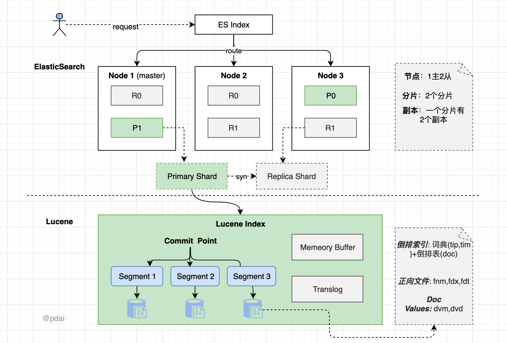

##### Q1 ElasticSearch是什么？基于Lucene的，那么为什么不是直接使用Lucene呢？
Lucene 可以说是当下最先进、高性能、全功能的搜索引擎库。
Elasticsearch 也是使用 Java 编写的，它的内部使用 Lucene 做索引与搜索，但是它的目的是使全文检索变得简单，通过隐藏 Lucene 的复杂性，取而代之的提供一套简单一致的 RESTful API。

然而，Elasticsearch 不仅仅是 Lucene，并且也不仅仅只是一个全文搜索引擎：
1. 一个分布式的实时文档存储，每个字段 可以被索引与搜索
2. 一个分布式实时分析搜索引擎
3. 能胜任上百个服务节点的扩展，并支持 PB 级别的结构化或者非结构化数据

##### Q2 ELK 技术栈的常见应用场景？
1. 日志系统 增加数据源，和使用MQ
2. Metric收集和APM性能监控

##### Q3. ES中索引模板是什么？
索引模板是一种告诉Elasticsearch在创建索引时如何配置索引的方法。

使用方式: 在创建索引之前可以先配置模板，这样在创建索引（手动创建索引或通过对文档建立索引）时，模板设置将用作创建索引的基础。

模板类型:
1. 组件模板是可重用的构建块，用于配置映射，设置和别名；它们不会直接应用于一组索引。
2. 索引模板可以包含组件模板的集合，也可以直接指定设置，映射和别名。

##### Q4. ES中索引的生命周期管理？
1. 为什么会引入？
   - 随着时间的增长索引的数量也会持续增长，然而这些场景基本上只有最近一段时间的数据有使用价值或者会被经常使用（热数据），而历史数据几乎没有作用或者很少会被使用（冷数据），这个时候就需要对索引进行一定策略的维护管理甚至是删除清理，否则随着数据量越来越多除了浪费磁盘与内存空间之外，还会严重影响 Elasticsearch 的性能。
2. 哪个版本引入的？
   - 在 Elastic Stack 6.6 版本后推出了新功能 Index Lifecycle Management(索引生命周期管理)，支持针对索引的全生命周期托管管理，并且在 Kibana 上也提供了一套UI界面来配置策略。
3. 索引生命周期常见的阶段？
   - hot: 索引还存在着大量的读写操作。
   - warm:索引不存在写操作，还有被查询的需要。
   - cold:数据不存在写操作，读操作也不多。
   - delete:索引不再需要，可以被安全删除。

##### Q5. ES查询和聚合的有哪些方式？
1. DSL
   - 基于文本 - match, query string
   - 基于词项 - term
   - 复合查询 - 5种
2. EQL Elastic Query Language
   - bucket
   - metric
   - pipline
3. SQL

##### Q6. ES查询中query和filter的区别？
query 是查询+score, 而filter仅包含查询， 比如在复合查询中constant_score查询无需计算score，所以对应查询是filter而不是query。

##### Q7. ES查询中match和term的区别？
term是基于索引的词项，而match基于文本。

##### Q8. ES查询中should和must的区别？
should是任意匹配，must是同时匹配。

##### Q9. ES查询中match，match_phrase和match_phrase_prefix有什么区别？
match本质上是对term组合，
match_phrase本质是连续的term的查询（and关系），
match_phrase_prefix在match_phrase基础上提供了一种可以查最后一个词项是前缀的方法

##### Q10. ES查询中什么是复合查询？有哪些复合查询方式？
在查询中会有多种条件组合的查询，在ElasticSearch中叫复合查询。它提供了5种复合查询方式：
1. bool query(布尔查询) - 通过布尔逻辑将较小的查询组合成较大的查询。
2. boosting query(提高查询) - 
   - 不同于bool查询，bool查询中只要一个子查询条件不匹配那么搜索的数据就不会出现。
   - 而boosting query则是降低显示的权重/优先级（即score)。
3. constant_score（固定分数查询）
   - 查询某个条件时，固定的返回指定的score；显然当不需要计算score时，只需要filter条件即可，因为filter context忽略score。
4. dis_max(最佳匹配查询）
   分离最大化查询（Disjunction Max Query）指的是： 将任何与任一查询匹配的文档作为结果返回，但只将最佳匹配的评分作为查询的评分结果返回 。
5. function_score(函数查询）
   简而言之就是用自定义function的方式来计算_score。

##### Q11. ES聚合中的Bucket聚合有哪些？如何理解？
设计上大概分为三类（当然有些是第二和第三类的融合）

##### Q12. ES聚合中的Metric聚合有哪些？如何理解？
1. 从分类看：Metric聚合分析分为单值分析和多值分析两类
2. 从功能看：根据具体的应用场景设计了一些分析api, 比如地理位置，百分数等等
   - 单值分析: 只输出一个分析结果
     - 标准stat型
       - avg 平均值
       - max 最大值
       - min 最小值
       - sum 和
       - value_count 数量
     - 其他类型
       - cardinality 基数（distinct去重）
       - weighted_avg 带权重的avg
       - median_absolute_deviation 中位值
   - 多值分析: 单值之外的
     - stats型
       - stats 包含avg,max,min,sum和count
       - matrix_stats 针对矩阵模型
       - extended_stats
       - string_stats 针对字符串
     - 百分数型
       - percentiles 百分数范围
       - percentile_ranks 百分数排行
     - 地理位置型
       - geo_bounds Geo bounds
       - geo_centroid Geo-centroid
       - geo_line Geo-Line
     - Top型
       - top_hits 分桶后的top hits
       - top_metrics

##### Q13. 如何理解ES的结构和底层实现？
1. ES的整体结构?
   - 一个 ES Index 在集群模式下，有多个 Node （节点）组成。每个节点就是 ES 的Instance (实例)。
   - 每个节点上会有多个 shard （分片）， P1 P2 是主分片, R1 R2 是副本分片
   - 每个分片上对应着就是一个 Lucene Index（底层索引文件）
   - Lucene Index 是一个统称
     - 由多个 Segment （段文件，就是倒排索引）组成。每个段文件存储着就是 Doc 文档。
     - commit point记录了所有 segments 的信息
     -
2. 底层和数据文件？
   - 倒排索引（词典+倒排表）
   - doc values - 列式存储
   - 正向文件 - 行式存储
   - 
   - 文件关系如下
   - 

##### Q14. ES内部读取文档是怎样的？如何实现的？
- 主分片或者副本分片检索文档的步骤顺序：
   - 客户端向 Node 1 发送获取请求。
   - 节点使用文档的 _id 来确定文档属于分片 0 。分片 0 的副本分片存在于所有的三个节点上。 在这种情况下，它将请求转发到 Node 2 。
   - Node 2 将文档返回给 Node 1 ，然后将文档返回给客户端。

在处理读取请求时，协调结点在每次请求的时候都会通过轮询所有的副本分片来达到负载均衡。

- 读取文档的两阶段查询？
  - 所有的搜索系统一般都是两阶段查询，第一阶段查询到匹配的DocID，第二阶段再查询DocID对应的完整文档，这种在Elasticsearch中称为query_then_fetch。（这里主要介绍最常用的2阶段查询）。
  - 在初始查询阶段时，查询会广播到索引中每一个分片拷贝（主分片或者副本分片）。 每个分片在本地执行搜索并构建一个匹配文档的大小为 from + size 的优先队列。PS：在2. 搜索的时候是会查询Filesystem Cache的，但是有部分数据还在Memory Buffer，所以搜索是近实时的。
  - 每个分片返回各自优先队列中 所有文档的 ID 和排序值 给协调节点，它合并这些值到自己的优先队列中来产生一个全局排序后的结果列表。
  - 接下来就是 取回阶段，协调节点辨别出哪些文档需要被取回并向相关的分片提交多个 GET 请求。每个分片加载并丰富文档，如果有需要的话，接着返回文档给协调节点。一旦所有的文档都被取回了，协调节点返回结果给客户端。#

##### Q15. ES内部索引文档是怎样的？如何实现的？
1. 新建单个文档所需要的步骤顺序：
   - 客户端向 Node 1 发送新建、索引或者删除请求。
   - 节点使用文档的 _id 确定文档属于分片 0 。请求会被转发到 Node 3，因为分片 0 的主分片目前被分配在 Node 3 上。
   - Node 3 在主分片上面执行请求。如果成功了，它将请求并行转发到 Node 1 和 Node 2 的副本分片上。一旦所有的副本分片都报告成功, Node 3 将向协调节点报告成功，协调节点向客户端报告成功。
2. 看下整体的索引流程
   - 协调节点默认使用文档ID参与计算（也支持通过routing），以便为路由提供合适的分片。
   - 当分片所在的节点接收到来自协调节点的请求后，会将请求写入到Memory Buffer，然后定时（默认是每隔1秒）写入到Filesystem Cache，这个从Momery Buffer到Filesystem Cache的过程就叫做refresh；
   - 当然在某些情况下，存在Momery Buffer和Filesystem Cache的数据可能会丢失，ES是通过translog的机制来保证数据的可靠性的。其实现机制是接收到请求后，同时也会写入到translog中，当Filesystem cache中的数据写入到磁盘中时，才会清除掉，这个过程叫做flush。
   - 在flush过程中，内存中的缓冲将被清除，内容被写入一个新段，段的fsync将创建一个新的提交点，并将内容刷新到磁盘，旧的translog将被删除并开始一个新的translog。 flush触发的时机是定时触发（默认30分钟）或者translog变得太大（默认为512M）时。#

##### Q16. ES遇到什么性能问题，如何优化的？
1. 硬件配置优化 包括三个因素：CPU、内存和 IO。
   - CPU： 大多数 Elasticsearch 部署往往对 CPU 要求不高； CPUs 和更多的核数之间选择，选择更多的核数更好。多个内核提供的额外并发远胜过稍微快一点点的时钟频率。
   - 内存
     - 配置： 由于 ES 构建基于 lucene，而 lucene 设计强大之处在于 lucene 能够很好的利用操作系统内存来缓存索引数据，以提供快速的查询性能。lucene 的索引文件 segements 是存储在单文件中的，并且不可变，对于 OS 来说，能够很友好地将索引文件保持在 cache 中，以便快速访问；因此，我们很有必要将一半的物理内存留给 lucene；另一半的物理内存留给 ES（JVM heap）。
     - 禁止 swap 禁止 swap，一旦允许内存与磁盘的交换，会引起致命的性能问题。可以通过在 elasticsearch.yml 中 bootstrap.memory_lock: true，以保持 JVM 锁定内存，保证 ES 的性能。
     - 垃圾回收器： 已知JDK 8附带的HotSpot JVM的早期版本存在一些问题，当启用G1GC收集器时，这些问题可能导致索引损坏。受影响的版本早于JDK 8u40随附的HotSpot版本。如果你使用的JDK8较高版本，或者JDK9+，我推荐你使用G1 GC； 因为我们目前的项目使用的就是G1 GC，运行效果良好，对Heap大对象优化尤为明显。
     - 磁盘 在经济压力能承受的范围下，尽量使用固态硬盘（SSD）
2. 索引方面优化
   - 批量提交 当有大量数据提交的时候，建议采用批量提交（Bulk 操作）；此外使用 bulk 请求时，每个请求不超过几十M，因为太大会导致内存使用过大。
   - 增加 Refresh 时间间隔 为了提高索引性能，Elasticsearch 在写入数据的时候，采用延迟写入的策略，即数据先写到内存中，当超过默认1秒（index.refresh_interval）会进行一次写入操作，就是将内存中 segment 数据刷新到磁盘中，此时我们才能将数据搜索出来，所以这就是为什么 Elasticsearch 提供的是近实时搜索功能，而不是实时搜索功能。如果我们的系统对数据延迟要求不高的话，我们可以通过延长 refresh 时间间隔，可以有效地减少 segment 合并压力，提高索引速度。比如在做全链路跟踪的过程中，我们就将 index.refresh_interval 设置为30s，减少 refresh 次数。再如，在进行全量索引时，可以将 refresh 次数临时关闭，即 index.refresh_interval 设置为-1，数据导入成功后再打开到正常模式，比如30s。
   - 索引缓冲的设置可以控制多少内存分配 indices.memory.index_buffer_size 接受一个百分比或者一个表示字节大小的值。默认是10%
   - translog 相关的设置 控制数据从内存到硬盘的操作频率，以减少硬盘 IO。可将 sync_interval 的时间设置大一些。默认为5s。也可以控制 tranlog 数据块的大小，达到 threshold 大小时，才会 flush 到 lucene 索引文件。默认为512m。
   - _id 字段的使用 _id 字段的使用，应尽可能避免自定义 _id，以避免针对 ID 的版本管理；建议使用 ES 的默认 ID 生成策略或使用数字类型 ID 做为主键。
   - _all 字段及 _source 字段的使用 _all 字段及 _source 字段的使用，应该注意场景和需要，_all 字段包含了所有的索引字段，方便做全文检索，如果无此需求，可以禁用；_source 存储了原始的 document 内容，如果没有获取原始文档数据的需求，可通过设置 includes、excludes 属性来定义放入 _source 的字段。
   - 合理的配置使用 index 属性 合理的配置使用 index 属性，analyzed 和 not_analyzed，根据业务需求来控制字段是否分词或不分词。只有 groupby 需求的字段，配置时就设置成 not_analyzed，以提高查询或聚类的效率。
3. 查询方面优化
   - Filter VS Query
   - 深度翻页 使用 Elasticsearch scroll 和 scroll-scan 高效滚动的方式来解决这样的问题。也可以结合实际业务特点，文档 id 大小如果和文档创建时间是一致有序的，可以以文档 id 作为分页的偏移量，并将其作为分页查询的一个条件。
   - 避免层级过深的聚合查询， 层级过深的aggregation , 会导致内存、CPU消耗，建议在服务层通过程序来组装业务，也可以通过pipeline的方式来优化。
   - 通过开启慢查询配置定位慢查询