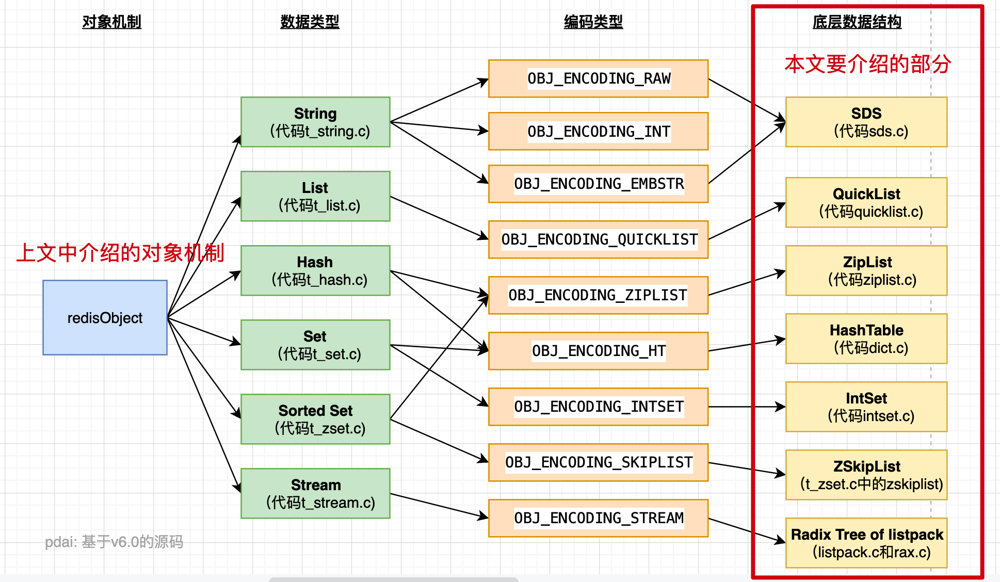
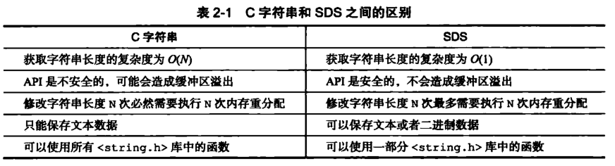

### Redis
#### Redis基础
##### Q1. 什么是Redis，为什么用Redis？
Redis的介绍：
1. Redis是一种支持key-value等多种数据结构的存储系统。
2. 可用于缓存，事件发布或订阅，高速队列等场景。支持网络，
3. 提供字符串，哈希，列表，队列，集合结构直接存取，基于内存，可持久化。

使用Redis的原因:
1. 读写性能优异
   - Redis能读的速度是110000次/s,写的速度是81000次/s （测试条件见下一节）。
2. 数据类型丰富
   - Redis支持二进制案例的 Strings, Lists, Hashes, Sets 及 Ordered Sets 数据类型操作。
3. 原子性
   - Redis的所有操作都是原子性的，同时Redis还支持对几个操作全并后的原子性执行。
4. 丰富的特性
   - Redis支持 publish/subscribe, 通知, key 过期等特性。
5. 持久化: Redis支持RDB, AOF等持久化方式
6. 发布订阅: Redis支持发布/订阅模式
7. 分布式: Redis Cluster

##### Q2. 为什么Redis 是单线程的以及为什么这么快？
1. redis完全基于内存,绝大部分请求是纯粹的内存操作,非常快速.
2. 数据结构简单,对数据操作也简单,redis中的数据结构是专门进行设计的
3. 采用单线程模型, 避免了不必要的上下文切换和竞争条件, 也不存在多线程或者多线程切换而消耗CPU, 不用考虑各种锁的问题, 不存在加锁, 释放锁的操作, 没有因为可能出现死锁而导致性能消耗
4. 使用了多路IO复用模型,非阻塞IO
5. 使用底层模型不同,它们之间底层实现方式及与客户端之间的 通信的应用协议不一样,Redis直接构建了自己的VM机制,因为一般的系统调用系统函数的话,会浪费一定的时间去移动和请求

##### Q3. Redis 一般有哪些使用场景？
1. 热点数据的缓存
   - 缓存是Redis最常见的应用场景，之所有这么使用，主要是因为Redis读写性能优异
   - 而且逐渐有取代memcached，成为首选服务端缓存的组件
   - 而且，Redis内部是支持事务的，在使用时候能有效保证数据的一致性。
2. 限时业务的运用
   - redis中可以使用expire命令设置一个键的生存时间，到时间后redis会删除它。利用这一特性可以运用在限时的优惠活动信息、手机验证码等业务场景。
3. 计数器相关问题
   - redis由于incrby命令可以实现原子性的递增，所以可以运用于高并发的秒杀活动、分布式序列号的生成、
   - 具体业务还体现在比如限制一个手机号发多少条短信、一个接口一分钟限制多少请求、一个接口一天限制调用多少次等等。
4. 分布式锁:
   - 这个主要利用redis的setnx命令进行，setnx："set if not exists"就是如果不存在则成功设置缓存同时返回1，否则返回0，并且可以增加定时任务
   - 可以用来防止定时任务重复执行

##### Q4. Redis 有哪些数据类型？
5种基础数据类型，分别是：String、List、Set、Zset、Hash。

| 结构类型       | 结构存储的值                | 结构的读写能力                                                              |
|------------|-----------------------|----------------------------------------------------------------------|
| String字符串	 | 可以是字符串、整数或浮点数         | 对整个字符串或字符串的一部分进行操作；对整数或浮点数进行自增或自减操作                                  |
| List列表	    | 一个链表，链表上的每个节点都包含一个字符串 | 对链表的两端进行push和pop操作，读取单个或多个元素；根据值查找或删除元素                              |
| Set集合	     | 包含字符串的无序集合	           | 字符串的集合，包含基础的方法有看是否存在添加、获取、删除；还包含计算交集、并集、差集等                          |
| Hash散列	    | 包含键值对的无序散列表           | 包含方法有添加、获取、删除单个元素                                                    |
| Zset有序集合	  | 和散列一样，用于存储键值对         | 字符串成员与浮点数分数之间的有序映射；元素的排列顺序由分数的大小决定；包含方法有添加、获取、删除单个元素以及根据分值范围或成员来获取元素 |

三种特殊的数据类型 分别是 HyperLogLogs（基数统计）， Bitmaps (位图) 和 geospatial （地理位置)

##### Q5. 谈谈Redis 的对象机制（redisObject)？
1. 在Redis中，为了能够正确地实现诸多的命令，必须为不同类型的键设置不同的处理方式，因为操作数据类型的命令除了要对键的类型进行检查之外, 还需要根据数据类型的不同编码进行多态处理.
2. 为了解决以上问题, Redis 构建了自己的类型系统, 这个系统的主要功能包括
   - redisObject对象
   - 基于redisObject对象的类型检查
   - 基于redisObject对象的显式多态函数
   - 对redisObject进行分配、共享和销毁的机制
3. redisObject对象解读
   - 数据结构
     - 类型 unsigned type:4;
     - 编码格式 unsigned encoding:4;
     - 最后一次访问时间 unsigned lru:LRU_BITS;
     - 引用计数 int refcount;
     - 指向底层数据结构实例 void *ptr;
     - 数据结构图:

##### Q6. Redis 数据类型有哪些底层数据结构？

- 简单动态字符串 - sds
- 压缩列表 - ZipList
- 快表 - QuickList
- 字典/哈希表 - Dict
- 整数集 - IntSet
- 跳表 - ZSkipList

##### Q7. Redis的命令的类型检查和多态
当执行一个处理数据类型命令的时候，redis执行以下步骤
1. 根据给定的key，在数据库字典中查找和他相对应的redisObject，如果没找到，就返回NULL；
2. 检查redisObject的type属性和执行命令所需的类型是否相符，如果不相符，返回类型错误；
3. 根据redisObject的encoding属性所指定的编码，选择合适的操作函数来处理底层的数据结构；
4. 返回数据结构的操作结果作为命令的返回值。

##### Q8. 为什么要设计SDS
1. SDS是什么
   - 简单动态字符串（simple dynamic string,SDS）是这是一种用于存储二进制数据的一种结构, 具有动态扩容的特点. 其实现位于src/sds.h与src/sds.c中，是Redis的默认字符串表示。
2. 使用SDS的原因（对比C语言）:
   - 常数复杂度获取字符串长度 : 
     - 由于 len 属性的存在，我们获取 SDS 字符串的长度只需要读取 len 属性，时间复杂度为 O(1)
     - 而对于 C 语言，获取字符串的长度通常是经过遍历计数来实现的，时间复杂度为 O(n);通过 strlen key 命令可以获取 key 的字符串长度
   - 杜绝缓冲区溢出: 
     - 我们知道在 C 语言中使用 strcat 函数来进行两个字符串的拼接，一旦没有分配足够长度的内存空间，就会造成缓冲区溢出。
     - SDS 数据类型，在进行字符修改的时候，会首先根据记录的 len 属性检查内存空间是否满足需求，如果不满足，会进行相应的空间扩展，然后在进行修改操作，所以不会出现缓冲区溢出。
   - 减少修改字符串的内存重新分配次数
     - 语言由于不记录字符串的长度，所以如果要修改字符串，必须要重新分配内存（先释放再申请），因为如果没有重新分配，字符串长度增大时会造成内存缓冲区溢出，字符串长度减小时会造成内存泄露。
     - SDS，由于len属性和alloc属性的存在，对于修改字符串SDS实现了空间预分配和惰性空间释放两种策略：
       - 空间预分配：对字符串进行空间扩展的时候，扩展的内存比实际需要的多，这样可以减少连续执行字符串增长操作所需的内存重分配次数。
       - 惰性空间释放：对字符串进行缩短操作时，程序不立即使用内存重新分配来回收缩短后多余的字节，而是使用 alloc 属性将这些字节的数量记录下来，等待后续使用。（当然SDS也提供了相应的API，当我们有需要时，也可以手动释放这些未使用的空间。）
   - 二进制安全
     - 因为C字符串以空字符作为字符串结束的标识，而对于一些二进制文件（如图片等），内容可能包括空字符串，因此C字符串无法正确存取
     - 而所有 SDS 的API 都是以处理二进制的方式来处理 buf 里面的元素，并且 SDS 不是以空字符串来判断是否结束，而是以 len 属性表示的长度来判断字符串是否结束
   - 兼容部分 C 字符串函数
     - 虽然 SDS 是二进制安全的，但是一样遵从每个字符串都是以空字符串结尾的惯例，这样可以重用 C 语言库<string.h> 中的一部分函数。
3. 对比图

##### Q9. Redis 一个字符串类型的值能存储最大容量是多少？
512M

#### Redis持久化
##### Q1. Redis 的持久化机制是什么？各自的优缺点？一般怎么用？
1. RDB(快照/内存快照)持久化是把当前进程数据生成快照保存到磁盘上的过程; 针对RDB不适合实时持久化的问题，Redis提供了AOF持久化方式来解决.
2. AOF是“写后”日志，Redis先执行命令，把数据写入内存，然后才记录日志。日志里记录的是Redis收到的每一条命令，这些命令是以文本形式保存
3. Redis 4.0 中提出了一个混合使用 AOF 日志和内存快照的方法。简单来说，内存快照以一定的频率执行，在两次快照之间，使用 AOF 日志记录这期间的所有命令操作。
   - 这样一来，快照不用很频繁地执行，这就避免了频繁 fork 对主线程的影响。
   - 而且，AOF 日志也只用记录两次快照间的操作，也就是说，不需要记录所有操作了，因此，就不会出现文件过大的情况了，也可以避免重写开销。

这个方法既能享受到 RDB 文件快速恢复的好处，又能享受到 AOF 只记录操作命令的简单优势, 实际环境中用的很多。

各自的优缺点：
1. RDB优点
   - RDB文件是某个时间节点的快照，默认使用LZF算法进行压缩，压缩后的文件体积远远小于内存大小，适用于备份、全量复制等场景；
   - Redis加载RDB文件恢复数据要远远快于AOF方式；
2. RDB缺点
   - RDB方式实时性不够，无法做到秒级的持久化；
   - 每次调用bgsave都需要fork子进程，fork子进程属于重量级操作，频繁执行成本较高；
   - RDB文件是二进制的，没有可读性，AOF文件在了解其结构的情况下可以手动修改或者补全；
   - 版本兼容RDB文件问题；

##### Q2. RDB 触发方式?
触发rdb持久化的方式有2种，分别是手动触发和自动触发。
1. 手动触发
   - save命令：阻塞当前Redis服务器，直到RDB过程完成为止，对于内存 比较大的实例会造成长时间阻塞，线上环境不建议使用
   - bgsave命令：Redis进程执行fork操作创建子进程，RDB持久化过程由子 进程负责，完成后自动结束。阻塞只发生在fork阶段，一般时间很短
2. 自动触发
   - redis.conf中配置save m n，即在m秒内有n次修改时，自动触发bgsave生成rdb文件；
   - 主从复制时，从节点要从主节点进行全量复制时也会触发bgsave操作，生成当时的快照发送到从节点；
   - 执行debug reload命令重新加载redis时也会触发bgsave操作；
   - 默认情况下执行shutdown命令时，如果没有开启aof持久化，那么也会触发bgsave操作；

##### Q3. 在RDB期间，如果服务器收到了数据写操作的请求，那么如何保证数据一致性
RDB中的核心思路是Copy-on-Write，来保证在进行快照操作的这段时间，需要压缩写入磁盘上的数据在内存中不会发生变化。

在正常的快照操作中，一方面Redis主进程会fork一个新的快照进程专门来做这个事情，这样保证了Redis服务不会停止对客户端包括写请求在内的任何响应

另一方面这段时间发生的数据变化会以副本的方式存放在另一个新的内存区域，待快照操作结束后才会同步到原来的内存区域。

##### Q4. 在进行RDB快照操作的这段时间，如果发生服务崩溃怎么办？
很简单，在没有将数据全部写入到磁盘前，这次快照操作都不算成功。

如果出现了服务崩溃的情况，将以上一次完整的RDB快照文件作为恢复内存数据的参考。也就是说，在快照操作过程中不能影响上一次的备份数据。Redis服务会在磁盘上创建一个临时文件进行数据操作，待操作成功后才会用这个临时文件替换掉上一次的备份

##### Q5. 可以每秒做一次RDB快照吗？
对于快照来说，所谓“连拍”就是指连续地做快照。这样一来，快照的间隔时间变得很短，即使某一时刻发生宕机了，因为上一时刻快照刚执行，丢失的数据也不会太多。但是，这其中的快照间隔时间就很关键了

不可以，虽然 bgsave 执行时不阻塞主线程，但是，如果频繁地执行全量快照，也会带来两方面的开销：
1. 一方面，频繁将全量数据写入磁盘，会给磁盘带来很大压力，多个快照竞争有限的磁盘带宽，前一个快照还没有做完，后一个又开始做了，容易造成恶性循环。
2. 另一方面，bgsave 子进程需要通过 fork 操作从主线程创建出来。虽然，子进程在创建后不会再阻塞主线程，但是，fork 这个创建过程本身会阻塞主线程，而且主线程的内存越大，阻塞时间越长。如果频繁 fork 出 bgsave 子进程，这就会频繁阻塞主线程了。

##### Q6. AOF是写前日志还是写后日志？
AOF日志采用写后日志，即先写内存，后写日志。采用写后日志的原因是

1. 优点
    - 避免额外的检查开销：Redis 在向 AOF 里面记录日志的时候，并不会先去对这些命令进行语法检查。所以，如果先记日志再执行命令的话，日志中就有可能记录了错误的命令，Redis 在使用日志恢复数据时，就可能会出错。
    - 不会阻塞当前的写操作
2. 缺点:
    - 如果命令执行完成，写日志之前宕机了，会丢失数据。
    - 主线程写磁盘压力大，导致写盘慢，阻塞后续操作。

##### Q7. 如何实现AOF的？
AOF日志记录Redis的每个写命令，步骤分为：命令追加（append）、文件写入（write）和文件同步（sync）。

1. 命令追加 当AOF持久化功能打开了，服务器在执行完一个写命令之后，会以协议格式将被执行的写命令追加到服务器的 aof_buf 缓冲区。
2. 文件写入和同步 关于何时将 aof_buf 缓冲区的内容写入AOF文件中，Redis提供了三种写回策略：
   - Always，同步写回：每个写命令执行完，立马同步地将日志写回磁盘；
   - Everysec，每秒写回：每个写命令执行完，只是先把日志写到AOF文件的内存缓冲区，每隔一秒把缓冲区中的内容写入磁盘；
   - No，操作系统控制的写回：每个写命令执行完，只是先把日志写到AOF文件的内存缓冲区，由操作系统决定何时将缓冲区内容写回磁盘
   - 上面的三种写回策略体现了一个重要原则：trade-off，取舍，指在性能和可靠性保证之间做取舍。

##### Q8. 什么是AOF重写？
Redis通过创建一个新的AOF文件来替换现有的AOF，新旧两个AOF文件保存的数据相同，但新AOF文件没有了冗余命令。

##### Q9. AOF重写会阻塞吗？
1. AOF重写过程是由后台进程bgrewriteaof来完成的。
2. 主线程fork出后台的bgrewriteaof子进程，fork会把主线程的内存拷贝一份给bgrewriteaof子进程，这里面就包含了数据库的最新数据。
3. 然后，bgrewriteaof子进程就可以在不影响主线程的情况下，逐一把拷贝的数据写成操作，记入重写日志。

所以aof在重写时，在fork进程时是会阻塞住主线程的。

##### Q10. AOF日志何时会重写？
有两个配置项控制AOF重写的触发：auto-aof-rewrite-min-size:表示运行AOF重写时文件的最小大小，默认为64MB。

auto-aof-rewrite-percentage:这个值的计算方式是，当前aof文件大小和上一次重写后aof文件大小的差值，再除以上一次重写后aof文件大小。也就是当前aof文件比上一次重写后aof文件的增量大小，和上一次重写后aof文件大小的比值。

##### Q11. AOF重写日志时，有新数据写入咋整？
重写过程总结为：“一个拷贝，两处日志”。

1. 在fork出子进程时的拷贝，以及在重写时，如果有新数据写入，主线程就会将命令记录到两个aof日志内存缓冲区中。
   - 如果AOF写回策略配置的是always，则直接将命令写回旧的日志文件，并且保存一份命令至AOF重写缓冲区，这些操作对新的日志文件是不存在影响的。
   - （旧的日志文件：主线程使用的日志文件，新的日志文件：bgrewriteaof进程使用的日志文件）
2. 而在bgrewriteaof子进程完成会日志文件的重写操作后，会提示主线程已经完成重写操作，主线程会将AOF重写缓冲中的命令追加到新的日志文件后面。
3. 这时候在高并发的情况下，AOF重写缓冲区积累可能会很大，这样就会造成阻塞，Redis后来通过Linux管道技术让aof重写期间就能同时进行回放，这样aof重写结束后只需回放少量剩余的数据即可。
4. 最后通过修改文件名的方式，保证文件切换的原子性。
5. 在AOF重写日志期间发生宕机的话，因为日志文件还没切换，所以恢复数据时，用的还是旧的日志文件。

##### Q12. 主线程fork出子进程的是如何复制内存数据的？
fork采用操作系统提供的写时复制（copy on write）机制，就是为了避免一次性拷贝大量内存数据给子进程造成阻塞。

fork子进程时，子进程时会拷贝父进程的页表，即虚实映射关系（虚拟内存和物理内存的映射索引表），而不会拷贝物理内存；
这个拷贝会消耗大量cpu资源，并且拷贝完成前会阻塞主线程，阻塞时间取决于内存中的数据量，数据量越大，则内存页表越大
拷贝完成后，父子进程使用相同的内存地址空间。

但主进程是可以有数据写入的，这时候就会拷贝物理内存中的数据;
在主进程有数据写入时，而这个数据刚好在页c中，操作系统会创建这个页面的副本（页c的副本），即拷贝当前页的物理数据，将其映射到主进程中，而子进程还是使用原来的的页c。

##### Q13. 在重写日志整个过程时，主线程有哪些地方会被阻塞？
1. fork子进程时，需要拷贝虚拟页表，会对主线程阻塞。
2. 主进程有bigkey写入时，操作系统会创建页面的副本，并拷贝原有的数据，会对主线程阻塞。
3. 子进程重写日志完成后，主进程追加aof重写缓冲区时可能会对主线程阻塞。

##### Q14. 为什么AOF重写不复用原AOF日志？
两方面原因：
1. 父子进程写同一个文件会产生竞争问题，影响父进程的性能。
2. 如果AOF重写过程中失败了，相当于污染了原本的AOF文件，无法做恢复数据使用

##### Q15. Redis 过期键的删除策略有哪些?
在单机版Redis中，存在两种删除策略：
1. 惰性删除：服务器不会主动删除数据，只有当客户端查询某个数据时，服务器判断该数据是否过期，如果过期则删除。
2. 定期删除：服务器执行定时任务删除过期数据，但是考虑到内存和CPU的折中（删除会释放内存，但是频繁的删除操作对CPU不友好），该删除的频率和执行时间都受到了限制。

在主从复制场景下，为了主从节点的数据一致性，从节点不会主动删除数据，而是由主节点控制从节点中过期数据的删除。由于主节点的惰性删除和定期删除策略，都不能保证主节点及时对过期数据执行删除操作，因此，当客户端通过Redis从节点读取数据时，很容易读取到已经过期的数据。

Redis 3.2中，从节点在读取数据时，增加了对数据是否过期的判断：如果该数据已过期，则不返回给客户端；将Redis升级到3.2可以解决数据过期问题。

##### Q16. Redis的内存用完了会发生什么？
如果达到设置的上限，Redis的写命令会返回错误信息（但是读命令还可以正常返回。）或者你可以配置内存淘汰机制，当Redis达到内存上限时会冲刷掉旧的内容。

##### Q17. Redis如何做内存优化？
1. 缩减键值对象: 缩减键（key）和值（value）的长度，
   - key长度：如在设计键时，在完整描述业务情况下，键值越短越好。
   - value长度：值对象缩减比较复杂，常见需求是把业务对象序列化成二进制数组放入Redis。
     - 首先应该在业务上精简业务对象，去掉不必要的属性避免存储无效数据。
     - 其次在序列化工具选择上，应该选择更高效的序列化工具来降低字节数组大小。
2. 共享对象池
    - 对象共享池指Redis内部维护[0-9999]的整数对象池。
    - 除了整数值对象，其他类型如list,hash,set,zset内部元素也可以使用整数对象池。因此开发中在满足需求的前提下，尽量使用整数对象以节省内存。
3. 字符串优化 
4. 编码优化 
5. 控制key的数量

##### Q18. Redis key 的过期时间和永久有效分别怎么设置？
EXPIRE 和 PERSIST 命令

##### Q19. 什么是redis事务？
Redis 事务的本质是一组命令的集合。事务支持一次执行多个命令，一个事务中所有命令都会被序列化。在事务执行过程，会按照顺序串行化执行队列中的命令，其他客户端提交的命令请求不会插入到事务执行命令序列中。

总结说：redis事务就是一次性、顺序性、排他性的执行一个队列中的一系列命令

##### Q20. Redis事务相关命令？
MULTI 、 EXEC 、 DISCARD 和 WATCH 是 Redis 事务相关的命令。
- MULTI ：开启事务，redis会将后续的命令逐个放入队列中，然后使用EXEC命令来原子化执行这个命令系列。
- EXEC：执行事务中的所有操作命令。
- DISCARD：取消事务，放弃执行事务块中的所有命令。WATCH：监视一个或多个key,如果事务在执行前，这个key(或多个key)被其他命令修改，则事务被中断，不会执行事务中的任何命令。
- UNWATCH：取消WATCH对所有key的监视

##### Q21. Redis事务的三个阶段？
Redis事务执行是三个阶段：
1. 开启：以MULTI开始一个事务
2. 入队：将多个命令入队到事务中，接到这些命令并不会立即执行，而是放到等待执行的事务队列里面
3. 执行：由EXEC命令触发事务

当一个客户端切换到事务状态之后， 服务器会根据这个客户端发来的不同命令执行不同的操作：

- 如果客户端发送的命令为 EXEC 、 DISCARD 、 WATCH 、 MULTI 四个命令的其中一个， 那么服务器立即执行这个命令。
- 与此相反， 如果客户端发送的命令是 EXEC 、 DISCARD 、 WATCH 、 MULTI 四个命令以外的其他命令， 那么服务器并不立即执行这个命令， 而是将这个命令放入一个事务队列里面， 然后向客户端返回 QUEUED 回复。

##### Q22. Redis事务其它实现？
1. 基于Lua脚本，Redis可以保证脚本内的命令一次性、按顺序地执行，其同时也不提供事务运行错误的回滚，执行过程中如果部分命令运行错误，剩下的命令还是会继续运行完
2. 基于中间标记变量，通过另外的标记变量来标识事务是否执行完成，读取数据时先读取该标记变量判断是否事务执行完成。但这样会需要额外写代码实现，比较繁琐

##### Q23. Redis事务中出现错误的处理？
1. 语法错误（编译器错误）
   - 在开启事务后，修改k1值为11，k2值为22，但k2语法错误，最终导致事务提交失败，k1、k2保留原值。
2. Redis类型错误（运行时错误）
   - 在开启事务后，修改k1值为11，k2值为22，但将k2的类型作为List，在运行时检测类型错误，最终导致事务提交失败，此时事务并没有回滚，而是跳过错误命令继续执行， 结果k1值改变、k2保留原值

##### Q24. Redis事务中watch是如何监视实现的呢？
Redis使用WATCH命令来决定事务是继续执行还是回滚，那就需要在MULTI之前使用WATCH来监控某些键值对，然后使用MULTI命令来开启事务，执行对数据结构操作的各种命令，此时这些命令入队列。

当使用EXEC执行事务时，首先会比对WATCH所监控的键值对，如果没发生改变，它会执行事务队列中的命令，提交事务；如果发生变化，将不会执行事务中的任何命令，同时事务回滚。当然无论是否回滚，Redis都会取消执行事务前的WATCH命令。

示意图:

##### Q25. 为什么 Redis 不支持回滚？
优点:
1. Redis 命令只会因为错误的语法而失败（并且这些问题不能在入队时发现），或是命令用在了错误类型的键上面：
   - 这也就是说，从实用性的角度来说，失败的命令是由编程错误造成的，而这些错误应该在开发的过程中被发现，而不应该出现在生产环境中。
2. 因为不需要对回滚进行支持，所以 Redis 的内部可以保持简单且快速。

有种观点认为 Redis 处理事务的做法会产生 bug ， 然而需要注意的是， 在通常情况下， 回滚并不能解决编程错误带来的问题。 举个例子， 如果你本来想通过 INCR 命令将键的值加上 1 ， 却不小心加上了 2 ， 又或者对错误类型的键执行了 INCR ， 回滚是没有办法处理这些情况的

##### Q26. Redis 对 ACID的支持性理解？
1. 原子性atomicity首先通过上文知道 运行期的错误是不会回滚的，很多文章由此说Redis事务违背原子性的；而官方文档认为是遵从原子性的。Redis官方文档给的理解是，Redis的事务是原子性的：所有的命令，要么全部执行，要么全部不执行。而不是完全成功。
2. 一致性consistencyredis事务可以保证命令失败的情况下得以回滚，数据能恢复到没有执行之前的样子，是保证一致性的，除非redis进程意外终结。
3. 隔离性Isolationredis事务是严格遵守隔离性的，原因是redis是单进程单线程模式(v6.0之前），可以保证命令执行过程中不会被其他客户端命令打断。但是，Redis不像其它结构化数据库有隔离级别这种设计。
4. 持久性Durabilityredis事务是不保证持久性的，这是因为redis持久化策略中不管是RDB还是AOF都是异步执行的，不保证持久性是出于对性能的考虑

##### Q
##### Q
##### Q
##### Q
##### Q
##### Q
##### Q