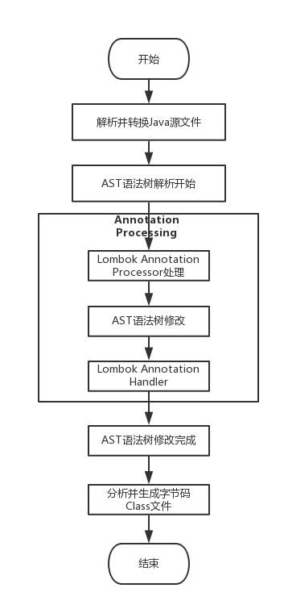

### 常用类库

#### 常用开发类库

##### Q1. 平时常用的开发工具库有哪些？
1. Apache Common
   - Apache Commons是对JDK的拓展，包含了很多开源的工具，用于解决平时编程经常会遇到的问题，减少重复劳动。
2. Google Guava
   - Guava工程包含了若干被Google的 Java项目广泛依赖 的核心库,例如：集合 [collections] 、缓存 [caching] 、原生类型支持 [primitives support] 、并发库 [concurrency libraries] 、通用注解 [common annotations] 、字符串处理 [string processing] 、I/O 等等
3. Hutool
   - 国产后起之秀，Hutool是一个小而全的Java工具类库，通过静态方法封装，降低相关API的学习成本，提高工作效率
4. Spring常用工具类
   - Spring作为常用的开发框架，在Spring框架应用中，排在ApacheCommon，Guava, Huool等通用库后，第二优先级可以考虑使用Spring-core-xxx.jar中的util包

##### Q2. Java常用的JSON库有哪些？有啥注意点？
1. FastJSON（不推荐，漏洞太多）
2. Jackson
3. Gson
   - 序列化
   - 反序列化
   - 自定义序列化和反序列化

##### Q3. Lombok工具库用来解决什么问题？
我们通常需要编写大量代码才能使类变得有用

1. toString()方法
2. hashCode() and equals()方法
3. Getter and Setter 方法
4. 构造函数

对于这种简单的类，这些方法通常是无聊的、重复的，而且是可以很容易地机械地生成的那种东西(ide通常提供这种功能)。

##### Q4. 为什么很多公司禁止使用lombok？
可以使用而且有着广泛的使用，但是需要理解部分注解的底层和潜在问题

1. @Data： 如果只使用了@Data，而不使用@EqualsAndHashCode(callSuper=true)的话，会默认是@EqualsAndHashCode(callSuper=false),这时候生成的equals()方法只会比较子类的属性，不会考虑从父类继承的属性，无论父类属性访问权限是否开放。
2. 代码可读性，可调试性低 在代码中使用了Lombok，确实可以帮忙减少很多代码，因为Lombok会帮忙自动生成很多代码。但是这些代码是要在编译阶段才会生成的，所以在开发的过程中，其实很多代码其实是缺失的。
3. Lombok有很强的侵入性
   - 强J队友，如果项目组中有一个人使用了Lombok，那么其他人就必须也要安装IDE插件。
   - 如果我们需要升级到某个新版本的JDK的时候，若其中的特性在Lombok中不支持的话就会受到影响
4. Lombok破坏了封装性

##### Q5. MapStruct工具库用来解决什么问题？
MapStruct是一款非常实用Java工具，主要用于解决对象之间的拷贝问题，比如PO/DTO/VO/QueryParam之间的转换问题。区别于BeanUtils这种通过反射，它通过编译器编译生成常规方法，将可以很大程度上提升效率。

##### Q6. Lombok和MapStruct工具库的原理？
1. 核心之处就是对于注解的解析上。JDK5引入了注解的同时，也提供了两种解析方式。
2. 运行时解析
   - 运行时能够解析的注解，必须将@Retention设置为RUNTIME, 比如@Retention(RetentionPolicy.RUNTIME)，这样就可以通过反射拿到该注解。
   - java.lang,reflect反射包中提供了一个接口AnnotatedElement，该接口定义了获取注解信息的几个方法，Class、Constructor、Field、Method、Package等都实现了该接口，对反射熟悉的朋友应该都会很熟悉这种解析方式。
3. 编译时解析: 编译时解析有两种机制，分别简单描述下：
   - Annotation Processing Tool: apt自JDK5产生，JDK7已标记为过期，不推荐使用，JDK8中已彻底删除，自JDK6开始，可以使用Pluggable Annotation Processing API来替换它，apt被替换主要有2点原因：
     - api都在com.sun.mirror非标准包下
     - 没有集成到javac中，需要额外运行  
   - Pluggable Annotation Processing API
     - JSR 269: Pluggable Annotation Processing API在新窗口打开自JDK6加入，作为apt的替代方案，它解决了apt的两个问题，javac在执行的时候会调用实现了该API的程序，这样我们就可以对编译器做一些增强，
     - Lombok本质上就是一个实现了“JSR 269 API”的程序。在使用javac的过程中，它产生作用的具体流程如下：
       - javac对源代码进行分析，生成了一棵抽象语法树（AST）
       - 运行过程中调用实现了“JSR 269 API”的Lombok程序
       - 此时Lombok就对第一步骤得到的AST进行处理，找到@Data注解所在类对应的语法树（AST），然后修改该语法树（AST），增加getter和setter方法定义的相应树节点
       - javac使用修改后的抽象语法树（AST）生成字节码文件，即给class增加新的节点（代码块）
       
       - 从上面的Lombok执行的流程图中可以看出，在Javac 解析成AST抽象语法树之后, Lombok 根据自己编写的注解处理器，动态地修改 AST，增加新的节点（即Lombok自定义注解所需要生成的代码），最终通过分析生成JVM可执行的字节码Class文件。
       - 使用Annotation Processing自定义注解是在编译阶段进行修改，而JDK的反射技术是在运行时动态修改，两者相比，反射虽然更加灵活一些但是带来的性能损耗更加大。