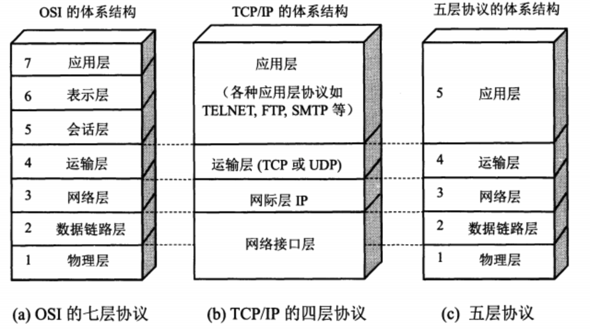
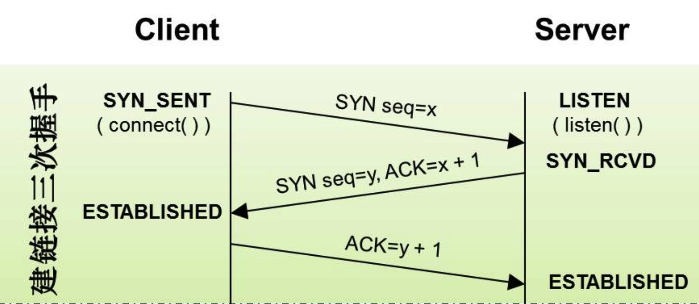
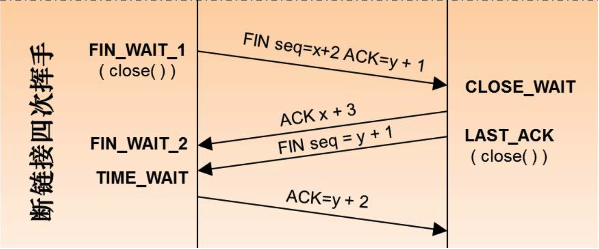
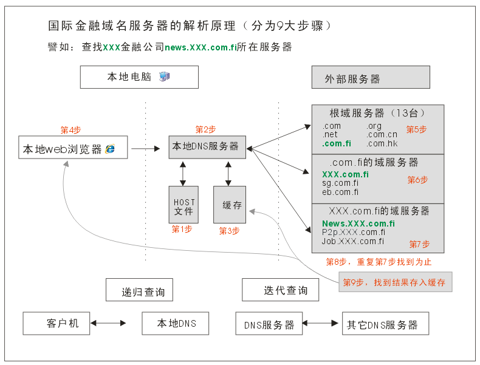
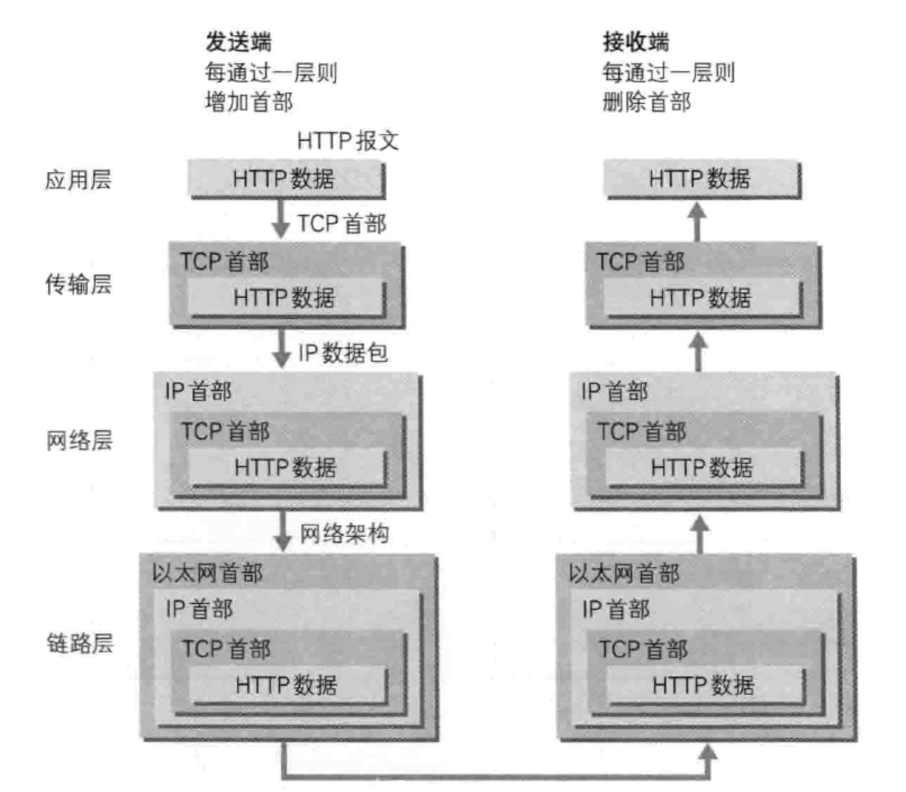

### 网络协议和工具

#### 网络模型

##### Q1. 什么是754层网络模型？
1. 全局上理解 7层协议，4层，5层的对应关系
   
2. OSI依层次结构来划分：应用层（Application）、表示层（Presentation）、会话层（Session）、传输层（Transport）、网络层（Network）、数据链路层（Data Link）、物理层（Physical）

##### Q2. TCP建立连接过程的三次握手？
TCP有6种标识：SYN(建立联机) ACK(确认) PSH(传送) FIN(结束) RST(重置) URG(紧急)； 然后我们来看三次握手

1. 什么是三次握手？为了保证数据能到达目标，TCP采用三次握手策略：

   - 发送端首先发送一个带SYN（synchronize）标志的数据包给接收方【第一次的seq序列号是随机产生的，这样是为了网络安全，如果不是随机产生初始序列号，黑客将会以很容易的方式获取到你与其他主机之间的初始化序列号，并且伪造序列号进行攻击】
   - 接收端收到后，回传一个带有SYN/ACK（acknowledgement）标志的数据包以示传达确认信息【SYN 是为了告诉发送端，发送方到接收方的通道没问题；ACK 用来验证接收方到发送方的通道没问题】
   - 最后，发送端再回传一个带ACK标志的数据包，代表握手结束若在握手某个过程中某个阶段莫名中断，TCP协议会再次以相同的顺序发送相同的数据包
2. 为什么要三次握手？
   - 三次握手的目的是建立可靠的通信信道，说到通讯，简单来说就是数据的发送与接收，而三次握手最主要的目的就是双方确认自己与对方的发送与接收是正常的
   - 第一次握手，发送端：什么都确认不了；接收端：对方发送正常，自己接受正常
   - 第二次握手，发送端：对方发送，接受正常，自己发送，接受正常 ；接收端：对方发送正常，自己接受正常
   - 第三次握手，发送端：对方发送，接受正常，自己发送，接受正常；接收端：对方发送，接受正常，自己发送，接受正常
3. 两次握手不行吗？为什么TCP客户端最后还要发送一次确认呢？
   - 主要防止已经失效的连接请求报文突然又传送到了服务器，从而产生错误; 经典场景：客户端发送了第一个请求连接并且没有丢失，只是因为在网络结点中滞留的时间太长了。
   - 由于TCP的客户端迟迟没有收到确认报文，以为服务器没有收到，此时重新向服务器发送这条报文，此后客户端和服务器经过两次握手完成连接，传输数据，然后关闭连接。
   - 此时此前滞留的那一次请求连接，网络通畅了到达服务器，这个报文本该是失效的，但是，两次握手的机制将会让客户端和服务器再次建立连接，这将导致不必要的错误和资源的浪费。
   - 如果采用的是三次握手，就算是那一次失效的报文传送过来了，服务端接受到了那条失效报文并且回复了确认报文，但是客户端不会再次发出确认。由于服务器收不到确认，就知道客户端并没有请求连接
4. 为什么三次握手，返回时，ack 值是 seq 加 1（ack = x+1）
   - 假设对方接收到数据，比如sequence number = 1000，TCP Payload = 1000，数据第一个字节编号为1000，最后一个为1999，回应一个确认报文，确认号为2000，意味着编号2000前的字节接收完成，准备接收编号为2000及更多的数据
   - 确认收到的序列，并且告诉发送端下一次发送的序列号从哪里开始（便于接收方对数据排序，便于选择重传）
5. TCP三次握手中，最后一次回复丢失，会发生什么？
   - 如果最后一次ACK在网络中丢失，那么Server端（服务端）该TCP连接的状态仍为SYN_RECV，并且根据 TCP的超时重传机制依次等待3秒、6秒、12秒后重新发送 SYN+ACK 包，以便 Client（客户端）重新发送ACK包
   - 如果重发指定次数后，仍然未收到ACK应答，那么一段时间后，Server（服务端）自动关闭这个连接
   - 但是Client（客户端）认为这个连接已经建立，如果Client（客户端）端向Server（服务端）发送数据，Server端（服务端）将以RST包（Reset，标示复位，用于异常的关闭连接）响应，此时，客户端知道第三次握手失败
   
##### Q3. SYN洪泛攻击(SYN Flood，半开放攻击)，怎么解决？
1. 什么是SYN洪范泛攻击？
   - SYN Flood利用TCP协议缺陷，发送大量伪造的TCP连接请求，常用假冒的IP或IP号段发来海量的请求连接的第一个握手包（SYN包），被攻击服务器回应第二个握手包（SYN+ACK包），因为对方是假冒IP，对方永远收不到包且不会回应第三个握手包
   - 导致被攻击服务器保持大量SYN_RECV状态的“半连接”，并且会重试默认5次回应第二个握手包，大量随机的恶意syn占满了未完成连接队列，导致正常合法的syn排不上队列，让正常的业务请求连接不进来
   - 【服务器端的资源分配是在二次握手时分配的，而客户端的资源是在完成三次握手时分配的，所以服务器容易受到SYN洪泛攻击】
2. 如何检测 SYN 攻击？
   - 当你在服务器上看到大量的半连接状态时，特别是源IP地址是随机的，基本上可以断定这是一次SYN攻击【在 Linux/Unix 上可以使用系统自带的 netstats 命令来检测 SYN 攻击】
   - 怎么解决？
     - SYN攻击不能完全被阻止，除非将TCP协议重新设计。我们所做的是尽可能地减轻SYN攻击的危害
     - 缩短超时（SYN Timeout）时间
     - 增加最大半连接数
     - 过滤网关防护
     - SYN cookies技术：
       - 当服务器接受到 SYN 报文段时，不直接为该 TCP 分配资源，而只是打开一个半开的套接字。接着会使用 SYN 报文段的源 Id，目的 Id，端口号以及只有服务器自己知道的一个秘密函数生成一个 cookie，并把 cookie 作为序列号响应给客户端。
       - 如果客户端是正常建立连接，将会返回一个确认字段为 cookie + 1 的报文段。接下来服务器会根据确认报文的源 Id，目的 Id，端口号以及秘密函数计算出一个结果，如果结果的值 + 1 等于确认字段的值，则证明是刚刚请求连接的客户端，这时候才为该 TCP 分配资源

##### Q4. TCP断开连接过程的四次挥手？
1. 什么是四次挥手？
  
   - 主动断开方（客户端/服务端）-发送一个 FIN，用来关闭主动断开方（客户端/服务端）到被动断开方（客户端/服务端）的数据传送
   - 被动断开方（客户端/服务端）-收到这个 FIN，它发回一 个 ACK，确认序号为收到的序号加1 。和 SYN 一样，一个 FIN 将占用一个序号
   - 被动断开方（客户端/服务端）-关闭与主动断开方（客户端/服务端）的连接，发送一个FIN给主动断开方（客户端/服务端）
   - 主动断开方（客户端/服务端）-发回 ACK 报文确认，并将确认序号设置为收到序号加1
2. 为什么连接的时候是三次握手，关闭的时候却是四次握手？
   - 建立连接的时候， 服务器在LISTEN状态下，收到建立连接请求的SYN报文后，把ACK和SYN放在一个报文里发送给客户端。
   - 关闭连接时，服务器收到对方的FIN报文时，仅仅表示对方不再发送数据了但是还能接收数据，而自己也未必全部数据都发送给对方了,所以服务器可以立即关闭，也可以发送一些数据给对方后，再发送FIN报文给对方来表示同意现在关闭连接。因此，服务器ACK和FIN一般都会分开发送，从而导致多了一次。
3. 为什么TCP挥手每两次中间有一个 FIN-WAIT2等待时间？
   - 主动关闭的一端调用完close以后（即发FIN给被动关闭的一端， 并且收到其对FIN的确认ACK）则进入FIN_WAIT_2状态
   - 如果这个时候因为网络突然断掉、被动关闭的一段宕机等原因，导致主动关闭的一端不能收到被动关闭的一端发来的FIN（防止对端不发送关闭连接的FIN包给本端），这个时候就需要FIN_WAIT_2定时器， 如果在该定时器超时的时候，还是没收到被动关闭一端发来的FIN，那么直接释放这个链接，进入CLOSE状态

##### Q5. UDP概述
1. UDP(User Datagram Protocol)即用户数据报协议，在网络中它与TCP协议一样用于处理数据包，是一种无连接的协议
2. 在OSI模型中，在第四层——传输层，处于IP协议的上一层。

##### Q6. UDP特点
1. UDP提供不可靠服务，具有TCP所没有的优势：
2. UDP无连接，时间上不存在建立连接需要的时延。空间上，TCP需要在端系统中维护连接状态，需要一定的开销。此连接装入包括接收和发送缓存，拥塞控制参数和序号与确认号的参数。UCP不维护连接状态，也不跟踪这些参数，开销小。空间和时间上都具有优势。
   - DNS如果运行在TCP之上而不是UDP，那么DNS的速度将会慢很多。
   - HTTP使用TCP而不是UDP，是因为对于基于文本数据的Web网页来说，可靠性很重要。
   - 同一种专用应用服务器在支持UDP时，一定能支持更多的活动客户机。
3. 分组首部开销小，TCP首部20字节，UDP首部8字节。
4. UDP没有拥塞控制，应用层能够更好的控制要发送的数据和发送时间，网络中的拥塞控制也不会影响主机的发送速率。某些实时应用要求以稳定的速度发送，能容 忍一些数据的丢失，但是不能允许有较大的时延（比如实时视频，直播等）
5. UDP提供尽最大努力的交付，不保证可靠交付。所有维护传输可靠性的工作需要用户在应用层来完成。没有TCP的确认机制、重传机制。如果因为网络原因没有传送到对端，UDP也不会给应用层返回错误信息
6. UDP是面向报文的，对应用层交下来的报文，添加首部后直接乡下交付为IP层，既不合并，也不拆分，保留这些报文的边界
   - 对IP层交上来UDP用户数据报，在去除首部后就原封不动地交付给上层应用进程，报文不可分割，是UDP数据报处理的最小单位
   - 正是因为这样，UDP显得不够灵活，不能控制读写数据的次数和数量
7. UDP常用一次性传输比较少量数据的网络应用，如DNS,SNMP等，因为对于这些应用，若是采用TCP，为连接的创建，维护和拆除带来不小的开销
   - UDP也常用于多媒体应用（如IP电话，实时视频会议，流媒体等）数据的可靠传输对他们而言并不重要，TCP的拥塞控制会使他们有较大的延迟，也是不可容忍的
8. UDP 支持一对一、一对多、多对一和多对多的交互通信。
9. IP 数据报要经过互连网中许多路由器的存储转发；UDP 用户数据报是在运输层的端到端抽象的逻辑信道中传送的。
10. UDP 对应用层交下来的报文，既不合并，也不拆分，而是保留这些报文的边界。应用层交给 UDP 多长的报文，UDP 就照样发送，即一次发送一个报文。

##### Q7. HTTPS详解
1. HTTPs 并不是新协议，而是让 HTTP 先和 SSL(Secure Sockets Layer)通信，再由 SSL 和 TCP 通信，也就是说 HTTPs 使用了隧道进行通信。
2. 通过使用 SSL，HTTPs 具有了加密(防窃听)、认证(防伪装)和完整性保护(防篡改)。
3. HTTPs 采用的加密方式
   - HTTPs 采用混合的加密机制，使用非对称密钥加密用于传输对称密钥来保证传输过程的安全性，之后使用对称密钥加密进行通信来保证通信过程的效率
4. 认证
   - 通过使用 证书 来对通信方进行认证。
   - 数字证书认证机构(CA，Certificate Authority)是客户端与服务器双方都可信赖的第三方机构。
   - 服务器的运营人员向 CA 提出公开密钥的申请，CA 在判明提出申请者的身份之后，会对已申请的公开密钥做数字签名，然后分配这个已签名的公开密钥，并将该公开密钥放入公开密钥证书后绑定在一起。
   - 进行 HTTPs 通信时，服务器会把证书发送给客户端。客户端取得其中的公开密钥之后，先使用数字签名进行验证，如果验证通过，就可以开始通信了。
   - 通信开始时，客户端需要使用服务器的公开密钥将自己的私有密钥传输给服务器，之后再进行对称密钥加密。

##### Q8. Https工作流程
1. Client发起一个HTTPS（比如https://juejin.cn/user/4283353031252967）的请求，根据RFC2818的规定，Client知道需要连接Server的443（默认）端口。
2. Server把事先配置好的公钥证书（public key certificate）返回给客户端。
3. Client验证公钥证书：比如是否在有效期内，证书的用途是不是匹配Client请求的站点，是不是在CRL吊销列表里面，它的上一级证书是否有效，这是一个递归的过程，直到验证到根证书（操作系统内置的Root证书或者Client内置的Root证书）。如果验证通过则继续，不通过则显示警告信息
4. Client使用伪随机数生成器生成加密所使用的对称密钥，然后用证书的公钥加密这个对称密钥，发给Server
5. Server使用自己的私钥（private key）解密这个消息，得到对称密钥。至此，Client和Server双方都持有了相同的对称密钥
6. Server使用对称密钥加密“明文内容A”，发送给Client
7. Client使用对称密钥解密响应的密文，得到“明文内容A”
8. Client再次发起HTTPS的请求，使用对称密钥加密请求的“明文内容B”，然后Server使用对称密钥解密密文，得到“明文内容B”

##### Q9. DNS 解析流程？
.com.fi国际金融域名DNS解析的步骤一共分为9步，如果每次解析都要走完9个步骤，大家浏览网站的速度也不会那么快,一般的解析都是跑完第4步就可以了，除非一个地区完全是第一次访问（在都没有缓存的情况下）才会走完9个步骤，这个情况很少
1. 本地客户机提出域名解析请求，查找本地HOST文件后将该请求发送给本地的域名服务器。
2. 将请求发送给本地的域名服务器。
3. 当本地的域名服务器收到请求后，就先查询本地的缓存。
4. 如果有该纪录项，则本地的域名服务器就直接把查询的结果返回浏览器。
5. 如果本地DNS缓存中没有该纪录，则本地域名服务器就直接把请求发给根域名服务器。
6. 然后根域名服务器再返回给本地域名服务器一个所查询域（根的子域）的主域名服务器的地址。
7. 本地服务器再向上一步返回的域名服务器发送请求，然后接受请求的服务器查询自己的缓存，如果没有该纪录，则返回相关的下级的域名服务器的地址。
8. 重复第7步，直到找到正确的纪录。
9. 本地域名服务器把返回的结果保存到缓存，以备下一次使用，同时还将结果返回给客户机

注意事项:
1. 递归查询
   - 在该模式下DNS服务器接收到客户机请求，必须使用一个准确的查询结果回复客户机
   - 如果DNS服务器本地没有存储查询DNS信息，那么该服务器会询问其他服务器，并将返回的查询结果提交给客户机。
2. 迭代查询
   - DNS所在服务器若没有可以响应的结果，会向客户机提供其他能够解析查询请求的DNS服务器地址
   - 当客户机发送查询请求时，DNS服务器并不直接回复查询结果
   - 而是告诉客户机另一台DNS服务器地址，客户机再向这台DNS服务器提交请求，依次循环直到返回查询的结果为止

##### Q10. 为什么DNS通常基于UDP？
DNS通常是基于UDP的，但当数据长度大于512字节的时候，为了保证传输质量，就会使用基于TCP的实现方式

1. 从数据包的数量以及占有网络资源的层面
   - 使用基于UDP的DNS协议只要一个请求、一个应答就好了
   - 而使用基于TCP的DNS协议要三次握手、发送数据以及应答、四次挥手; 
   - 明显基于TCP协议的DNS更浪费网络资源！
2. 从数据一致性层面
   - DNS数据包不是那种大数据包，所以使用UDP不需要考虑分包，如果丢包那么就是全部丢包，如果收到了数据，那就是收到了全部数据！
   - 所以只需要考虑丢包的情况，那就算是丢包了，重新请求一次就好了
   - 而且DNS的报文允许填入序号字段，对于请求报文和其对应的应答报文，这个字段是相同的，通过它可以区分DNS应答是对应的哪个请求

##### Q11. 什么是DNS劫持？
1. DNS劫持就是通过劫持了DNS服务器，通过某些手段取得某域名的解析记录控制权，进而修改此域名的解析结果，导致对该域名的访问由原IP地址转入到修改后的指定IP
2. 其结果就是对特定的网址不能访问或访问的是假网址，从而实现窃取资料或者破坏原有正常服务的目的。
3. DNS劫持通过篡改DNS服务器上的数据返回给用户一个错误的查询结果来实现的。

- DNS劫持症状
  - 在某些地区的用户在成功连接宽带后，首次打开任何页面都指向ISP提供的“电信互联星空”、“网通黄页广告”等内容页面
  - 还有就是曾经出现过用户访问Google域名的时候出现了百度的网站。这些都属于DNS劫持。

##### Q12. 什么是DNS污染？
1. DNS污染是一种让一般用户由于得到虚假目标主机IP而不能与其通信的方法，是一种DNS缓存投毒攻击（DNS cache poisoning）
2. 其工作方式是
   - 由于通常的DNS查询没有任何认证机制，而且DNS查询通常基于的UDP是无连接不可靠的协议
   - 因此DNS的查询非常容易被篡改，通过对UDP端口53上的DNS查询进行入侵检测
   - 一经发现与关键词相匹配的请求则立即伪装成目标域名的解析服务器（NS，Name Server）给查询者返回虚假结果。
   - 而DNS污染则是发生在用户请求的第一步上，直接从协议上对用户的DNS请求进行干扰。

##### Q13. DNS污染症状：
目前一些被禁止访问的网站很多就是通过DNS污染来实现的，例如YouTube、Facebook等网站。

解决方法: 
   - 对于DNS劫持，可以采用使用国外免费公用的DNS服务器解决。例如OpenDNS（208.67.222.222）或GoogleDNS（8.8.8.8）。
   - 对于DNS污染，可以说，个人用户很难单单靠设置解决，通常可以使用VPN或者域名远程解析的方法解决，但这大多需要购买付费的VPN或SSH等，也可以通过修改Hosts的方法，手动设置域名正确的IP地址

##### Q14. 输入URL 到页面加载过程？
1. 地址栏输入URL
2. DNS 域名解析IP
3. 请求和响应数据
   - 建立TCP连接（3次握手）
   - 发送HTTP请求
   - 服务器处理请求
   - 返回HTTP响应结果
   - 关闭TCP连接（4次挥手）
4. 浏览器加载，解析和渲染

下图是在数据传输过程中的工作方式，
1. 在发送端是应用层-->链路层这个方向的封包过程，每经过一层都会增加该层的头部。
2. 而接收端则是从链路层-->应用层解包的过程，每经过一层则会去掉相应的首部。

图示: