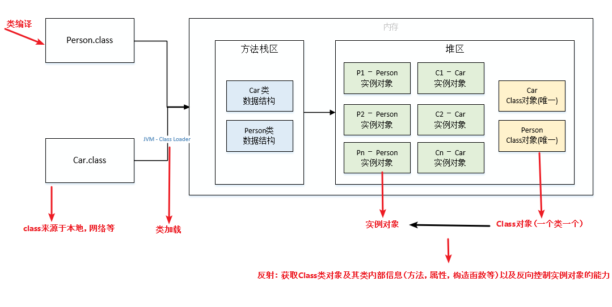

### Java基础
#### 语法基础
##### Q1: 封装
1. 把数据和基于数据的操作一起封装成一个独立不可分割的抽象数据类型
2. 数据隐藏在抽象数据类型的内部，尽可能地隐藏内部细节，仅提供与外部保持联系的接口
3. 用户无需知道内部的细节，但是可以通过抽象数据类型提供的接口对其进行访问
4. 优点：降低耦合，风险，维护成本；提高可重用性，性能调节的便利性

##### Q2: 继承
1. 从已有类中派生出新类，新类吸收已有类的属性和接口，并在这个基础上面增加新的属性和接口
2. 继承实现了 IS-A 关系，并且继承遵循里氏替换原则，子类能够替换掉所有的父类对象
3. 在引用中，父类引用指向子类对象称为向上转型

##### Q3: 多态
1. 多态分为编译时多态和运行时多态
    - 编译时多态主要指方法的重载
    - 运行时多态指程序中定义的对象引用所指向的具体类型在运行期间才确定
2. 运行时多态的三个条件
   - 继承
   - 覆盖(重写)
   - 向上转型

##### Q4: switch中使用的类型，以及原理？
switch实际上只是一种语法糖，它支持的只有int类型，但是可以使用的类型有6种，分别为以下3种情况。
1. byte, char, short以及这些类型的包装类，可以使用的原因是因为他们可以向上转型为int，并且Java的自动拆箱机制。
2. String类型，实际上switch比较的string.hashCode值，它是一个int类型。
3. enum类型，实际比较的是enum的ordinal值（表示枚举值的顺序），实际上也是一个int类型。

##### Q5: final、finalize 和 finally 的不同之处?
1. final是一个修饰符，可以修饰变量，方法和类。 
   - 如果final修饰变量，该变量的值初始化之后不能被改变; 对于基本类型，final使数值不变，对于引用类型，final使引用不变
   - final修饰方法，声明的方法不能被子类重写
   - final修饰类，声明类不允许被继承
2. Java技术允许使用finalize()方法在垃圾收集器将对象从内存中清除出去之前做必要的清理工作。这个方法是由垃圾回收器确定这个对象没有被引用时候对这个对象调用的，但是调用时机不确定。
3. finally是一个关键字，在try...catch一起用于异常的处理。finally块一定会被执行，无论try中是否发生异常，常用于释放系统资源。

##### Q6: String、StringBuffer与StringBuilder的区别？
1. 可变和适用范围
   - String对象不可变，每次对String的操作相当于生成一个新的String对象。
   - StringBuffer和StringBuilder的操作是对对象本身的操作，而不会生成新的对象。
   - 适用范围: 有频繁修改内容字符串的时候避免使用String，因为频繁的生成对象将会对系统性能产生影响。
2. 线程安全
   - String由于有final修饰，是immutable的，安全性是简单而纯粹的。
   - StringBuilder和StringBuffer的区别在于StringBuilder不保证同步，也就是说如果需要线程安全需要使用StringBuffer，不需要同步的StringBuilder效率更高。

##### Q7: 接口和抽象类的区别？
| 对比点  |       抽象类        |                            接口                             |
|:----:|:----------------:|:---------------------------------------------------------:|
| 静态方法 |       可以有        |              JDK8之前不能有，JDK8中可以有，但是只能被接口类直接调用              |
| 静态变量 |   可以有，并且访问类型任意   |                只能是public static final(默认)                 |
| 普通方法 | public，protected | JDK8之前只有public abstract，JDK8中可以有default方法，JDK9中允许有private |
| 普通变量 |        有         |                            没有                             |
| 构造方法 |        有         |                            没有                             |
| 抽象方法 |      有，可以没有      |                           同普通方法                           |
| 实现方式 |       单继承        |                            多实现                            |

##### Q8: this() & super()在构造方法中的区别？
**区别**
1. 调用
   - super从子类中调用父类的构造
   - this是在同一个类中调用其他的构造方法
2. 本质
   - super是一个关键字 
   - this指向本对象的指针

**相同点**
1. this()&super()都需要放在第一行，否则编译不通过,所以两者不能出现在同一个构造器中
2. this()、super()都指的对象,不可以在static环境中使用

##### Q9: equals与==的区别
1. 对于基本类型，== 判断两个值是否相等，基本类型没有 equals() 方法。
2. 对于引用类型，== 判断两个变量是否引用同一个对象，而 equals() 判断引用的对象是否等价

#### 泛型
##### Q1: 泛型是什么，为什么需要泛型？
1. 泛型的本质是参数化类型，是JDK引入的一个特性。
   - 给类型指定参数，在使用的时候再决定这个参数具体的值，
   - 这种参数类型可以用在类、接口和方法中，分别被称为泛型类、泛型接口、泛型方法。
2. 需要泛型的原因有两个
   - 适用于多种数据类型执行相同的代码
   - 泛型中的类型在使用时指定，不需要强制类型转换（类型安全，编译器会检查类型）

##### Q2: 为什么说Java中的泛型是伪泛型？
因为Java在语法上支持泛型，但是在编译阶段会进行所谓的“类型擦除”（Type Erasure），将所有的泛型表示（尖括号中的内容）都替换为具体的类型（其对应的原生态类型），就像完全没有泛型一样。

#### 注解
##### Q1: 注解的作用
注解是Java1.5版本引入的特性，用于对代码进行说明；可以对包、类、接口、字段、方法参数、局部变量等进行注解。

主要作用有以下四个方面:
元注解，元注解
1. 生成文档，通过代码里标识的元数据，生成Javadoc文档
2. 编译检查，通过代码里标识的元数据，让编译器在编译期间进行类型检查
3. 编译时动态处理，编译时通过代码里标识的元数据动态处理，Lombok的实现原理
4. 运行时动态处理，运行时通过代码里标识的元数据动态处理，例如使用反射注入实例

##### Q2: 注解的分类
1. Java自带的注解标准
   - @Override，用于标明重写某个方法
   - @Deprecated，标明某个类或方法过时
   - @SuppressWarnings，标明要忽略的警告
2. 元注解，用于定义注解的注解
   - @Retention用于标明注解被保留的阶段
   - @Target用于标明注解使用的范围
   - @Inherited用于标明注解可继承
   - @Documented用于标明是否生成javadoc文档
3. 自定义注解,可以根据自己的需求定义注解，并可用元注解对自定义注解进行注解。

#### 异常
##### Q1: Java异常类层次结构
Throwable 是 Java 语言中所有错误与异常地超类，异常结构图如下

1. Error 类及其子类：程序中无法处理的错误，表示运行应用程序中出现了严重的错误。
2. Exception 程序本身可以捕获并且可以处理的异常。Exception 这种异常又分为两类,运行时异常和非运行时异常。

##### Q2: 可查的异常（checked exceptions）和不可查的异常（unchecked exceptions）区别？
可查异常就是编译时异常，编译器要求必须处置的异常; 不可查异常就是运行时异常和错误(Error),编译器不要求强制处置的异常；
1. 运行时异常，RuntimeException类及其子类异常,例如NullPointerException(空指针异常)、IndexOutOfBoundsException(下标越界异常)等，
   - 这些异常Java编译器不会进行检查，程序中可以选择捕获处理，也可以不处理，都能编译通过。
   - 这些异常一般是由程序逻辑错误引起的，程序应该从逻辑角度尽可能避免这类异常地发生。
2. 非运行时(编译时)异常，RuntimeException以外的异常，类型上都属于Exception类及其子类
   - 从程序语法角度讲是必须进行处理的异常，如果不处理，程序就不能编译通过。
   - 例如IOException、SQLException等以及用户自定义的Exception异常，一般情况下不自定义检查异常

##### Q3: throw和throws的区别？
1. throws是异常的申明。
   - 若方法中存在检查异常，如果不对其捕获，那必须在方法头中显式声明该异常，便于告知方法调用者此方法有异常，需要进行处理。
2. throw是异常的抛出。
   - 如果代码可能会引发某种错误，可以创建一个合适的异常类实例并抛出它，这就是抛出异常。

##### Q4: Java7的try-with-resource?
1. 使用的前提是，资源实现了AutoCloseable 接口。
2. 使用效果: 当你在try子句中打开资源，资源会在try代码块执行后或异常处理后自动关闭。

##### Q5: 异常的底层原理？
JVM的异常异常处理机制是依赖于Exception Table(异常表); 异常表中包含了一个或多个异常处理者(Exception Handler)的信息，这些信息包含如下:
- from 可能发生异常的起始点
- to 可能发生异常的结束点
- target 上述from和to之前发生异常后的异常处理者的位置
- type 异常处理者处理的异常的类信息

异常表示例代码如下:
```text
Exception table:
    from    to  target type 
     0       3     6   Class java/lang/Exception
```

异常表使用时机是在异常发生的时候，当一个异常发生时，处理机制如下:
1. JVM会在当前出现异常的方法中，查找异常表，是否有合适的处理者来处理 
2. 如果当前方法异常表不为空，并且异常符合处理者的from和to节点，并且type也匹配，则JVM调用位于target的调用者来处理。 
3. 如果上一条未找到合理的处理者，则继续查找异常表中的剩余条目 
4. 如果当前方法的异常表无法处理，则向上查找（弹栈处理）刚刚调用该方法的调用处，并重复上面的操作。 
5. 如果所有的栈帧被弹出，仍然没有处理，则抛给当前的Thread，Thread则会终止。 
6. 如果当前Thread为最后一个非守护线程，且未处理异常，则会导致JVM终止运行。

#### 反射
##### Q1: 什么是反射？
Java的反射机制指的是在运行状态中动态获取类的信息以及动态调用对象方法的功能。
   - 对于任意一个类，都能够知道这个类的所有属性和方法。
   - 对于任意一个对象，都能够调用它的任意一个方法和属性。


##### Q2: 反射的使用？
在java中，Class类与java.lang.reflect类库实现了反射机制。反射中包含的对象有class,Constructor,Field类,Method类。
1. 获取类的方法:
   - 根据类名：类名.class
   - 根据对象：对象.getClass()
   - 根据全限定类名：Class.forName(全限定类名)

##### Q3: getName、getCanonicalName与getSimpleName的区别?
1. getSimpleName：只获取类名
2. getName：类的全限定名，jvm中Class的表示，可以用于动态加载Class对象，例如Class.forName。
3. getCanonicalName：返回更容易理解的表示，主要用于输出（toString）或log打印。

#### SPI机制
##### Q1: 什么是SPI机制？
1. SPI（Service Provider Interface），是JDK内置的一种服务提供发现机制，可以用来启用框架扩展和替换组件，主要是被框架的开发人员使用。
2. 主要思想是将装配的控制权移到程序之外，核心思想就是解耦。
3. 实现:
   - 服务者提供服务实现，放在META-INF/services/目录里的文件中
   - 服务调用者查找jar包里的META-INF/services/中的配置文件
   - 根据类名进行加载实例化，就可以使用该服务了。JDK中查找服务的实现的工具类是：java.util.ServiceLoader。