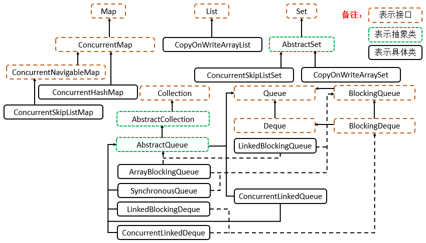

### Java并发

#### 并发基础
##### Q1: 多线程的出现是要解决什么问题的? 线程不安全的本质什么?
多线程的出现是因为计算机各层(CPU,内存,I/O设备)速度的差异。

为了合理地利用CPU的高性能，平衡这三者的速度差异。计算机体系结构、操作系统、编译程序都做出了贡献，主要体现为:
1. CPU增加了缓存，以均衡与内存的速度差异————>导致可见性问题
2. 操作系统增加了进程、线程，以分时复用CPU，进而均衡CPU与I/O设备的差异性————>导致原子性问题
3. 编译程序优化指令执行次序，使得缓存能够更加合理地利用————>导致有序性问题

##### Q2: 并发三要素
1. 可见性
    - 由CPU缓存引起，
    - 一个线程对共享变量的修改，另外一个线程能够立刻看到。
    - 线程修改值写入到了缓存中，但是没有马上写到主存里面，这时候另外一个线程访问，就出现问题了
2. 原子性
    - 由分时复用引起
    - 即一个操作或者多个操作 要么全部执行并且执行的过程不会被任何因素打断，要么就都不执行。
3. 有序性
    - 重排序引起
    - 重排序分三种类型
        - 编译器优化的重排序。编译器在不改变单线程程序语义的前提下，可以重新安排语句的执行顺序
        - 指令级并行的重排序。现代处理器采用了指令级并行技术（Instruction-Level Parallelism， ILP）来将多条指令重叠执行。如果不存在数据依赖性，处理器可以改变语句对应机器指令的执行顺序。
        - 内存系统的重排序。由于处理器使用缓存和读 / 写缓冲区，这使得加载和存储操作看上去可能是在乱序执行。
          

##### Q3: Java是怎么解决并发问题？JMM(Java内存模型)
**理解的第一个维度：核心知识点**

JMM本质上可以理解为，Java 内存模型规范了 JVM 如何提供按需禁用缓存和编译优化的方法。
   - volatile、synchronized 和 final 三个关键字
   - Happens-Before 规则

**理解第二个维度：可见性，有序性，原子性**

1. 原子性
   - 在Java(JMM)中，对基本数据类型的变量的读取和赋值操作是原子性操作
   - 如果需要实现更大范围操作的原子性，可以通过synchronized和Lock来实现。
   - synchronized和Lock能够保证任一时刻只有一个线程执行该代码块，那么自然就不存在原子性问题了，从而保证了原子性。
2. 可见性
   - Java提供了volatile关键字来保证可见性。
   - 当一个共享变量被volatile修饰时，它会保证修改的值会立即被更新到主存，当有其他线程需要读取时，它会去内存中读取新值。
   - 另外，通过synchronized和Lock也能够保证可见性，synchronized和Lock能保证同一时刻只有一个线程获取锁然后执行同步代码，并且在释放锁之前会将对变量的修改刷新到主存当中。因此可以保证可见性。
3. 有序性
   - 在Java里面，可以通过volatile关键字来保证一定的“有序性”。
   - 另外可以通过synchronized和Lock来保证有序性，保证了只有一个线程在执行同步代码，相当于顺序执行。
   - JMM是通过Happens-Before 规则来保证有序性的。

##### Q4: Happens—Before规则(先行发生规则)
先行发生原则，是JVM规定的，让一个操作无需控制就能先于另一个操作完成。

1. 单一线程原则：在一个线程内，在程序前面的操作先行发生于后面的操作。
2. 管程锁定规则：一个 unlock 操作先行发生于后面对同一个锁的 lock 操作。
3. volatile 变量规则：对一个 volatile 变量的写操作先行发生于后面对这个变量的读操作。
4. 线程启动规则：Thread 对象的 start() 方法调用先行发生于此线程的每一个动作。
5. 线程加入规则：Thread 对象的结束先行发生于 join() 方法返回。
6. 线程中断规则：对线程 interrupt() 方法的调用先行发生于被中断线程的代码检测到中断事件的发生，可以通过 interrupted() 方法检测到是否有中断发生
7. 对象终结规则：一个对象的初始化完成(构造函数执行结束)先行发生于它的 finalize() 方法的开始
8. 传递性：如果操作 A 先行发生于操作 B，操作 B 先行发生于操作 C，那么操作 A 先行发生于操作 C

##### Q5: 线程安全的分类?
1. 不可变
   - 不可变(Immutable)的对象一定是线程安全的，不需要再采取任何的线程安全保障措施。
   - 只要一个不可变的对象被正确地构建出来，永远也不会看到它在多个线程之中处于不一致的状态。
   - 多线程环境下，应当尽量使对象成为不可变，来满足线程安全。
   - 不可变的类型:
     - final 关键字修饰的基本数据类型
     - String
     - 枚举类型
     - Number 部分子类，如 Long 和 Double 等数值包装类型，BigInteger 和 BigDecimal 等大数据类型。但同为 Number 的原子类 AtomicInteger 和 AtomicLong 则是可变的
     - 对于集合类型，可以使用 Collections.unmodifiableXXX() 方法来获取一个不可变的集合;Collections.unmodifiableXXX() 先对原始的集合进行拷贝，需要对集合进行修改的方法都直接抛出异常。
2. 绝对线程安全的类
   - 不管运行时环境如何，调用者都不需要任何额外的同步措施
3. 相对线程安全
   - 相对线程安全需要保证对这个对象单独的操作是线程安全的，在调用的时候不需要做额外的保障措施。
   - 但是对于一些特定顺序的连续调用，就可能需要在调用端使用额外的同步手段来保证调用的正确性
   - 在 Java 语言中，大部分的线程安全类都属于这种类型，例如 Vector、HashTable、Collections 的 synchronizedCollection() 方法包装的集合等
4. 线程兼容
   - 线程兼容是指对象本身并不是线程安全的，但是可以通过在调用端正确地使用同步手段来保证对象在并发环境中可以安全地使用。
   - 我们平常说一个类不是线程安全的，绝大多数时候指的是这一种情况
   - Java API 中大部分的类都是属于线程兼容的，如与前面的 Vector 和 HashTable 相对应的集合类 ArrayList 和 HashMap 等
5. 线程对立
   - 线程对立是指无论调用端是否采取了同步措施，都无法在多线程环境中并发使用的代码。
   - 由于 Java 语言天生就具备多线程特性，线程对立这种排斥多线程的代码是很少出现的，而且通常都是有害的，应当尽量避免。

##### Q6: 线程安全有哪些实现思路/方法？
1. 互斥同步
   - synchronized 和 ReentrantLock。
   - 互斥同步最主要的问题就是线程阻塞和唤醒所带来的性能问题，因此这种同步也称为阻塞同步。
   - 互斥同步属于一种悲观地并发策略，认为只要不去做正确地同步措施，就会出现问题。
   - 所以无论是否出现竞争，都要进行加锁、用户和心态转换，维护锁计数器和检查是否有被阻塞地线程需要唤醒等操作。
2. 非阻塞同步
   - CAS(乐观锁，比较并交换)
     - 随着硬件指令集的发展，我们可以使用基于冲突检测的乐观并发策略: 
       - 先进行操作，如果没有其它线程争用共享数据，那操作就成功了
       - 否则采取补偿措施(不断地重试,直到成功为止)。
     - 这种乐观地并发策略许多实现都不需要将线程阻塞，因此这种同步操作称为非阻塞同步
     - CAS的一个问题: ABA问题
       - 如果一个变量初次读取的时候是 A 值，它的值被改成了 B，后来又被改回为 A，那 CAS 操作就会误认为它从来没有被改变过。
       - J.U.C 包提供了一个带有标记的原子引用类 AtomicStampedReference 来解决这个问题，它可以通过控制变量值的版本来保证 CAS 的正确性。
   - AtomicInteger
      - J.U.C 包里面的整数原子类 AtomicInteger，其中的 compareAndSet() 和 getAndIncrement() 等方法都使用了 Unsafe 类的 CAS 操作。
3. 无同步方案
   - 要保证线程安全，并不是一定就要进行同步。如果一个方法本来就不涉及共享数据，那它自然就无须任何同步措施去保证正确性。
   - 栈封闭
     - 多个线程访问同一个方法的局部变量时，不会出现线程安全问题，因为局部变量存储在虚拟机栈中，属于线程私有的
   - 线程本地存储(Thread Local Storage)
     - 如果一段代码中所需要的数据必须与其他代码共享，那就看看这些共享数据的代码是否能保证在同一个线程中执行。
     - 如果能保证，我们就可以把共享数据的可见范围限制在同一个线程之内，这样，无须同步也能保证线程之间不出现数据争用的问题。

##### Q7: Thread Local Storage的实现方案
java中是使用java.lang.ThreadLocal类来实现线程本地存储功能。

底层实现是使用一个ThreadLocal.ThreadLocalMap对象。实现的具体方案如下：
1. Thread 类中就定义了 ThreadLocal.ThreadLocalMap 成员
2. 当调用一个 ThreadLocal 的 set(T value) 方法时，先得到当前线程的 ThreadLocalMap 对象
3. 然后将 ThreadLocal->value 键值对插入到该 Map 中

【注意】在一些场景 (尤其是使用线程池) 下，由于 ThreadLocal.ThreadLocalMap 的底层数据结构导致 ThreadLocal 有内存泄漏的情况，应该尽可能在每次使用 ThreadLocal 后手动调用 remove()，以避免出现 ThreadLocal 经典的内存泄漏甚至是造成自身业务混乱的风险。

##### Q8: 如何理解并发和并行的区别?
1. 并发是指一个处理器同时处理多个任务。

2. 并行是指多个处理器或者是多核的处理器同时处理多个不同的任务。


##### Q9: 线程有哪几种状态? 分别说明从一种状态到另一种状态转变有哪些方式?
1. 新建(New)
   - 创建后尚未启动
2. 可运行(Runnable)
   - 可能正在运行，也可能正在等待 CPU 时间片。
   - 包含了操作系统线程状态中的 Running 和 Ready。
3. 阻塞(Blocking)
   - 等待获取一个排它锁，如果其线程释放了锁就会结束此状态。
4. 无限期等待(Waiting)
   - 等待其它线程显式地唤醒，否则不会被分配 CPU 时间片。
   - 进入方法
     - 没有设置Timeout参数的Object.wait()方法
     - 没有设置Timeout参数的Thread.join()方法
   - 退出方法
     - Object.notify() / Object.notifyAll()
     - 被调用的线程执行完毕 LockSupport.park() 方法
5. 限期等待(Timed Waiting)
   - 无需等待其它线程显式地唤醒，在一定时间之后会被系统自动唤醒。
   - 进入方法
     - Thread.sleep()方法，进入限期等待状态，常常用“使一个线程睡眠”进行描述
     - 设置了Timeout参数的Object.wait()方法，常常用“挂起一个线程”进行描述
     - 设置了Timeout参数的Thread.join()方法
     - LockSupport.parkNanos() 方法
     - LockSupport.parkUntil() 方法
   - 退出方法
     - 时间结束
     - 时间结束 / Object.notify() / Object.notifyAll()
     - 时间结束 / 被调用的线程执行完毕
   - 【注意】 睡眠和挂起是用来描述行为，而阻塞和等待用来描述状态。
     - 阻塞和等待的区别在于，阻塞是被动的，它是在等待获取一个排它锁。
     - 而等待是主动的，通过调用 Thread.sleep() 和 Object.wait() 等方法进入。
6. 死亡(Terminated)
   - 可以是线程结束任务之后自己结束，或者产生了异常而结束。


##### Q10: 通常线程有哪几种使用方式？
1. 实现 Runnable 接口
2. 实现 Callable 接口
3. 继承 Thread 类

【注意】实现 Runnable 和 Callable 接口的类只能当做一个可以在线程中运行的任务，不是真正意义上的线程，因此最后还需要通过 Thread 来调用。可以说任务是通过线程驱动从而执行的。

**实现接口VS继承Thread**

实现接口会更好一些，因为: 
   - Java 不支持多重继承，因此继承了 Thread 类就无法继承其它类，但是可以实现多个接口；
   - 类可能只要求可执行就行，继承整个 Thread 类开销过大

##### Q11: 基础线程机制有哪些?
1. Executor
   - Executor 管理多个异步任务的执行，而无需程序员显式地管理线程的生命周期
   - 这里的异步是指多个任务的执行互不干扰，不需要进行同步操作
   - 主要有三种Executor:
     - CachedThreadPool: 一个任务创建一个线程
     - FixedThreadPool: 所有任务只能使用固定大小的线程；
     - SingleThreadExecutor: 相当于大小为 1 的 FixedThreadPool
2. Daemon
   - 守护线程是程序运行时在后台提供服务的线程，不属于程序中不可或缺的部分。
   - 当所有非守护线程结束时，程序也就终止，同时会杀死所有守护线程。
   - main() 属于非守护线程。使用 setDaemon() 方法将一个线程设置为守护线程。
3. sleep()
   - Thread.sleep(millis) 方法会休眠当前正在执行的线程，millis 单位为毫秒
   - sleep() 可能会抛出 InterruptedException，因为异常不能跨线程传播回 main() 中，因此必须在本地进行处理
   - 线程中抛出的其它异常也同样需要在本地进行处理
4. yield()
   - 对静态方法 Thread.yield() 的调用声明了当前线程已经完成了生命周期中最重要的部分，可以切换给其它线程来执行。
   - 该方法只是对线程调度器的一个建议，而且也只是建议具有相同优先级的其它线程可以运行

##### Q12: 线程的中断方式有哪些?
一个线程执行完毕之后会自动结束，如果在运行过程中发生异常也会提前结束。

1. InterruptedException
   - 通过调用一个线程的 interrupt() 来中断该线程
   - 如果该线程处于阻塞、限期等待或者无限期等待状态,那么就会抛出 InterruptedException,从而提前结束该线程
   - 但是不能中断 I/O 阻塞和 synchronized 锁阻塞。
2. interrupted()
   - 如果一个线程的 run() 方法执行一个无限循环，并且没有执行 sleep() 等会抛出 InterruptedException 的操作，那么调用线程的 interrupt() 方法就无法使线程提前结束。
   - 但是调用 interrupt() 方法会设置线程的中断标记，此时调用 interrupted() 方法会返回 true。
   - 因此可以在循环体中使用 interrupted() 方法来判断线程是否处于中断状态，从而提前结束线程。
3. Executor 的中断操作
   - 调用 Executor 的 shutdown() 方法会等待线程都执行完毕之后再关闭
   - 但是如果调用的是 shutdownNow() 方法，则相当于调用每个线程的 interrupt() 方法

##### Q13: 线程的互斥同步方式有哪些? 如何比较和选择?
Java 提供了两种锁机制来控制多个线程对共享资源的互斥访问，第一个是 JVM 实现的 synchronized，而另一个是 JDK 实现的 ReentrantLock。

**对比**

1. 锁的实现
   - synchronized 是 JVM 实现的，而 ReentrantLock 是 JDK 实现的。
2. 性能
   - 新版本 Java 对 synchronized 进行了很多优化，例如自旋锁等，synchronized 与 ReentrantLock 大致相同。
3. 等待可中断
   - 当持有锁的线程长期不释放锁的时候，正在等待的线程可以选择放弃等待，改为处理其他事情。
   - ReentrantLock 可中断
   - 而 synchronized 不行
4. 公平锁
   - 公平锁是指多个线程在等待同一个锁时，必须按照申请锁的时间顺序来依次获得锁。
   - synchronized 中的锁是非公平的，
   - ReentrantLock 默认情况下也是非公平的，但是也可以是公平的
5. 锁绑定多个条件
   - 一个 ReentrantLock 可以同时绑定多个 Condition 对象。

**使用选择**

1. 除非需要使用 ReentrantLock 的高级功能，否则优先使用 synchronized
2. 这是因为 synchronized 是 JVM 实现的一种锁机制，JVM 原生地支持它，而 ReentrantLock 不是所有的 JDK 版本都支持
3. 并且使用 synchronized 不用担心没有释放锁而导致死锁问题，因为 JVM 会确保锁的释放。

##### Q14: 线程之间的协作
当多个线程可以一起工作去解决某个问题时，如果某些部分必须在其它部分之前完成，那么就需要对线程进行协调。

1. join()
   - 在线程中调用另一个线程的 join() 方法，会将当前线程挂起，而不是忙等待，直到目标线程结束。
2. wait() notify() notifyAll()
   - 调用 wait() 使得线程等待某个条件满足，线程在等待时会被挂起，
   - 当其他线程的运行使得这个条件满足时，其它线程会调用 notify() 或者 notifyAll() 来唤醒挂起的线程。
   - 它们都属于 Object 的一部分，而不属于 Thread。
   - 只能用在同步方法或者同步控制块中使用，否则会在运行时抛出IllegalMonitorStateException。
   - 【注意】使用 wait() 挂起期间，线程会释放锁。
     - 这是因为，如果没有释放锁，那么其它线程就无法进入对象的同步方法或者同步控制块中，
     - 那么就无法执行 notify() 或者 notifyAll() 来唤醒挂起的线程，造成死锁。
3. await() signal() signalAll()
   - java.util.concurrent 类库中提供了 Condition 类来实现线程之间的协调，可以在 Condition 上调用 await() 方法使线程等待，
   - 其它线程调用 signal() 或 signalAll() 方法唤醒等待的线程。
   - 相比于 wait() 这种等待方式，await() 可以指定等待的条件，因此更加灵活。

#### 并发关键字

##### Q1: Synchronized可以作用在哪里?
1. 类锁 指synchronize修饰静态的方法或指定锁对象为Class对象
2. 对象锁 包括方法锁(默认锁对象为this,当前实例对象)和同步代码块锁(自己指定锁对象)
3. 方法锁 synchronized修饰普通方法，锁对象默认为this

##### Q2: Synchronized本质上是通过什么保证线程安全的?
1. 加锁和释放锁的原理(指令)
   - Monitorenter和Monitorexit指令，会让对象在执行，使其锁计数器加1或者减1
   - 每一个对象在同一时间只与一个monitor(锁)相关联，而一个monitor在同一时间只能被一个线程获得
   - 一个对象在尝试获得与这个对象相关联的Monitor锁的所有权的时候，monitorenter指令会发生如下3中情况之一: 
     - monitor计数器为0，意味着目前还没有被获得，那这个线程就会立刻获得然后把锁计数器+1，一旦+1，别的线程再想获取，就需要等待
     - 如果这个monitor已经拿到了这个锁的所有权，又重入了这把锁，那锁计数器就会累加，变成2，并且随着重入的次数，会一直累加
     - 这把锁已经被别的线程获取了，等待锁释放
   - monitorexit指令:
     - 释放对于monitor的所有权，释放过程很简单，就是讲monitor的计数器减1
     - 如果减完以后，计数器不是0，则代表刚才是重入进来的，当前线程还继续持有这把锁的所有权
     - 如果计数器变成0，则代表当前线程不再拥有该monitor的所有权，即释放锁
2. 可重入原理：加锁次数计数器
   - 这就是锁的重入性，即在同一锁程中，线程不需要再次获取同一把锁。
   - Synchronized先天具有重入性。每个对象拥有一个计数器，当线程获取该对象锁后，计数器就会加一，释放锁后就会将计数器减一
3. 保证可见性的原理：内存模型和happens-before规则
   - Synchronized的happens-before规则，即监视器锁规则：对同一个监视器的解锁，happens-before于对该监视器的加锁

##### Q3: Synchronized使得同时只有一个线程可以执行，性能比较差，有什么提升的方法?(JVM锁优化)
**首先分析上锁的代价和现实中的情况**

1. Mutex Lock
    - 简单来说在JVM中monitorenter和monitorexit字节码依赖于底层的操作系统的Mutex Lock来实现的。
    - Mutex Lock需要将当前线程挂起并从用户态切换到内核态来执行，这种切换的代价是非常昂贵的
2. 现实情况
   - 同步方法是运行在单线程环境(无锁竞争环境)
   - 如果每次都调用Mutex Lock那么将严重的影响程序的性能

JDK1.6引入的锁优化方式:
1. 锁粗化(Lock Coarsening)：减少不必要的紧连在一起的unlock，lock操作，将多个连续的锁扩展成一个范围更大的锁。
2. 锁消除(Lock Elimination): 通过运行时JIT编译器的逃逸分析可以进行两部操作：
   - 消除一些没有在当前同步块以外被其他线程共享的数据的锁保护
   - 在线程本地Stack上进行对象空间的分配(同时还可以减少Heap上的垃圾收集开销)
3. 轻量级锁(Lightweight Locking): 即在真实的情况下我们程序中的大部分同步代码一般都处于无锁竞争状态(即单线程执行环境)，
   - 在无锁竞争的情况下完全可以避免调用操作系统层面的重量级互斥锁，取而代之的是在monitorenter和monitorexit中只需要依靠一条CAS原子指令就可以完成锁的获取及释放。
   - 当存在锁竞争的情况下，执行CAS指令失败的线程将调用操作系统互斥锁进入到阻塞状态，当锁被释放的时候被唤醒。
4. 偏向锁(Biased Locking):是为了在无锁竞争的情况下避免在锁获取过程中执行不必要的CAS原子指令，因为CAS原子指令虽然相对于重量级锁来说开销比较小但还是存在非常可观的本地延迟。
5. 适应性自旋(Adaptive Spinning): 当线程在获取轻量级锁的过程中执行CAS操作失败时，在进入与monitor相关联的操作系统重量级锁(mutex semaphore)前会进入忙等待(Spinning)然后再次尝试，当尝试一定的次数后如果仍然没有成功则调用与该monitor关联的semaphore(即互斥锁)进入到阻塞状态。

##### Q4: Synchronized由什么样的缺陷? Java Lock是怎么弥补这些缺陷的?
**synchronized的缺陷**

1. 效率低: 
   - 锁的释放情况少，只有代码执行完毕或者异常结束才会释放锁；
   - 试图获取锁的时候不能设定超时，不能中断一个正在使用锁的线程，相对而言，Lock可以中断和设置超时
2. 不够灵活: 加锁和释放的时机单一，每个锁仅有一个单一的条件(某个对象)，相对而言，读写锁更加灵活
3. 无法知道是否成功获得锁，相对而言，Lock可以拿到状态

**Lock解决相应问题**

Lock类这里不做过多解释，主要看里面的4个方法:
1. lock(): 加锁
2. unlock(): 解锁
3. tryLock(): 尝试获取锁，返回一个boolean值
4. tryLock(long,TimeUtil): 尝试获取锁，可以设置超时

Synchronized持有锁只与一个条件(是否获取锁)相关联，不灵活，后来Condition与Lock的结合解决了这个问题。

多线程竞争一个锁时，其余未得到锁的线程只能不停的尝试获得锁，而不能中断。高并发的情况下会导致性能下降。
1. ReentrantLock的lockInterruptibly()方法可以优先考虑响应中断。
2. 一个线程等待时间过长，它可以中断自己，
3. 然后ReentrantLock响应这个中断，不再让这个线程继续等待。
4. 有了这个机制，使用ReentrantLock时就不会像synchronized那样产生死锁了。

##### Q5: Synchronized和Lock的对比和选择?
| 对比点        | Synchronized                                                         | Lock                                                                                   |
|------------|----------------------------------------------------------------------|----------------------------------------------------------------------------------------|
| 存在层次上      | Java的关键字，在jvm层面上                                                     | 接口，代码层面                                                                                |
| 锁的释放       | 1、以获取锁的线程执行完同步代码，释放锁  2、线程执行发生异常，jvm会让线程释放锁                          | 在finally中必须释放锁，不然容易造成线程死锁                                                              |
| 锁的获取       | 假设A线程获得锁，B线程等待。如果A线程阻塞，B线程会一直等待                                      | 分情况而定，Lock有多个锁获取的方式，大致就是可以尝试获得锁，线程可以不用一直等待(可以通过tryLock判断有没有锁)                          |
| 锁的释放（死锁产生） | 在发生异常时候会自动释放占有的锁，因此不会出现死锁                                            | 发生异常时候，不会主动释放占有的锁，必须手动unlock来释放锁，可能引起死锁的发生                                             |
| 锁的状态       | 无法判断                                                                 | 可以判断                                                                                   |
| 锁的类型       | 可重入 不可中断 非公平                                                         | 可重入 可判断 可公平（两者皆可）                                                                      |
| 性能         | 少量同步                                                                 | 大量同步（并且平滑性好）                                                                           |
| 调度         | 使用Object对象本身的wait 、notify、notifyAll调度机制                              | 可以使用Condition进行线程之间的调度                                                                 |
| 用法         | 在需要同步的对象中加入此控制，可以做用在类，对象，方法，对象                                       | 一般使用ReentrantLock类做为锁。在加锁和解锁处需要通过lock()和unlock()显示指出。所以一般会在finally块中写unlock()以防死锁      |
| 底层实现       | 底层使用指令码方式来控制锁的，映射成字节码指令就是增加来两个指令:monitorenter和monitorexit。里面通过计数器来完成 | 底层是CAS乐观锁，依赖AbstractQueuedSynchronizer类，把所有的请求线程构成一个CLH队列。而对该队列的操作均通过Lock-Free（CAS）操作。 |

【注意】 对于性能的说明

Lock可以提高多个线程进行读操作的效率。（可以通过readwritelock实现读写分离）在资源竞争不是很激烈的情况下，Synchronized的性能要优于ReetrantLock，但是在资源竞争很激烈的情况下，Synchronized的性能会下降几十倍，但是ReetrantLock的性能能维持常态； 

ReentrantLock提供了多样化的同步，比如有时间限制的同步，可以被Interrupt的同步（synchronized的同步是不能Interrupt的）等。在资源竞争不激烈的情形下，性能稍微比synchronized差点点。但是当同步非常激烈的时候，synchronized的性能一下子能下降好几十倍。而ReentrantLock确还能维持常态

##### Q6: Synchronized在使用时有何注意事项?
1. 锁对象不能为空，因为锁的信息都保存在对象头里 
2. 作用域不宜过大，影响程序执行的速度，控制范围过大，编写代码也容易出错 
3. 避免死锁 
4. 在能选择的情况下，既不要用Lock也不要用synchronized关键字，用java.util.concurrent包中的各种各样的类，如果不用该包下的类，在满足业务的情况下，可以使用synchronized关键，因为代码量少，避免出错

##### Q7: Synchronized修饰的方法在抛出异常时,会释放锁吗?
会

##### Q8: 多个线程等待同一个Synchronized锁的时候，JVM如何选择下一个获取锁的线程?
非公平锁，即抢占式。

##### Q9: synchronized是公平锁吗？
synchronized实际上是非公平的，新来的线程有可能立即获得监视器，而在等待区中等候已久的线程可能再次等待，这样有利于提高性能，但是也可能会导致饥饿现象

##### Q10: volatile关键字的作用是什么?
1. 防重排序
2. 实现可见性
3. 保证原子性:单次读/写

##### Q11. volatile能保证原子性吗?
不能完全保证，只能保证单次的读/写操作具有原子性

##### Q12: 32位机器上共享的long和double变量的为什么要用volatile?
1. 因为long和double两种数据类型的操作可分为高32位和低32位两部分，因此普通的long或double类型读/写可能不是原子的。
2. 因此，鼓励大家将共享的long和double变量设置为volatile类型，这样能保证任何情况下对long和double的单次读/写操作都具有原子性。
3. 目前各种平台下的商用虚拟机都选择把 64 位数据的读写操作作为原子操作来对待，因此我们在编写代码时一般不把long 和 double 变量特地声明为 volatile多数情况下也是不会错的。

##### Q13: volatile是如何实现可见性的?
1. 内存屏障，又称内存栅栏，是一个 CPU 指令。
2. 在程序运行时，为了提高执行性能，编译器和处理器会对指令进行重排序，JMM 为了保证在不同的编译器和 CPU 上有相同的结果，通过插入特定类型的内存屏障来禁止+ 特定类型的编译器重排序和处理器重排序，插入一条内存屏障会告诉编译器和 CPU：不管什么指令都不能和这条 Memory Barrier 指令重排序


##### Q14: volatile是如何实现有序性的?
happens-before 规则中有一条是 volatile 变量规则：对一个 volatile 域的写，happens-before 于任意后续对这个 volatile 域的读。

##### Q15: 说下volatile的应用场景?
1. 使用 volatile 必须具备的条件
   - 对变量的写操作不依赖于当前值
   - 该变量没有包含在具有其他变量的不变式中。
   - 只有在状态真正独立于程序内其他内容时才能使用 volatile.
2. 应用场景
   - 单例模式
   - volatile bean
   - 双检锁模式

##### Q16. 所有的final修饰的字段都是编译期常量吗?
不是所有的final修饰的字段都是编译期常量，只是final修饰的值在被初始化后无法被更改。

##### Q17. 如何理解private所修饰的方法是隐式的final?
类中所有private方法都隐式地指定为final的，由于无法取用private方法，所以也就不能覆盖它。

##### Q18. 说说final类型的类如何拓展?
通过外观模式，进行调用来完成。

##### Q19: final方法可以被重载吗?
可以

##### Q20. 父类的final方法能不能够被子类重写?
不可以

##### Q21. 说说基本类型的final域重排序规则?
- 写final域重排序规则：写final域的重排序规则禁止对final域的写重排序到构造函数之外，这个规则的实现主要包含了两个方面;
  - JMM禁止编译器把final域的写重排序到构造函数之外
  - 编译器会在final域写之后，构造函数return之前，插入一个store-store屏障。这个屏障可以禁止处理器把final域的写重排序到构造函数之外。
  - 从而保证该对象对所有线程可见时，该对象的final域全部已经初始化过
- 读final域重排序规则: 在一个线程中，初次读对象引用和初次读该对象包含的final域，JMM会禁止这两个操作的重排序。针对处理器；处理器会在读final域操作的前面插入一个Load-Load屏障
  - 在读一个对象的final域之前，一定会先读这个包含这个final域的对象的引用

##### Q22. final域为引用类型
- 对final修饰的对象的成员域写操作:针对引用数据类型，final域写针对编译器和处理器重排序增加了这样的约束
  - 在构造函数内对一个final修饰的对象的成员域的写入
  - 与随后在构造函数之外把这个被构造的对象的引用赋给一个引用变量，这两个操作是不能被vol重排序的
- 对final修饰的对象的成员域读操作

##### Q23. 说说final的原理?
1. 写final域会要求编译器在final域写之后，构造函数返回前插入一个StoreStore屏障。
2. 读final域的重排序规则会要求编译器在读final域的操作前插入一个LoadLoad屏障。

##### Q24. volatile可以修饰什么?
volatile关键字可以修饰在类变量或者实例变量上，不能修饰在方法参数，局部变量，实例常量以及类常量上


#### JUC全局观
##### Q1. JUC框架包含几个部分?
五个部分: 框架图如下
- Lock框架和Tools类(把图中这两个放到一起理解)
- Collections: 并发集合
- Atomic: 原子类
- Executors: 线程池


##### Q2. Lock框架和Tools哪些核心的类?

1. 接口
   - Condition: Condition为接口类型,
     - 它将 Object 监视器方法(wait、notify 和 notifyAll)分解成截然不同的对象，以便通过将这些对象与任意 Lock 实现组合使用，为每个对象提供多个等待 set (wait-set)。
     - 其中，Lock 替代了 synchronized 方法和语句的使用，Condition 替代了 Object 监视器方法的使用
     - 可以通过await(),signal()来休眠/唤醒线程
   - Lock: Lock为接口类型
     - Lock实现提供了比使用synchronized方法和语句可获得的更广泛的锁定操作
     - 此实现允许更灵活的结构，可以具有差别很大的属性，可以支持多个相关的Condition对象。
   - ReadWriteLock: ReadWriteLock为接口类型
     - 维护了一对相关的锁，一个用于只读操作，另一个用于写入操作
     - 只要没有 writer，读取锁可以由多个 reader 线程同时保持。写入锁是独占的
2. 抽象类
   - AbstractOwnableSynchonizer:
     - 可以由线程以独占方式拥有的同步器,此类为创建锁和相关同步器(伴随着所有权的概念)提供了基础
     - AbstractOwnableSynchronizer 类本身不管理或使用此信息。但是，子类和工具可以使用适当维护的值帮助控制和监视访问以及提供诊断
   - AbstractQueuedLongSynchronizer:
     - 以 long 形式维护同步状态的一个 AbstractQueuedSynchronizer 版本
     - 此类具有的结构、属性和方法与 AbstractQueuedSynchronizer 完全相同,但所有与状态相关的参数和结果都定义为 long 而不是 int
     - 当创建需要 64 位状态的多级别锁和屏障等同步器时，此类很有用
   - AbstractQueuedSynchronizer
     - 其为实现依赖于先进先出 (FIFO) 等待队列的阻塞锁和相关同步器(信号量、事件，等等)提供一个框架
     - 此类的设计目标是成为依靠单个原子 int 值来表示状态的大多数同步器的一个有用基础。
3. 锁常用类
   - LockSupport: 
     - 用来创建锁和其他同步类的基本线程阻塞原语
     - LockSupport的功能和"Thread中的 Thread.suspend()和Thread.resume()有点类似"
     - LockSupport中的park() 和 unpark() 的作用分别是阻塞线程和解除阻塞线程
     - 但是park()和unpark()不会遇到“Thread.suspend 和 Thread.resume所可能引发的死锁”问题。
   - ReentrantLock:
     - 它是一个可重入的互斥锁Lock
     - 它具有与使用 synchronized 方法和语句所访问的隐式监视器锁相同的一些基本行为和语义,但功能更强大。
   - ReentrantReadWriteLock
     - ReentrantReadWriteLock是读写锁接口ReadWriteLock的实现类
     - 它包括Lock子类ReadLock和WriteLock。ReadLock是共享锁，WriteLock是独占锁
   - StampedLock
     - 它是java8在java.util.concurrent.locks新增的一个API
     - StampedLock控制锁有三种模式(写，读，乐观读)
     - 一个StampedLock状态是由版本和模式两个部分组成,锁获取方法返回一个数字作为票据stamp，它用相应的锁状态表示并控制访问，数字0表示没有写锁被授权访问
     - 在读锁上分为悲观锁和乐观锁。
4. 工具常用类
   - CountDownLatch
     - 它是一个同步辅助类
     - 在完成一组正在其他线程中执行的操作之前，它允许一个或多个线程一直等待。
   - CyclicBarrier 
     - 其是一个同步辅助类，它允许一组线程互相等待，直到到达某个公共屏障点 (common barrier point)。
     - 在涉及一组固定大小的线程的程序中，这些线程必须不时地互相等待，此时 CyclicBarrier 很有用
     - 因为该 barrier 在释放等待线程后可以重用，所以称它为循环 的 barrier
   - Phaser
     - Phaser是JDK 7新增的一个同步辅助类，
     - 它可以实现CyclicBarrier和CountDownLatch类似的功能, 而且它支持对任务的动态调整,并支持分层结构来达到更高的吞吐量
   - Semaphore 
     - Semaphore为常用类，其是一个计数信号量，从概念上讲，信号量维护了一个许可集
     - 如有必要，在许可可用前会阻塞每一个 acquire()，然后再获取该许可
     - 每个 release() 添加一个许可，从而可能释放一个正在阻塞的获取者
     - 但是，不使用实际的许可对象，Semaphore 只对可用许可的号码进行计数，并采取相应的行动
     - 通常用于限制可以访问某些资源(物理或逻辑的)的线程数目
   - Exchanger 
     - Exchanger是用于线程协作的工具类, 主要用于两个线程之间的数据交换
     - 它提供一个同步点，在这个同步点，两个线程可以交换彼此的数据
     - 这两个线程通过exchange()方法交换数据，当一个线程先执行exchange()方法后，它会一直等待第二个线程也执行exchange()方法，当这两个线程到达同步点时，这两个线程就可以交换数据了

##### Q3. JUC并发集合哪些核心的类?

1. Queue
    - ArrayBlockingQueue:  一个由数组支持的有界阻塞队列。
      - 此队列按 FIFO(先进先出)原则对元素进行排序
      - 队列的头部 是在队列中存在时间最长的元素。队列的尾部 是在队列中存在时间最短的元素
      - 新元素插入到队列的尾部，队列获取操作则是从队列头部开始获得元素
    - LinkedBlockingQueue: 一个基于已链接节点的、范围任意的 blocking queue,
      - 此队列按 FIFO(先进先出)排序元素
      - 大部分特性同上
      - 链接队列的吞吐量通常要高于基于数组的队列，但是在大多数并发应用程序中，其可预知的性能要低。
    - LinkedBlockingDeque: 一个基于已链接节点的、任选范围的阻塞双端队列。
    - ConcurrentLinkedQueue: 一个基于链接节点的无界线程安全队列
      - 大部分特性同ArrayBlockingQueue
      - 当多个线程共享访问一个公共 collection 时，ConcurrentLinkedQueue 是一个恰当的选择
      - 此队列不允许使用 null 元素
    - ConcurrentLinkedDeque: 是双向链表实现的无界队列，该队列同时支持FIFO和FILO两种操作方式
    - DelayQueue: 延时无界阻塞队列, 使用Lock机制实现并发访问。
      - 队列里只允许放可以“延期”的元素，队列中的head是最先“到期”的元素
      - 如果队里中没有元素到“到期”，那么就算队列中有元素也不能获取到
    - PriorityBlockingQueue: 无界优先级阻塞队列，使用Lock机制实现并发访问。
      - priorityQueue的线程安全版，不允许存放null值，依赖于comparable的排序，不允许存放不可比较的对象类型。
    - SynchronousQueue: 没有容量的同步队列，通过CAS实现并发访问，支持FIFO和FILO
    - LinkedTransferQueue: JDK 7新增，单向链表实现的无界阻塞队列，通过CAS实现并发访问，队列元素使用 FIFO(先进先出)方式。
      - LinkedTransferQueue可以说是ConcurrentLinkedQueue、SynchronousQueue(公平模式)和LinkedBlockingQueue的超集
      - 仅仅综合了这几个类的功能，同时也提供了更高效的实现
2. List
   - CopyOnWriteArrayList: ArrayList 的一个线程安全的变体，其中所有可变操作(add、set 等等)都是通过对底层数组进行一次新的复制来实现的。
     - 这一般需要很大的开销，但是当遍历操作的数量大大超过可变操作的数量时，这种方法可能比其他替代方法更 有效
     - 在不能或不想进行同步遍历，但又需要从并发线程中排除冲突时，它也很有用
3. Set
   - CopyOnWriteArraySet 对其所有操作使用内部CopyOnWriteArrayList的Set
     - 即将所有操作转发至CopyOnWriteArrayList来进行操作，能够保证线程安全
     - 在add时，会调用addIfAbsent，由于每次add时都要进行数组遍历，因此性能会略低于CopyOnWriteArrayList
   - ConcurrentSkipListSet: 一个基于ConcurrentSkipListMap 的可缩放并发 NavigableSet 实现,
     - set 的元素可以根据它们的自然顺序进行排序，也可以根据创建 set 时所提供的 Comparator 进行排序，具体取决于使用的构造方法
4. Map
   - ConcurrentHashMap 是线程安全的HashMap
     - ConcurrentHashMap在JDK 7之前是通过Lock和segment(分段锁)实现
     - JDK 8 之后改为CAS+synchronized来保证并发安全
   - ConcurrentSkipListMap 线程安全的有序的哈希表(相当于线程安全的TreeMap);
     - 映射可以根据键的自然顺序进行排序，也可以根据创建映射时所提供的 Comparator 进行排序，具体取决于使用的构造方法

##### Q4. JUC原子类哪些核心的类?
其基本的特性就是在多线程环境下，当有多个线程同时执行这些类的实例包含的方法时，具有排他性，即当某个线程进入方法，执行其中的指令时，不会被其他线程打断，而别的线程就像自旋锁一样，一直等到该方法执行完成，才由JVM从等待队列中选择一个另一个线程进入，这只是一种逻辑上的理解。实际上是借助硬件的相关指令来实现的，不会阻塞线程(或者说只是在硬件级别上阻塞了)。
1. 原子更新基本类型
   - AtomicBoolean: 原子更新布尔类型。
   - AtomicInteger: 原子更新整型。
   - AtomicLong: 原子更新长整型。
2. 原子更新数组
   - AtomicIntegerArray: 原子更新整型数组里的元素。
   - AtomicLongArray: 原子更新长整型数组里的元素。
   - AtomicReferenceArray: 原子更新引用类型数组里的元素。
3. 原子更新引用类型
   - AtomicIntegerFieldUpdater: 原子更新整型的字段的更新器。
   - AtomicLongFieldUpdater: 原子更新长整型字段的更新器。
   - AtomicStampedFieldUpdater: 原子更新带有版本号的引用类型。
   - AtomicReferenceFieldUpdater: 上面已经说过此处不在赘述
4. 原子更新字段类
   - AtomicReference: 原子更新引用类型。
   - AtomicStampedReference: 原子更新引用类型, 内部使用Pair来存储元素值及其版本号。
   - AtomicMarkableReferce: 原子更新带有标记位的引用类型。

##### Q5. JUC线程池哪些核心的类?

1. 接口
   - Executor
     - 接口提供一种将任务提交与每个任务将如何运行的机制(包括线程使用的细节、调度等)分离开来的方法。通常使用 Executor 而不是显式地创建线程。
   - ExecutorService
     - ExecutorService继承自Executor接口，ExecutorService提供了管理终止的方法，以及可为跟踪一个或多个异步任务执行状况而生成 Future 的方法
     - 可以关闭 ExecutorService，这将导致其停止接受新任务。关闭后，执行程序将最后终止，这时没有任务在执行，也没有任务在等待执行，并且无法提交新任务
   - ScheduledExecutorService
     - ScheduledExecutorService继承自ExecutorService接口，可安排在给定的延迟后运行或定期执行的命令。
2. 抽象类
   - AbstractExecutorService
     - AbstractExecutorService继承自ExecutorService接口，其提供 ExecutorService 执行方法的默认实现。
     - 此类使用 newTaskFor 返回的 RunnableFuture 实现 submit、invokeAny 和 invokeAll 方法，默认情况下，RunnableFuture 是此包中提供的 FutureTask 类。
   - FutureTask: 为Future提供了基础实现，如获取任务执行结果(get)和取消任务(cancel)等
     - 如果任务尚未完成，获取任务执行结果时将会阻塞
     - 一旦执行结束，任务就不能被重启或取消(除非使用runAndReset执行计算)
     - FutureTask 常用来封装 Callable 和 Runnable，也可以作为一个任务提交到线程池中执行
     - 除了作为一个独立的类之外，此类也提供了一些功能性函数供我们创建自定义 task 类使用。FutureTask 的线程安全由CAS来保证
3. 核心类
   - ThreadPoolExecutor
     - 实现了AbstractExecutorService接口，也是一个 ExecutorService，
     - 它使用可能的几个池线程之一执行每个提交的任务，通常使用 Executors 工厂方法配置
     - 线程池可以解决两个不同问题: 由于减少了每个任务调用的开销，它们通常可以在执行大量异步任务时提供增强的性能，并且还可以提供绑定和管理资源(包括执行任务集时使用的线程)的方法
     - 每个 ThreadPoolExecutor 还维护着一些基本的统计数据，如完成的任务数
   - ScheduledThreadExecutor 
     - 实现ScheduledExecutorService接口，可安排在给定的延迟后运行命令，或者定期执行命令
     - 需要多个辅助线程时，或者要求 ThreadPoolExecutor 具有额外的灵活性或功能时，此类要优于 Timer
   - Fork/Join框架 是JDK 7加入的一个线程池类
     - Fork/Join 技术是分治算法(Divide-and-Conquer)的并行实现，它是一项可以获得良好地并行性能的简单且高效的设计技术
     - 目的是为了帮助我们更好地利用多处理器带来的好处，使用所有可用的运算能力来提升应用的性能
4. 工具类
   - Executors 一个工具类
     - 用其可以创建ExecutorService、ScheduledExecutorService、ThreadFactory、Callable等对象
     - 它的使用融入到了ThreadPoolExecutor, ScheduledThreadExecutor和ForkJoinPool中

#### 3.4 JUC原子类

##### Q1. 什么是CAS?
1. CAS的全称为Compare-And-Swap，直译就是对比交换
2. 是一条CPU的原子指令，其作用是让CPU先进行比较两个值是否相等，然后原子地更新某个位置的值
3. 经过调查发现，其实现方式是基于硬件平台的汇编指令，就是说CAS是靠硬件实现的，JVM只是封装了汇编调用，那些AtomicInteger类便是使用了这些封装后的接口。
4. 简单解释：CAS操作需要输入两个数值，一个旧值(期望操作前的值)和一个新值，在操作期间先比较下在旧值有没有发生变化，如果没有发生变化，才交换成新值，发生了变化则不交换。
5. CAS操作是原子性的，所以多线程的时候可以避免加锁。JDK中使用了大量的CAS而防止加锁来保持原子更新。


##### Q2. CAS会有哪些问题?
CAS 方式为乐观锁，synchronized 为悲观锁。因此使用 CAS 解决并发问题通常情况下性能更优。

1. ABA问题
   - 因为CAS需要在操作值的时候，检查值有没有发生变化，比如没有发生变化则更新
   - 但是如果一个值原来是A，变成了B，又变成了A，那么使用CAS进行检查时则会发现它的值没有发生变化，但是实际上却变化了。
   - 解决方案: 版本号，在变量前面追加上版本号每次修改把版本号加1
   - 从Java 1.5开始，JDK的Atomic包里提供了一个类AtomicStampedReference来解决ABA问题
     - 这个类的compareAndSet方法的作用是首先检查当前引用是否等于预期引用
     - 并且检查当前标志是否等于预期标志，
     - 如果全部相等，则以原子方式将该引用和该标志的值设置为给定的更新值。
2. 循环时间长开销大
   - 自旋CAS如果长时间不成功，会给CPU带来非常大的执行开销
   - 如果JVM能支持处理器提供的pause指令，那么效率会有一定的提升，pause指令有两个作用
     - 第一，它可以延迟流水线执行命令(de-pipeline)，使CPU不会消耗过多的执行资源，延迟的时间取决于具体实现的版本，在一些处理器上延迟时间是零
     - 第二，它可以避免在退出循环的时候因内存顺序冲突(Memory Order Violation)而引起CPU流水线被清空(CPU Pipeline Flush)，从而提高CPU的执行效率。
3. 只能保证一个共享变量的原子操作
   - 当对一个共享变量执行操作时，我们可以使用循环CAS的方式来保证原子操作，但是对多个共享变量操作时，循环CAS就无法保证操作的原子性，这个时候就可以用锁。
   - 还有一个取巧的办法，就是把多个共享变量合并成一个共享变量来操作
   - 从Java 1.5开始，JDK提供了AtomicReference类来保证引用对象之间的原子性，就可以把多个变量放在一个对象里来进行CAS操作。

##### Q3. AtomicInteger底层实现?
1. CAS+volatile
2. CAS保证数据更新的原子性
3. volatile保证线程的可见性，多线程并发时，一个线程修改数据，可以保证其它线程立马看到修改后的值CAS 保证数据更新的原子性。

##### Q4. AtomicStampedReference是怎么解决ABA的?
AtomicStampedReference主要维护包含一个对象引用以及一个可以自动更新的整数"stamp"的pair对象来解决ABA问题。

【注】 还有一个AtomicMarkableReference也可以解决ABA问题，它不是维护一个版本号，而是维护一个boolean类型的标记，标记值有修改，了解一下


#### 3.5 JUC锁

##### Q1. 为什么LockSupport也是核心基础类?
AQS框架借助于两个类：Unsafe(提供CAS操作)和LockSupport(提供park/unpark操作)

##### Q2. 通过wait/notify实现同步和通过LockSupport的park/unpark实现同步？
先调用unpark，再调用park时，仍能够正确实现同步，不会造成由wait/notify调用顺序不当所引起的阻塞。因此park/unpark相比wait/notify更加的灵活。

##### Q3. Thread.sleep()、Object.wait()、Condition.await()、LockSupport.park()的区别? 重点
- Thread.sleep()和Object.wait()的区别

| 对比   | Thread.sleep | Object.wait                                                                                           |
|------|--------------|-------------------------------------------------------------------------------------------------------|
| 占有的锁 | 不会释放         | 会释放                                                                                                   |
| 时间   | 必须传入         | 可传可不传(不传表示一直阻塞)                                                                                       |
| 自动唤醒 | 到了时间会自动唤醒    | wait，不带时间的需要另外的线程使用Object.notify()唤醒；带时间的会自动唤醒，这时又分好两种情况，一是立即获取到了锁，线程自然会继续执行；二是没有立即获取锁，线程进入同步队列等待获取锁； |
- Object.wait()和Condition.await()的区别
  - Object.wait()和Condition.await()的原理是基本一致的，不同的是Condition.await()底层是调用LockSupport.park()来实现阻塞当前线程的。
  - 实际上，它在阻塞当前线程之前还干了两件事
    - 一是把当前线程添加到条件队列中
    - 二是“完全”释放锁，也就是让state状态变量变为0
    - 然后才是调用LockSupport.park()阻塞当前线程
- Thread.sleep()和LockSupport.park()的区别
  - 从功能上来说，Thread.sleep()和LockSupport.park()方法类似，都是阻塞当前线程的执行，且都不会释放当前线程占有的锁资源
  - Thread.sleep()没法从外部唤醒，只能自己醒过来；LockSupport.park()方法可以被另一个线程调用LockSupport.unpark()方法唤醒
  - Thread.sleep()方法声明上抛出了InterruptedException中断异常，所以调用者需要捕获这个异常或者再抛出；LockSupport.park()方法不需要捕获中断异常
  - Thread.sleep()本身就是一个native方法；LockSupport.park()底层是调用的Unsafe的native方法；
- Object.wait()和LockSupport.park()的区别
  - Object.wait()方法需要在synchronized块中执行；LockSupport.park()可以在任意地方执行；
  - Object.wait()方法声明抛出了中断异常，调用者需要捕获或者再抛出；LockSupport.park()不需要捕获中断异常；
  - Object.wait()不带超时的，需要另一个线程执行notify()来唤醒，但不一定继续执行后续内容；LockSupport.park()不带超时的，需要另一个线程执行unpark()来唤醒，一定会继续执行后续内容；

park()/unpark()底层的原理是“二元信号量”，你可以把它相像成只有一个许可证的Semaphore，只不过这个信号量在重复执行unpark()的时候也不会再增加许可证，最多只有一个许可证。

##### Q4. 如果在wait()之前执行了notify()会怎样?
如果当前的线程不是此对象锁的所有者，却调用该对象的notify()或wait()方法时抛出IllegalMonitorStateException异常；如果当前线程是此对象锁的所有者，wait()将一直阻塞，因为后续将没有其它notify()唤醒它。

##### Q5. 如果在park()之前执行了unpark()会怎样?
线程不会被阻塞，直接跳过park()，继续执行后续内容

##### Q6. 什么是AQS? 为什么它是核心?
AQS是一个用来构建锁和同步器的框架，使用AQS能简单且高效地构造出应用广泛的大量的同步器ReentrantLock，Semaphore，FutureTask

AQS核心思想是: 
1. 如果被请求的共享资源空闲，则将当前请求资源的线程设置为有效的工作线程，并且将共享资源设置为锁定状态
2. 如果被请求的共享资源被占用，那么就需要一套线程阻塞等待以及被唤醒时锁分配的机制，这个机制AQS是用CLH队列锁实现的，即将暂时获取不到锁的线程加入到队列中

AbstractQueuedSynchronizer类底层的数据结构是使用CLH(Craig,Landin,and Hagersten)队列是一个虚拟的双向队列(虚拟的双向队列即不存在队列实例，仅存在结点之间的关联关系)。
1. AQS是将每条请求共享资源的线程封装成一个CLH锁队列的一个结点(Node)来实现锁的分配。
2. 其中Sync queue，即同步队列，是双向链表，包括head结点和tail结点，head结点主要用作后续的调度
3. 而Condition queue不是必须的，其是一个单向链表，只有当使用Condition时，才会存在此单向链表。并且可能会有多个Condition queue

##### Q7. AQS有哪些核心的方法?
```
isHeldExclusively()//该线程是否正在独占资源。只有用到condition才需要去实现它。
tryAcquire(int)//独占方式。尝试获取资源，成功则返回true，失败则返回false。
tryRelease(int)//独占方式。尝试释放资源，成功则返回true，失败则返回false。
tryAcquireShared(int)//共享方式。尝试获取资源。负数表示失败；0表示成功，但没有剩余可用资源；正数表示成功，且有剩余资源。
tryReleaseShared(int)//共享方式。尝试释放资源，成功则返回true，失败则返回false。
```

##### Q8. AQS定义什么样的资源获取方式?
AQS定义了两种资源获取方式：
1. 独占(只有一个线程能访问执行，又根据是否按队列的顺序分为公平锁和非公平锁，如ReentrantLock)
   - 公平锁：按照线程在队列中的排队顺序，先到者先拿到锁
   - 非公平锁：当线程要获取锁时，无视队列顺序直接去抢锁，谁抢到就是谁的
2. 共享(多个线程可同时访问执行，如Semaphore、CountDownLatch、 CyclicBarrier )。ReentrantReadWriteLock可以看成是组合式，允许多个线程同时对某一资源进行读。#

##### Q9. AQS底层使用了什么样的设计模式?
模板， 共享锁和独占锁在一个接口类中。
使用者继承AbstractQueuedSynchronizer并重写指定的方法。(这些重写方法很简单，无非是对于共享资源state的获取和释放) 将AQS组合在自定义同步组件的实现中，并调用其模板方法，而这些模板方法会调用使用者重写的方法。

##### Q10. 什么是可重入，什么是可重入锁? 它用来解决什么问题?
可重入：（来源于维基百科）若一个程序或子程序可以“在任意时刻被中断然后操作系统调度执行另外一段代码，这段代码又调用了该子程序不会出错”，则称其为可重入（reentrant或re-entrant）的。即当该子程序正在运行时，执行线程可以再次进入并执行它，仍然获得符合设计时预期的结果。与多线程并发执行的线程安全不同，可重入强调对单个线程执行时重新进入同一个子程序仍然是安全的。

可重入锁：又名递归锁，是指在同一个线程在外层方法获取锁的时候，再进入该线程的内层方法会自动获取锁（前提锁对象得是同一个对象或者class），不会因为之前已经获取过还没释放而阻塞。

##### Q11. ReentrantLock的核心是AQS，那么它怎么来实现的，继承吗?
ReentrantLock总共有三个内部类，并且三个内部类是紧密相关的，下面先看三个类的关系


说明: ReentrantLock类内部总共存在Sync、NonfairSync、FairSync三个类，NonfairSync与FairSync类继承自Sync类，Sync类继承自AbstractQueuedSynchronizer抽象类。下面逐个进行分析

默认实现非公平锁。

##### Q12. ReentrantLock是如何实现公平锁的?
FairSync

##### Q13. ReentrantLock是如何实现非公平锁的?
UnFairSync

##### Q14. 为了有了ReentrantLock还需要ReentrantReadWriteLock?
读锁和写锁分离：ReentrantReadWriteLock表示可重入读写锁，ReentrantReadWriteLock中包含了两种锁，读锁ReadLock和写锁WriteLock，可以通过这两种锁实现线程间的同步。

##### Q15. ReentrantReadWriteLock底层实现原理?
ReentrantReadWriteLock有五个内部类，五个内部类之间也是相互关联的。内部类的关系如下图所示


说明: 如上图所示，Sync继承自AQS、NonfairSync继承自Sync类、FairSync继承自Sync类；ReadLock实现了Lock接口、WriteLock也实现了Lock接口。

##### Q16. ReentrantReadWriteLock底层读写状态如何设计的?
高16位为读锁，低16位为写锁

##### Q17. 读锁和写锁的最大数量是多少?
2的16次方-1

##### Q18. 本地线程计数器ThreadLocalHoldCounter是用来做什么的?
本地线程计数器，与对象绑定（线程-》线程重入的次数）

##### Q19. 写锁的获取与释放是怎么实现的?
tryAcquire/tryRelease

##### Q20. 读锁的获取与释放是怎么实现的?
tryAcquireShared/tryReleaseShared

##### Q21. 什么是锁的升降级?
锁降级指的是写锁降级成为读锁。如果当前线程拥有写锁，然后将其释放，最后再获取读锁，这种分段完成的过程不能称之为锁降级。
锁降级是指把持住(当前拥有的)写锁，再获取到读锁，随后释放(先前拥有的)写锁的过程。

ReentrantReadWriteLock为什么不支持锁升级? 
ReentrantReadWriteLock不支持锁升级(把持读锁、获取写锁，最后释放读锁的过程)。
目的也是保证数据可见性，如果读锁已被多个线程获取，其中任意线程成功获取了写锁并更新了数据，则其更新对其他获取到读锁的线程是不可见的。


#### 3.6 JUC集合类
##### Q1. 为什么HashTable慢? 它的并发度是什么? 那么ConcurrentHashMap并发度是什么?
Hashtable之所以效率低下主要是因为其实现使用了synchronized关键字对put等操作进行加锁，而synchronized关键字加锁是对整个对象进行加锁，也就是说在进行put等修改Hash表的操作时，锁住了整个Hash表，从而使得其表现的效率低下

##### Q2. ConcurrentHashMap在JDK1.7和JDK1.8中实现有什么差别? JDK1.8解決了JDK1.7中什么问题
1. HashTable : 使用了synchronized关键字对put等操作进行加锁;
2. ConcurrentHashMap JDK1.7: 使用分段锁机制实现;
3. ConcurrentHashMap JDK1.8: 则使用数组+链表+红黑树数据结构和CAS原子操作实现;

##### Q3. ConcurrentHashMap JDK1.7实现的原理是什么?
1. 在JDK1.5~1.7版本，Java使用了分段锁机制实现ConcurrentHashMap.
2. 简而言之，ConcurrentHashMap在对象中保存了一个Segment数组，即将整个Hash表划分为多个分段
3. 而每个Segment元素，它通过继承 ReentrantLock 来进行加锁，所以每次需要加锁的操作锁住的是一个 segment
4. 这样只要保证每个 Segment 是线程安全的，也就实现了全局的线程安全
5. 这样，在执行put操作时首先根据hash算法定位到元素属于哪个Segment，然后对该Segment加锁即可
6. 因此，ConcurrentHashMap在多线程并发编程中可是实现多线程put操作

##### Q4. ConcurrentHashMap JDK1.7中Segment数(concurrencyLevel)默认值是多少? 为何一旦初始化就不可再扩容?
concurrencyLevel: Segment 数（并行级别、并发数）。
默认是 16，也就是说 ConcurrentHashMap 有 16 个 Segments，
所以理论上，这个时候，最多可以同时支持 16 个线程并发写，只要它们的操作分别分布在不同的 Segment 上。
这个值可以在初始化的时候设置为其他值，但是一旦初始化以后，它是不可 以扩容的
据 hash 值找到 Segment 数组中的位置 j； ensureSegment(j) 对 segment[j] 进行初始化（Segment 内部是由 数组+链表 组成的）

##### Q5. ConcurrentHashMap JDK1.7说说其put的机制?
1. 计算 key 的 hash 值
2. 根据 hash 值找到 Segment 数组中的位置 j； ensureSegment(j) 对 segment[j] 进行初始化（Segment 内部是由 数组+链表 组成的）
3. 插入新值到 槽 s 中

##### Q6. ConcurrentHashMap JDK1.8实现的原理是什么?
在JDK1.7之前，ConcurrentHashMap是通过分段锁机制来实现的，所以其最大并发度受Segment的个数限制。
因此，在JDK1.8中，ConcurrentHashMap的实现原理摒弃了这种设计，而是选择了与HashMap类似的数组+链表+红黑树的方式实现，而加锁则采用CAS和synchronized实现。
简而言之：数组+链表+红黑树，CAS

##### Q7. ConcurrentHashMap JDK1.8是如何扩容的?是如何进行数据迁移的?
tryPresize, 扩容也是做翻倍扩容的，扩容后数组容量为原来的 2 倍

transfer, 将原来的 tab 数组的元素迁移到新的 nextTab 数组中

##### Q8. CopyOnWriteArrayList的实现原理?
COW基于拷贝
```
// 将toCopyIn转化为Object[]类型数组，然后设置当前数组
  setArray(Arrays.copyOf(toCopyIn, toCopyIn.length, Object[].class));
```
属性中有一个可重入锁，用来保证线程安全访问，还有一个Object类型的数组，用来存放具体的元素。当然，也使用到了反射机制和CAS来保证原子性的修改lock域。
```
// 可重入锁
final transient ReentrantLock lock = new ReentrantLock();
// 对象数组，用于存放元素
private transient volatile Object[] array;
// 反射机制
private static final sun.misc.Unsafe UNSAFE;
// lock域的内存偏移量
private static final long lockOffset;
```

##### Q9. CopyOnWriteArrayList为什么并发安全且性能比Vector好?
Vector对单独的add，remove等方法都是在方法上加了synchronized; 并且如果一个线程A调用size时，另一个线程B 执行了remove，然后size的值就不是最新的，然后线程A调用remove就会越界(这时就需要再加一个Synchronized)。

这样就导致有了双重锁，效率大大降低，何必呢。于是vector废弃了，要用就用CopyOnWriteArrayList 吧

##### Q10. CopyOnWriteArrayList有何缺陷，说说其应用场景?
1. CopyOnWriteArrayList 有几个缺点：
   - 由于写操作的时候，需要拷贝数组，会消耗内存，如果原数组的内容比较多的情况下，可能导致young gc或者full gc
   - 不能用于实时读的场景，像拷贝数组、新增元素都需要时间，所以调用一个set操作后，读取到数据可能还是旧的,虽然CopyOnWriteArrayList 能做到最终一致性,但是还是没法满足实时性要求；
2. CopyOnWriteArrayList 合适读多写少的场景，不过这类慎用
   - 因为谁也没法保证CopyOnWriteArrayList 到底要放置多少数据，
   - 万一数据稍微有点多，每次add/set都要重新复制数组，这个代价实在太高昂了。
   - 在高性能的互联网应用中，这种操作分分钟引起故障

##### Q11. 要想用线程安全的队列有哪些选择?
Vector，Collections.synchronizedList( List<T> list), ConcurrentLinkedQueue等

##### Q12. ConcurrentLinkedQueue实现的数据结构?
ConcurrentLinkedQueue的数据结构与LinkedBlockingQueue的数据结构相同，都是使用的链表结构。并且包含有一个头节点和一个尾结点

##### Q13. ConcurrentLinkedQueue底层原理?
```
// 反射机制
private static final sun.misc.Unsafe UNSAFE;
// head域的偏移量
private static final long headOffset;
// tail域的偏移量
private static final long tailOffset;
```
属性中包含了head域和tail域，表示链表的头节点和尾结点，同时，ConcurrentLinkedQueue也使用了反射机制和CAS机制来更新头节点和尾结点，保证原子性。

##### Q14. ConcurrentLinkedQueue的核心方法有哪些?
offer()，poll()，peek()，isEmpty()等队列常用方法

##### Q15. 说说ConcurrentLinkedQueue的HOPS(延迟更新的策略)的设计?
通过上面对offer和poll方法的分析，我们发现tail和head是延迟更新的，两者更新触发时机为：
- **tail更新触发时机**：当tail指向的节点的下一个节点不为null的时候，会执行定位队列真正的队尾节点的操作，找到队尾节点后完成插入之后才会通过casTail进行tail更新；当tail指向的节点的下一个节点为null的时候，只插入节点不更新tail。
- **head更新触发时机**：当head指向的节点的item域为null的时候，会执行定位队列真正的队头节点的操作，找到队头节点后完成删除之后才会通过updateHead进行head更新；当head指向的节点的item域不为null的时候，只删除节点不更新head。

##### Q16. ConcurrentLinkedQueue适合什么样的使用场景?
- ConcurrentLinkedQueue通过无锁来做到了更高的并发量，是个高性能的队列，
- 但是使用场景相对不如阻塞队列常见，毕竟取数据也要不停的去循环，不如阻塞的逻辑好设计，
- 但是在并发量特别大的情况下，是个不错的选择，性能上好很多，
- 而且这个队列的设计也是特别费力，尤其的使用的改良算法和对哨兵的处理
- 整体的思路都是比较严谨的，这个也是使用了无锁造成的，我们自己使用无锁的条件的话，这个队列是个不错的参考

##### Q17. 什么是BlockingDeque? 适合用在什么样的场景?
BlockingQueue 通常用于一个线程生产对象，而另外一个线程消费这些对象的场景

1. 一个线程将会持续生产新对象并将其插入到队列之中，直到队列达到它所能容纳的临界点,也就是说，它是有限的
2. 如果该阻塞队列到达了其临界点，负责生产的线程将会在往里边插入新对象时发生阻塞
3. 它会一直处于阻塞之中，直到负责消费的线程从队列中拿走一个对象
4. 负责消费的线程将会一直从该阻塞队列中拿出对象
5. 如果消费线程尝试去从一个空的队列中提取对象的话，这个消费线程将会处于阻塞之中，直到一个生产线程把一个对象丢进队列

##### Q18. BlockingQueue大家族有哪些?
ArrayBlockingQueue, DelayQueue, LinkedBlockingQueue, SynchronousQueue...

##### Q19. BlockingQueue常用的方法?
BlockingQueue 具有 4 组不同的方法用于插入、移除以及对队列中的元素进行检查。如果请求的操作不能得到立即执行的话，每个方法的表现也不同

|     | 抛异常       | 特定值      | 阻塞     | 超时                          |
|-----|-----------|----------|--------|-----------------------------|
| 插入  | add(o)    | offer(o) | put(o) | offer(o, timeout, timeunit) |
| 移除  | remove()  | poll()   | take() | poll(timeout, timeunit)     |
| 检查  | element() | peek()   |        |                             |

四组不同的行为方式解释:
- 抛异常: 如果试图的操作无法立即执行，抛一个异常。
- 特定值: 如果试图的操作无法立即执行，返回一个特定的值(常常是 true / false)。
- 阻塞: 如果试图的操作无法立即执行，该方法调用将会发生阻塞，直到能够执行。
- 超时: 如果试图的操作无法立即执行，该方法调用将会发生阻塞，直到能够执行，但等待时间不会超过给定值。返回一个特定值以告知该操作是否成功(典型的是 true / false)


##### Q20. 什么是BlockingDeque? 适合用在什么样的场景?
java.util.concurrent 包里的 BlockingDeque 接口表示一个线程安放入和提取实例的双端队列

BlockingDeque 类是一个双端队列，
在不能够插入元素时，它将阻塞住试图插入元素的线程；
在不能够抽取元素时，它将阻塞住试图抽取的线程。 
deque(双端队列) 是 "Double Ended Queue" 的缩写。因此，双端队列是一个你可以从任意一端插入或者抽取元素的队列。

在线程既是一个队列的生产者又是这个队列的消费者的时候可以使用到 BlockingDeque。
如果生产者线程需要在队列的两端都可以插入数据，消费者线程需要在队列的两端都可以移除数据，这个时候也可以使用 BlockingDeque。

##### Q21. BlockingDeque大家族有哪些?
LinkedBlockingDeque 是一个双端队列，在它为空的时候，一个试图从中抽取数据的线程将会阻塞，无论该线程是试图从哪一端抽取数据

#### 3.7 JUC线程池
##### Q1. FutureTask用来解决什么问题的? 为什么会出现?
FutureTask 为 Future 提供了基础实现，如获取任务执行结果(get)和取消任务(cancel)等。如果任务尚未完成，获取任务执行结果时将会阻塞。一旦执行结束，任务就不能被重启或取消(除非使用runAndReset执行计算)

FutureTask 常用来封装 Callable 和 Runnable，也可以作为一个任务提交到线程池中执行。除了作为一个独立的类之外，此类也提供了一些功能性函数供我们创建自定义 task 类使用。FutureTask 的线程安全由CAS来保证

##### Q2. FutureTask类结构关系怎么样的?


可以看到,FutureTask实现了RunnableFuture接口，则RunnableFuture接口继承了Runnable接口和Future接口，所以FutureTask既能当做一个Runnable直接被Thread执行，也能作为Future用来得到Callable的计算结果

##### Q3. FutureTask的线程安全是由什么保证的?
FutureTask 的线程安全由CAS来保证。

##### Q4. 为什么要有线程池?
线程池能够对线程进行统一分配，调优和监控:
- 降低资源消耗(线程无限制地创建，然后使用完毕后销毁)
- 提高响应速度(无须创建线程)
- 提高线程的可管理性

##### Q7. Java是实现和管理线程池有哪些方式?
从JDK 5开始，把工作单元与执行机制分离开来，工作单元包括Runnable和Callable，而执行机制由Executor框架提供。

##### Q8. ThreadPoolExecutor的原理?
其实java线程池的实现原理很简单，说白了就是一个线程集合workerSet和一个阻塞队列workQueue。

当用户向线程池提交一个任务(也就是线程)时，线程池会先将任务放入workQueue中。workerSet中的线程会不断的从workQueue中获取线程然后执行。当workQueue中没有任务的时候，worker就会阻塞，直到队列中有任务了就取出来继续执行


当一个任务提交至线程池之后: 
1. 线程池首先当前运行的线程数量是否少于corePoolSize。如果是，则创建一个新的工作线程来执行任务。如果都在执行任务，则进入2.
2. 判断BlockingQueue是否已经满了，倘若还没有满，则将线程放入BlockingQueue。否则进入3.
3. 如果创建一个新的工作线程将使当前运行的线程数量超过maximumPoolSize，则交给RejectedExecutionHandler来处理任务。
4. 当ThreadPoolExecutor创建新线程时，通过CAS来更新线程池的状态ctl.

##### Q9. ThreadPoolExecutor有哪些核心的配置参数? 请简要说明
```
public ThreadPoolExecutor(int corePoolSize,
                              int maximumPoolSize,
                              long keepAliveTime,
                              TimeUnit unit,
                              BlockingQueue<Runnable> workQueue,
                              RejectedExecutionHandler handler)
```

- corePoolSize 线程池中的核心线程数
  - 当提交一个任务时，线程池创建一个新线程执行任务，直到当前线程数等于corePoolSize,即使有其他空闲线程能够执行新来的任务, 也会继续创建线程
  - 如果当前线程数为corePoolSize，继续提交的任务被保存到阻塞队列中，等待被执行；
  - 如果执行了线程池的prestartAllCoreThreads()方法，线程池会提前创建并启动所有核心线程。
- workQueue: 用来保存等待被执行的任务的阻塞队列.
  - ArrayBlockingQueue: 基于数组结构的有界阻塞队列，按FIFO排序任务；
  - LinkedBlockingQueue: 基于链表结构的阻塞队列，按FIFO排序任务，吞吐量通常要高于ArrayBlockingQueue
  - SynchronousQueue: 一个不存储元素的阻塞队列，每个插入操作必须等到另一个线程调用移除操作，否则插入操作一直处于阻塞状态，吞吐量通常要高于LinkedBlockingQueue；
  - PriorityBlockingQueue: 具有优先级的无界阻塞队列；
- maximumPoolSize: 线程池中允许的最大线程数。
  - 如果当前阻塞队列满了，且继续提交任务，则创建新的线程执行任务，前提是当前线程数小于maximumPoolSize
  - 当阻塞队列是无界队列, 则maximumPoolSize则不起作用, 因为无法提交至核心线程池的线程会一直持续地放入workQueue.
- keepAliveTime: 线程空闲时的存活时间
  - 即当线程没有任务执行时，该线程继续存活的时间
  - 默认情况下，该参数只在线程数大于corePoolSize时才有用, 超过这个时间的空闲线程将被终止；
- unit keepAliveTime的单位
- threadFactory 创建线程的工厂，通过自定义的线程工厂可以给每个新建的线程设置一个具有识别度的线程名。默认为DefaultThreadFactory
- handler 线程池的饱和策略，当阻塞队列满了，且没有空闲的工作线程，如果继续提交任务，必须采取一种策略处理该任务，线程池提供了4种策略
  - AbortPolicy: 直接抛出异常，默认策略；
  - CallerRunsPolicy: 用调用者所在的线程来执行任务；
  - DiscardOldestPolicy: 丢弃阻塞队列中靠最前的任务，并执行当前任务；
  - DiscardPolicy: 直接丢弃任务；
  - 当然也可以根据应用场景实现RejectedExecutionHandler接口，自定义饱和策略，如记录日志或持久化存储不能处理的任务

##### Q10. ThreadPoolExecutor可以创建哪是哪三种线程池呢?
- newFixedThreadPool
  - 线程池的线程数量达corePoolSize后，即使线程池没有可执行任务时，也不会释放线程。
  - FixedThreadPool的工作队列为无界队列LinkedBlockingQueue(队列容量为Integer.MAX_VALUE), 这会导致以下问题:
    - 线程池里的线程数量不超过corePoolSize,这导致了maximumPoolSize和keepAliveTime将会是个无用参数
    - 由于使用了无界队列, 所以FixedThreadPool永远不会拒绝, 即饱和策略失效
- newSingleThreadExecutor
  - 初始化的线程池中只有一个线程，如果该线程异常结束，会重新创建一个新的线程继续执行任务，唯一的线程可以保证所提交任务的顺序执行.
  - 由于使用了无界队列, 所以SingleThreadPool永远不会拒绝, 即饱和策略失效
- newCachedThreadPool
  - 线程池的线程数可达到Integer.MAX_VALUE，即2147483647
  - 内部使用SynchronousQueue作为阻塞队列
  - 和newFixedThreadPool创建的线程池不同，newCachedThreadPool在没有任务执行时，当线程的空闲时间超过keepAliveTime，会自动释放线程资源，
  - 当提交新任务时，如果没有空闲线程，则创建新线程执行任务，会导致一定的系统开销； 执行过程与前两种稍微不同
  - 主线程调用SynchronousQueue的offer()方法放入task, 倘若此时线程池中有空闲的线程尝试读取 SynchronousQueue的task, 即调用了SynchronousQueue的poll(), 那么主线程将该task交给空闲线程. 否则执行(2)
  - 当线程池为空或者没有空闲的线程, 则创建新的线程执行任务.
  - 执行完任务的线程倘若在60s内仍空闲, 则会被终止. 因此长时间空闲的CachedThreadPool不会持有任何线程资源

##### 11. 当队列满了并且worker的数量达到maxSize的时候，会怎么样?
当队列满了并且worker的数量达到maxSize的时候,执行具体的拒绝策略

##### 12. 说说ThreadPoolExecutor有哪些RejectedExecutionHandler策略? 默认是什么策略?
- AbortPolicy, 默认
  - 该策略是线程池的默认策略。使用该策略时，如果线程池队列满了丢掉这个任务并且抛出RejectedExecutionException异常
- DiscardPolicy
  - 这个策略和AbortPolicy的slient版本，如果线程池队列满了，会直接丢掉这个任务并且不会有任何异常
- DiscardOldestPolicy
  - 这个策略从字面上也很好理解，丢弃最老的。也就是说如果队列满了，会将最早进入队列的任务删掉腾出空间，再尝试加入队列。 因为队列是队尾进，队头出，所以队头元素是最老的，因此每次都是移除对头元素后再尝试入队
- CallerRunsPolicy
  - 使用此策略，如果添加到线程池失败，那么主线程会自己去执行该任务，不会等待线程池中的线程去执行

##### Q13. 简要说下线程池的任务执行机制?
  - execute –> addWorker –>runworker (getTask)
1. 线程池的工作线程通过Woker类实现，在ReentrantLock锁的保证下，把Woker实例插入到HashSet后，并启动Woker中的线程。
2. 从Woker类的构造方法实现可以发现: 线程工厂在创建线程thread时，将Woker实例本身this作为参数传入，当执行start方法启动线程thread时，本质是执行了Worker的runWorker方法。
3. firstTask执行完成之后，通过getTask方法从阻塞队列中获取等待的任务，如果队列中没有任务，getTask方法会被阻塞并挂起，不会占用cpu资源

##### Q14. 线程池中任务是如何提交的?
1. submit任务，等待线程池execute
2. 执行FutureTask类的get方法时，会把主线程封装成WaitNode节点并保存在waiters链表中， 并阻塞等待运行结果；
3. FutureTask任务执行完成后，通过UNSAFE设置waiters相应的waitNode为null，并通过LockSupport类unpark方法唤醒主线程；

【注】 在实际业务场景中，Future和Callable基本是成对出现的，Callable负责产生结果，Future负责获取结果
1. Callable接口类似于Runnable，只是Runnable没有返回值。
2. Callable任务除了返回正常结果之外，如果发生异常，该异常也会被返回，即Future可以拿到异步执行任务各种结果
3. Future.get方法会导致主线程阻塞，直到Callable任务执行完成；

##### Q15. 线程池中任务是如何关闭的?
- shutdown
  将线程池里的线程状态设置成SHUTDOWN状态, 然后中断所有没有正在执行任务的线程.
- shutdownNow
  将线程池里的线程状态设置成STOP状态, 然后停止所有正在执行或暂停任务的线程. 只要调用这两个关闭方法中的任意一个, isShutDown() 返回true. 当所有任务都成功关闭了, isTerminated()返回true

##### Q16. 在配置线程池的时候需要考虑哪些配置因素?
1. 从任务的优先级，任务的执行时间长短，任务的性质(CPU密集/ IO密集)，任务的依赖关系这四个角度来分析。并且近可能地使用有界的工作队列。
2. 性质不同的任务可用使用不同规模的线程池分开处理:
   - CPU密集型: 尽可能少的线程，Ncpu+1
   - IO密集型: 尽可能多的线程, Ncpu*2，比如数据库连接池
   - 混合型: CPU密集型的任务与IO密集型任务的执行时间差别较小，拆分为两个线程池；否则没有必要拆分。

##### Q17. 为什么很多公司不允许使用Executors去创建线程池? 那么推荐怎么使用呢?
线程池不允许使用Executors去创建，而是通过ThreadPoolExecutor的方式，这样的处理方式让写的同学更加明确线程池的运行规则，规避资源耗尽的风险

说明：Executors各个方法的弊端:
- newFixedThreadPool和newSingleThreadExecutor: 主要问题是堆积的请求处理队列可能会耗费非常大的内存，甚至OOM。
- newCachedThreadPool和newScheduledThreadPool: 主要问题是线程数最大数是Integer.MAX_VALUE，可能会创建数量非常多的线程，甚至OOM。
- 推荐方式 1 首先引入：commons-lang3包
- 推荐方式 2 首先引入：com.google.guava包
- 推荐方式 3 spring配置线程池方式：自定义线程工厂bean需要实现ThreadFactory，可参考该接口的其它默认实现类，使用方式直接注入bean调用execute(Runnable task)方法即可

##### Q18. ScheduledThreadPoolExecutor要解决什么样的问题?
1. 需要周期性的运行某项任务来获取结果
2. 多个工作线程运行任务来尽可能的增加产品性能
3. 需要更高的灵活性来控制和监控这些周期业务

##### Q19. ScheduledThreadPoolExecutor相比ThreadPoolExecutor有哪些特性?
ScheduledThreadPoolExecutor继承自 ThreadPoolExecutor，为任务提供延迟或周期执行，属于线程池的一种。和 ThreadPoolExecutor 相比，它还具有以下几种特性:
- 使用专门的任务类型—ScheduledFutureTask 来执行周期任务，也可以接收不需要时间调度的任务(这些任务通过 ExecutorService 来执行)。
- 使用专门的存储队列—DelayedWorkQueue 来存储任务，DelayedWorkQueue 是无界延迟队列DelayQueue 的一种。相比ThreadPoolExecutor也简化了执行机制(delayedExecute方法，后面单独分析)。
- 支持可选的run-after-shutdown参数，在池被关闭(shutdown)之后支持可选的逻辑来决定是否继续运行周期或延迟任务。并且当任务(重新)提交操作与 shutdown 操作重叠时，复查逻辑也不相同。

##### Q20. Fork/Join主要用来解决什么样的问题?
ForkJoinPool 是JDK 7加入的一个线程池类。Fork/Join 技术是分治算法(Divide-and-Conquer)的并行实现，它是一项可以获得良好的并行性能的简单且高效的设计技术。目的是为了帮助我们更好地利用多处理器带来的好处，使用所有可用的运算能力来提升应用的性能

##### Q21. Fork/Join框架主要包含哪三个模块? 模块之间的关系是怎么样的?
Fork/Join框架主要包含三个模块:
- 任务对象: ForkJoinTask (包括RecursiveTask、RecursiveAction 和 CountedCompleter)
- 执行Fork/Join任务的线程: ForkJoinWorkerThread
- 线程池: ForkJoinPool

这三者的关系是: ForkJoinPool可以通过池中的ForkJoinWorkerThread来处理ForkJoinTask任务。

##### Q22. 整个Fork/Join 框架的执行流程/运行机制是怎么样的?
1. 首先介绍任务的提交流程 - 外部任务(external/submissions task)提交
2. 然后介绍任务的提交流程 - 子任务(Worker task)提交
3. 再分析任务的执行过程(ForkJoinWorkerThread.run()到ForkJoinTask.doExec()这一部分)；
4. 最后介绍任务的结果获取(ForkJoinTask.join()和ForkJoinTask.invoke())

#### 3.8 JUC工具类

##### Q1. 什么是CountDownLatch?
CountDownLatch底层也是由AQS，用来同步一个或多个任务的常用并发工具类，强制它们等待由其他任务执行的一组操作完成

##### Q2. CountDownLatch底层实现原理?
其底层是由AQS提供支持，所以其数据结构可以参考AQS的数据结构，而AQS的数据结构核心就是两个虚拟队列: 同步队列sync queue 和条件队列condition queue，不同的条件会有不同的条件队列

CountDownLatch典型的用法是将一个程序分为n个互相独立的可解决任务，并创建值为n的CountDownLatch。当每一个任务完成时，都会在这个锁存器上调用countDown，等待问题被解决的任务调用这个锁存器的await，将他们自己拦住，直至锁存器计数结束。

##### Q3. CountDownLatch一次可以唤醒几个任务?
多个

##### Q4. CountDownLatch有哪些主要方法?
await(), 此函数将会使当前线程在锁存器倒计数至零之前一直等待，除非线程被中断。

countDown(), 此函数将递减锁存器的计数，如果计数到达零，则释放所有等待的线程

##### Q5. 什么是CyclicBarrier?
同步屏障，在JDK1.5被引入，可以让一组线程达到一个屏障时被阻塞，直到最后一个线程达到屏障时，所以被阻塞的线程才能继续执行。

##### Q6. CountDownLatch和CyclicBarrier对比?
1. CountDownLatch减计数，CyclicBarrier加计数。
2. CountDownLatch是一次性的，CyclicBarrier可以重用。
3. CountDownLatch和CyclicBarrier都有让多个线程等待同步然后再开始下一步动作的意思，但是CountDownLatch的下一步的动作实施者是主线程，具有不可重复性；而CyclicBarrier的下一步动作实施者还是“其他线程”本身，具有往复多次实施动作的特点。#

##### Q7. 什么是Semaphore?
Semaphore底层是基于AbstractQueuedSynchronizer来实现的。Semaphore称为计数信号量，它允许n个任务同时访问某个资源，可以将信号量看做是在向外分发使用资源的许可证，只有成功获取许可证，才能使用资源#

##### Q8. Semaphore内部原理?
Semaphore总共有三个内部类，并且三个内部类是紧密相关的，下面先看三个类的关系。
说明: Semaphore与ReentrantLock的内部类的结构相同，类内部总共存在Sync、NonfairSync、FairSync三个类，NonfairSync与FairSync类继承自Sync类，Sync类继承自AbstractQueuedSynchronizer抽象类。

##### Q9. Phaser主要用来解决什么问题?
Phaser是JDK 7新增的一个同步辅助类，它可以实现CyclicBarrier和CountDownLatch类似的功能，而且它支持对任务的动态调整，并支持分层结构来达到更高的吞吐量。

##### Q10. Phaser与CyclicBarrier和CountDownLatch的区别是什么?
Phaser 和 CountDownLatch、CyclicBarrier 都有很相似的地方。
Phaser 顾名思义，就是可以分阶段的进行线程同步。
- CountDownLatch 只能在创建实例时，通过构造方法指定同步数量；
- Phaser 支持线程动态地向它注册。

利用这个动态注册的特性，可以达到分阶段同步控制的目的：注册一批操作，等待它们执行结束；再注册一批操作，等它们结束..

##### Q11. Exchanger主要解决什么问题?
Exchanger用于进行两个线程之间的数据交换。它提供一个同步点，在这个同步点，两个线程可以交换彼此的数据。

这两个线程通过exchange()方法交换数据，当一个线程先执行exchange()方法后，它会一直等待第二个线程也执行exchange()方法，当这两个线程到达同步点时，这两个线程就可以交换数据了

##### Q12. Exchanger在不同的JDK版本中实现有什么差别?
在JDK5中Exchanger被设计成一个容量为1的容器，存放一个等待线程，直到有另外线程到来就会发生数据交换，然后清空容器，等到下一个到来的线程。

从JDK6开始，Exchanger用了类似ConcurrentMap的分段思想，提供了多个slot，增加了并发执行时的吞吐量

##### Q13. 什么是ThreadLocal? 用来解决什么问题的?
我们在Java 并发 - 并发理论基础总结过线程安全(是指广义上的共享资源访问安全性，因为线程隔离是通过副本保证本线程访问资源安全性，它不保证线程之间还存在共享关系的狭义上的安全性)的解决思路：

ThreadLocal是通过线程隔离的方式防止任务在共享资源上产生冲突, 线程本地存储是一种自动化机制，可以为使用相同变量的每个不同线程都创建不同的存储。

##### Q14. ThreadLocal是如何实现线程隔离的?
ThreadLocalMap

##### Q15. 为什么ThreadLocal会造成内存泄露? 如何解决
1. ThreadLocal 对象确实会造成内存泄露, 因为对于线程池里面不会销毁的线程, 里面总会存在着<ThreadLocal, LocalVariable>的强引用,
2. 因为final static 修饰的 ThreadLocal 并不会释放, 而ThreadLocalMap 对于 Key 虽然是弱引用, 但是强引用不会释放, 弱引用当然也会一直有值,
3. 同时创建的LocalVariable对象也不会释放, 就造成了内存泄露; 如果LocalVariable对象不是一个大对象的话, 其实泄露的并不严重, 泄露的内存 = 核心线程数 * LocalVariable对象的大
4. 所以, 为了避免出现内存泄露的情况, ThreadLocal提供了一个清除线程中对象的方法, 即 remove, 其实内部实现就是调用 ThreadLocalMap 的remove方法:
   - 找到Key对应的Entry, 并且清除Entry的Key(ThreadLocal)置空, 随后清除过期的Entry即可避免内存泄露。

##### Q16. 还有哪些使用ThreadLocal的应用场景?
- 每个线程维护了一个“序列号”
- Session的管理
- 在线程内部创建ThreadLocal