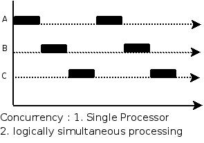

### Java并发

#### 并发基础
##### Q1: 多线程的出现是要解决什么问题的? 线程不安全的本质什么?
多线程的出现是因为计算机各层(CPU,内存,I/O设备)速度的差异。

为了合理地利用CPU的高性能，平衡这三者的速度差异。计算机体系结构、操作系统、编译程序都做出了贡献，主要体现为:
1. CPU增加了缓存，以均衡与内存的速度差异————>导致可见性问题
2. 操作系统增加了进程、线程，以分时复用CPU，进而均衡CPU与I/O设备的差异性————>导致原子性问题
3. 编译程序优化指令执行次序，使得缓存能够更加合理地利用————>导致有序性问题

##### Q2: 并发三要素
1. 可见性
    - 由CPU缓存引起，
    - 一个线程对共享变量的修改，另外一个线程能够立刻看到。
    - 线程修改值写入到了缓存中，但是没有马上写到主存里面，这时候另外一个线程访问，就出现问题了
2. 原子性
    - 由分时复用引起
    - 即一个操作或者多个操作 要么全部执行并且执行的过程不会被任何因素打断，要么就都不执行。
3. 有序性
    - 重排序引起
    - 重排序分三种类型
        - 编译器优化的重排序。编译器在不改变单线程程序语义的前提下，可以重新安排语句的执行顺序
        - 指令级并行的重排序。现代处理器采用了指令级并行技术（Instruction-Level Parallelism， ILP）来将多条指令重叠执行。如果不存在数据依赖性，处理器可以改变语句对应机器指令的执行顺序。
        - 内存系统的重排序。由于处理器使用缓存和读 / 写缓冲区，这使得加载和存储操作看上去可能是在乱序执行。
          

##### Q3: Java是怎么解决并发问题？JMM(Java内存模型)
**理解的第一个维度：核心知识点**

JMM本质上可以理解为，Java 内存模型规范了 JVM 如何提供按需禁用缓存和编译优化的方法。
   - volatile、synchronized 和 final 三个关键字
   - Happens-Before 规则

**理解第二个维度：可见性，有序性，原子性**

1. 原子性
   - 在Java(JMM)中，对基本数据类型的变量的读取和赋值操作是原子性操作
   - 如果需要实现更大范围操作的原子性，可以通过synchronized和Lock来实现。
   - synchronized和Lock能够保证任一时刻只有一个线程执行该代码块，那么自然就不存在原子性问题了，从而保证了原子性。
2. 可见性
   - Java提供了volatile关键字来保证可见性。
   - 当一个共享变量被volatile修饰时，它会保证修改的值会立即被更新到主存，当有其他线程需要读取时，它会去内存中读取新值。
   - 另外，通过synchronized和Lock也能够保证可见性，synchronized和Lock能保证同一时刻只有一个线程获取锁然后执行同步代码，并且在释放锁之前会将对变量的修改刷新到主存当中。因此可以保证可见性。
3. 有序性
   - 在Java里面，可以通过volatile关键字来保证一定的“有序性”。
   - 另外可以通过synchronized和Lock来保证有序性，保证了只有一个线程在执行同步代码，相当于顺序执行。
   - JMM是通过Happens-Before 规则来保证有序性的。

##### Q4: Happens—Before规则(先行发生规则)
先行发生原则，是JVM规定的，让一个操作无需控制就能先于另一个操作完成。

1. 单一线程原则：在一个线程内，在程序前面的操作先行发生于后面的操作。
2. 管程锁定规则：一个 unlock 操作先行发生于后面对同一个锁的 lock 操作。
3. volatile 变量规则：对一个 volatile 变量的写操作先行发生于后面对这个变量的读操作。
4. 线程启动规则：Thread 对象的 start() 方法调用先行发生于此线程的每一个动作。
5. 线程加入规则：Thread 对象的结束先行发生于 join() 方法返回。
6. 线程中断规则：对线程 interrupt() 方法的调用先行发生于被中断线程的代码检测到中断事件的发生，可以通过 interrupted() 方法检测到是否有中断发生
7. 对象终结规则：一个对象的初始化完成(构造函数执行结束)先行发生于它的 finalize() 方法的开始
8. 传递性：如果操作 A 先行发生于操作 B，操作 B 先行发生于操作 C，那么操作 A 先行发生于操作 C

##### Q5: 线程安全的分类?
1. 不可变
   - 不可变(Immutable)的对象一定是线程安全的，不需要再采取任何的线程安全保障措施。
   - 只要一个不可变的对象被正确地构建出来，永远也不会看到它在多个线程之中处于不一致的状态。
   - 多线程环境下，应当尽量使对象成为不可变，来满足线程安全。
   - 不可变的类型:
     - final 关键字修饰的基本数据类型
     - String
     - 枚举类型
     - Number 部分子类，如 Long 和 Double 等数值包装类型，BigInteger 和 BigDecimal 等大数据类型。但同为 Number 的原子类 AtomicInteger 和 AtomicLong 则是可变的
     - 对于集合类型，可以使用 Collections.unmodifiableXXX() 方法来获取一个不可变的集合;Collections.unmodifiableXXX() 先对原始的集合进行拷贝，需要对集合进行修改的方法都直接抛出异常。
2. 绝对线程安全的类
   - 不管运行时环境如何，调用者都不需要任何额外的同步措施
3. 相对线程安全
   - 相对线程安全需要保证对这个对象单独的操作是线程安全的，在调用的时候不需要做额外的保障措施。
   - 但是对于一些特定顺序的连续调用，就可能需要在调用端使用额外的同步手段来保证调用的正确性
   - 在 Java 语言中，大部分的线程安全类都属于这种类型，例如 Vector、HashTable、Collections 的 synchronizedCollection() 方法包装的集合等
4. 线程兼容
   - 线程兼容是指对象本身并不是线程安全的，但是可以通过在调用端正确地使用同步手段来保证对象在并发环境中可以安全地使用。
   - 我们平常说一个类不是线程安全的，绝大多数时候指的是这一种情况
   - Java API 中大部分的类都是属于线程兼容的，如与前面的 Vector 和 HashTable 相对应的集合类 ArrayList 和 HashMap 等
5. 线程对立
   - 线程对立是指无论调用端是否采取了同步措施，都无法在多线程环境中并发使用的代码。
   - 由于 Java 语言天生就具备多线程特性，线程对立这种排斥多线程的代码是很少出现的，而且通常都是有害的，应当尽量避免。

##### Q6: 线程安全有哪些实现思路/方法？
1. 互斥同步
   - synchronized 和 ReentrantLock。
   - 互斥同步最主要的问题就是线程阻塞和唤醒所带来的性能问题，因此这种同步也称为阻塞同步。
   - 互斥同步属于一种悲观地并发策略，认为只要不去做正确地同步措施，就会出现问题。
   - 所以无论是否出现竞争，都要进行加锁、用户和心态转换，维护锁计数器和检查是否有被阻塞地线程需要唤醒等操作。
2. 非阻塞同步
   - CAS(乐观锁，比较并交换)
     - 随着硬件指令集的发展，我们可以使用基于冲突检测的乐观并发策略: 
       - 先进行操作，如果没有其它线程争用共享数据，那操作就成功了
       - 否则采取补偿措施(不断地重试,直到成功为止)。
     - 这种乐观地并发策略许多实现都不需要将线程阻塞，因此这种同步操作称为非阻塞同步
     - CAS的一个问题: ABA问题
       - 如果一个变量初次读取的时候是 A 值，它的值被改成了 B，后来又被改回为 A，那 CAS 操作就会误认为它从来没有被改变过。
       - J.U.C 包提供了一个带有标记的原子引用类 AtomicStampedReference 来解决这个问题，它可以通过控制变量值的版本来保证 CAS 的正确性。
   - AtomicInteger
      - J.U.C 包里面的整数原子类 AtomicInteger，其中的 compareAndSet() 和 getAndIncrement() 等方法都使用了 Unsafe 类的 CAS 操作。
3. 无同步方案
   - 要保证线程安全，并不是一定就要进行同步。如果一个方法本来就不涉及共享数据，那它自然就无须任何同步措施去保证正确性。
   - 栈封闭
     - 多个线程访问同一个方法的局部变量时，不会出现线程安全问题，因为局部变量存储在虚拟机栈中，属于线程私有的
   - 线程本地存储(Thread Local Storage)
     - 如果一段代码中所需要的数据必须与其他代码共享，那就看看这些共享数据的代码是否能保证在同一个线程中执行。
     - 如果能保证，我们就可以把共享数据的可见范围限制在同一个线程之内，这样，无须同步也能保证线程之间不出现数据争用的问题。

##### Q7: Thread Local Storage的实现方案
java中是使用java.lang.ThreadLocal类来实现线程本地存储功能。

底层实现是使用一个ThreadLocal.ThreadLocalMap对象。实现的具体方案如下：
1. Thread 类中就定义了 ThreadLocal.ThreadLocalMap 成员
2. 当调用一个 ThreadLocal 的 set(T value) 方法时，先得到当前线程的 ThreadLocalMap 对象
3. 然后将 ThreadLocal->value 键值对插入到该 Map 中

【注意】在一些场景 (尤其是使用线程池) 下，由于 ThreadLocal.ThreadLocalMap 的底层数据结构导致 ThreadLocal 有内存泄漏的情况，应该尽可能在每次使用 ThreadLocal 后手动调用 remove()，以避免出现 ThreadLocal 经典的内存泄漏甚至是造成自身业务混乱的风险。

##### Q8: 如何理解并发和并行的区别?
1. 并发是指一个处理器同时处理多个任务。

2. 并行是指多个处理器或者是多核的处理器同时处理多个不同的任务。

##### Q9: 线程有哪几种状态? 分别说明从一种状态到另一种状态转变有哪些方式?
1. 新建(New)
   - 创建后尚未启动
2. 可运行(Runnable)
   - 可能正在运行，也可能正在等待 CPU 时间片。
   - 包含了操作系统线程状态中的 Running 和 Ready。
3. 阻塞(Blocking)
   - 等待获取一个排它锁，如果其线程释放了锁就会结束此状态。
4. 无限期等待(Waiting)
   - 等待其它线程显式地唤醒，否则不会被分配 CPU 时间片。
   - 进入方法
     - 没有设置Timeout参数的Object.wait()方法
     - 没有设置Timeout参数的Thread.join()方法
   - 退出方法
     - Object.notify() / Object.notifyAll()
     - 被调用的线程执行完毕 LockSupport.park() 方法
5. 限期等待(Timed Waiting)
   - 无需等待其它线程显式地唤醒，在一定时间之后会被系统自动唤醒。
   - 进入方法
     - Thread.sleep()方法，进入限期等待状态，常常用“使一个线程睡眠”进行描述
     - 设置了Timeout参数的Object.wait()方法，常常用“挂起一个线程”进行描述
     - 设置了Timeout参数的Thread.join()方法
     - LockSupport.parkNanos() 方法
     - LockSupport.parkUntil() 方法
   - 退出方法
     - 时间结束
     - 时间结束 / Object.notify() / Object.notifyAll()
     - 时间结束 / 被调用的线程执行完毕
   - 【注意】 睡眠和挂起是用来描述行为，而阻塞和等待用来描述状态。
     - 阻塞和等待的区别在于，阻塞是被动的，它是在等待获取一个排它锁。
     - 而等待是主动的，通过调用 Thread.sleep() 和 Object.wait() 等方法进入。
6. 死亡(Terminated)
   - 可以是线程结束任务之后自己结束，或者产生了异常而结束。

##### Q10: 通常线程有哪几种使用方式？
1. 实现 Runnable 接口
2. 实现 Callable 接口
3. 继承 Thread 类

【注意】实现 Runnable 和 Callable 接口的类只能当做一个可以在线程中运行的任务，不是真正意义上的线程，因此最后还需要通过 Thread 来调用。可以说任务是通过线程驱动从而执行的。

**实现接口VS继承Thread**

实现接口会更好一些，因为: 
   - Java 不支持多重继承，因此继承了 Thread 类就无法继承其它类，但是可以实现多个接口；
   - 类可能只要求可执行就行，继承整个 Thread 类开销过大

##### Q11: 基础线程机制有哪些?
1. Executor
   - Executor 管理多个异步任务的执行，而无需程序员显式地管理线程的生命周期
   - 这里的异步是指多个任务的执行互不干扰，不需要进行同步操作
   - 主要有三种Executor:
     - CachedThreadPool: 一个任务创建一个线程
     - FixedThreadPool: 所有任务只能使用固定大小的线程；
     - SingleThreadExecutor: 相当于大小为 1 的 FixedThreadPool
2. Daemon
   - 守护线程是程序运行时在后台提供服务的线程，不属于程序中不可或缺的部分。
   - 当所有非守护线程结束时，程序也就终止，同时会杀死所有守护线程。
   - main() 属于非守护线程。使用 setDaemon() 方法将一个线程设置为守护线程。
3. sleep()
   - Thread.sleep(millis) 方法会休眠当前正在执行的线程，millis 单位为毫秒
   - sleep() 可能会抛出 InterruptedException，因为异常不能跨线程传播回 main() 中，因此必须在本地进行处理
   - 线程中抛出的其它异常也同样需要在本地进行处理
4. yield()
   - 对静态方法 Thread.yield() 的调用声明了当前线程已经完成了生命周期中最重要的部分，可以切换给其它线程来执行。
   - 该方法只是对线程调度器的一个建议，而且也只是建议具有相同优先级的其它线程可以运行

##### Q12: 线程的中断方式有哪些?
一个线程执行完毕之后会自动结束，如果在运行过程中发生异常也会提前结束。

1. InterruptedException
   - 通过调用一个线程的 interrupt() 来中断该线程
   - 如果该线程处于阻塞、限期等待或者无限期等待状态,那么就会抛出 InterruptedException,从而提前结束该线程
   - 但是不能中断 I/O 阻塞和 synchronized 锁阻塞。
2. interrupted()
   - 如果一个线程的 run() 方法执行一个无限循环，并且没有执行 sleep() 等会抛出 InterruptedException 的操作，那么调用线程的 interrupt() 方法就无法使线程提前结束。
   - 但是调用 interrupt() 方法会设置线程的中断标记，此时调用 interrupted() 方法会返回 true。
   - 因此可以在循环体中使用 interrupted() 方法来判断线程是否处于中断状态，从而提前结束线程。
3. Executor 的中断操作
   - 调用 Executor 的 shutdown() 方法会等待线程都执行完毕之后再关闭
   - 但是如果调用的是 shutdownNow() 方法，则相当于调用每个线程的 interrupt() 方法

##### Q13: 线程的互斥同步方式有哪些? 如何比较和选择?
Java 提供了两种锁机制来控制多个线程对共享资源的互斥访问，第一个是 JVM 实现的 synchronized，而另一个是 JDK 实现的 ReentrantLock。

**对比**

1. 锁的实现
   - synchronized 是 JVM 实现的，而 ReentrantLock 是 JDK 实现的。
2. 性能
   - 新版本 Java 对 synchronized 进行了很多优化，例如自旋锁等，synchronized 与 ReentrantLock 大致相同。
3. 等待可中断
   - 当持有锁的线程长期不释放锁的时候，正在等待的线程可以选择放弃等待，改为处理其他事情。
   - ReentrantLock 可中断
   - 而 synchronized 不行
4. 公平锁
   - 公平锁是指多个线程在等待同一个锁时，必须按照申请锁的时间顺序来依次获得锁。
   - synchronized 中的锁是非公平的，
   - ReentrantLock 默认情况下也是非公平的，但是也可以是公平的
5. 锁绑定多个条件
   - 一个 ReentrantLock 可以同时绑定多个 Condition 对象。

**使用选择**

1. 除非需要使用 ReentrantLock 的高级功能，否则优先使用 synchronized
2. 这是因为 synchronized 是 JVM 实现的一种锁机制，JVM 原生地支持它，而 ReentrantLock 不是所有的 JDK 版本都支持
3. 并且使用 synchronized 不用担心没有释放锁而导致死锁问题，因为 JVM 会确保锁的释放。

##### Q14: 线程之间的协作
当多个线程可以一起工作去解决某个问题时，如果某些部分必须在其它部分之前完成，那么就需要对线程进行协调。

1. join()
   - 在线程中调用另一个线程的 join() 方法，会将当前线程挂起，而不是忙等待，直到目标线程结束。
2. wait() notify() notifyAll()
   - 调用 wait() 使得线程等待某个条件满足，线程在等待时会被挂起，
   - 当其他线程的运行使得这个条件满足时，其它线程会调用 notify() 或者 notifyAll() 来唤醒挂起的线程。
   - 它们都属于 Object 的一部分，而不属于 Thread。
   - 只能用在同步方法或者同步控制块中使用，否则会在运行时抛出IllegalMonitorStateException。
   - 【注意】使用 wait() 挂起期间，线程会释放锁。
     - 这是因为，如果没有释放锁，那么其它线程就无法进入对象的同步方法或者同步控制块中，
     - 那么就无法执行 notify() 或者 notifyAll() 来唤醒挂起的线程，造成死锁。
3. await() signal() signalAll()
   - java.util.concurrent 类库中提供了 Condition 类来实现线程之间的协调，可以在 Condition 上调用 await() 方法使线程等待，
   - 其它线程调用 signal() 或 signalAll() 方法唤醒等待的线程。
   - 相比于 wait() 这种等待方式，await() 可以指定等待的条件，因此更加灵活。