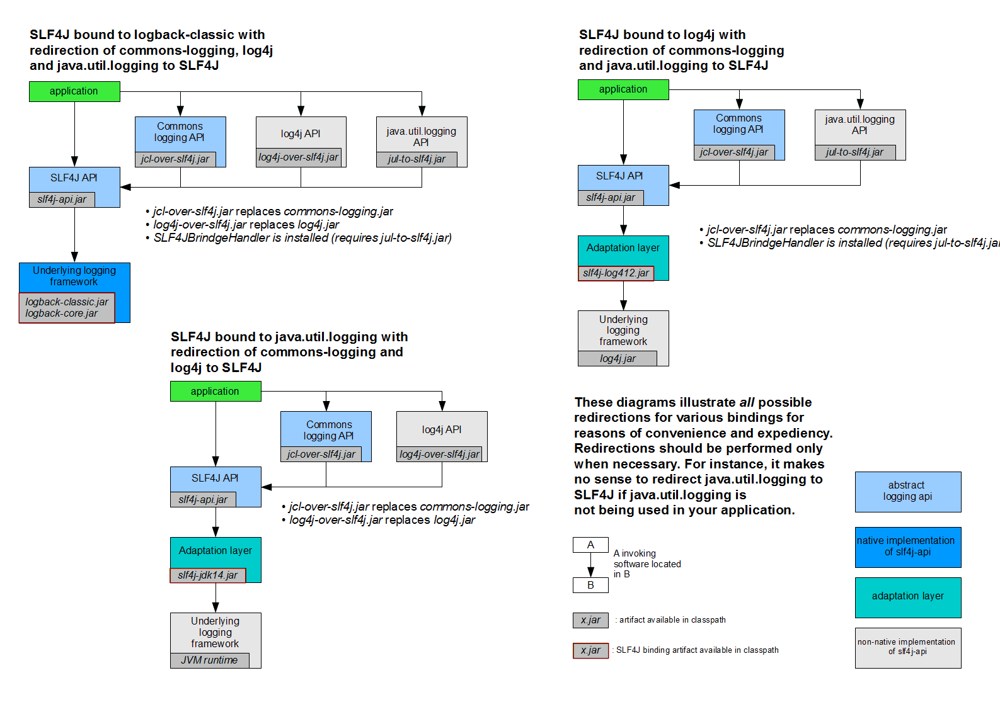

### Logging

#### 日志框架
##### Q1. 什么是日志系统和日志门面？分别有哪些框架？
日志系统是具体的日志框架，日志门面是不提供日志的具体实现，而是在运行时动态的绑定日志实现组件来工作，是一种外观模式。

1. 日志系统
   - java.util.logging (JUL)，JDK1.4 开始，通过 java.util.logging 提供日志功能。虽然是官方自带的log lib，JUL的使用确不广泛。
   - Log4j，Log4j 是 apache 的一个开源项目，Log4j 应该说是 Java 领域资格最老，应用最广的日志工具，Log4j 是高度可配置的，并可通过在运行时的外部文件配置。它根据记录的优先级别，并提供机制，以指示记录信息到许多的目的地。Log4j 的短板在于性能，在Logback 和 Log4j2 出来之后，Log4j的使用也减少了
   - Logback，Logback 是由 log4j 创始人 Ceki Gulcu 设计的又一个开源日志组件，是作为 Log4j 的继承者来开发的，提供了性能更好的实现，异步 logger，Filter等更多的特性
   - Log4j2，维护 Log4j 的人为了性能又搞出了 Log4j2。Log4j2 和 Log4j1.x 并不兼容，设计上很大程度上模仿了 SLF4J/Logback，性能上也获得了很大的提升。Log4j2 也做了 Facade/Implementation 分离的设计，分成了 log4j-api 和 log4j-core。
2. 日志门面
   - common-logging，common-logging 是 apache 的一个开源项目。也称Jakarta Commons Logging，缩写 JCL。
   - slf4j, 全称为 Simple Logging Facade for Java，即 java 简单日志门面。slf4j 是对不同日志框架提供的一个 API 封装，可以在部署的时候不修改任何配置即可接入一种日志实现方案。但是，slf4j 在编译时静态绑定真正的 Log 库。使用 SLF4J 时，如果你需要使用某一种日志实现，那么你必须选择正确的 SLF4J 的 jar 包的集合（各种桥接包）

##### Q2. 日志库中使用桥接模式解决什么问题？
1. 什么是桥接呢？
   - 这时你需要 jcl-over-slf4j.jar 把日志信息输出重定向到 slf4j-api，slf4j-api 再去调用 slf4j 实际依赖的日志组件。这个过程称为桥接
   -
   - 无论你的老项目中使用的是 common-logging 或是直接使用 log4j、java.util.logging，都可以使用对应的桥接 jar 包来解决兼容问题

##### Q3. 在日志配置时会考虑哪些点？
1. 支持日志路径，日志level等配置
2. 日志控制配置通过application.yml下发
3. 按天生成日志，当天的日志>50MB回滚
4. 最多保存10天日志
5. 生成的日志中Pattern自定义
6. Pattern中添加用户自定义的MDC字段，比如用户信息(当前日志是由哪个用户的请求产生)，request信息。此种方式可以通过AOP切面控制，在MDC中添加requestID，在spring-logback.xml中配置Pattern。
7. 根据不同的运行环境设置Profile - dev，test，product
8. 对控制台，Err和全量日志分别配置
9. 对第三方包路径日志控制

##### Q4. 对Java日志组件选型的建议？
slf4j已经成为了Java日志组件的明星选手，可以完美替代JCL，使用JCL桥接库也能完美兼容一切使用JCL作为日志门面的类库，现在的新系统已经没有不使用slf4j作为日志API的理由了。

日志记录服务方面，log4j在功能上输于logback和log4j2，在性能方面log4j2则全面超越log4j和logback。所以新系统应该在logback和log4j2中做出选择，对于性能有很高要求的系统，应优先考虑log4j2。#

##### Q5. 对日志架构使用比较好的实践？
说几个点：
- 总是使用Log Facade，而不是具体Log Implementation
- 只添加一个 Log Implementation依赖
- 具体的日志实现依赖应该设置为optional和使用runtime scope
- 如果有必要, 排除依赖的第三方库中的Log Impementation依赖
- 避免为不会输出的log付出代价
- 日志格式中最好不要使用行号，函数名等字段
