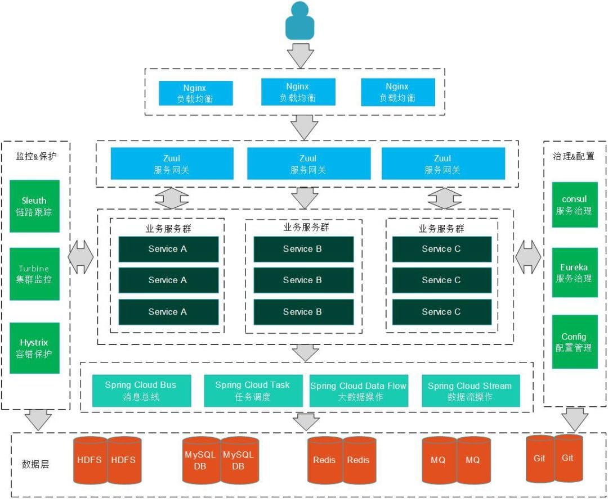

### Spring Cloud
#### Spring Cloud

##### Q1. 什么是微服务？谈谈你对微服务的理解？
1. 微服务
    - 以前所有的代码都放在同一个工程中、部署在同一个服务器、同一项目的不同模块不同功能互相抢占资源
    - 微服务就是将工程根据不同的业务规则拆分成微服务，部署在不同的服务器上
    - 服务之间相互调用，java中有的微服务有dubbo(只能用来做微服务)、springcloud( 提供了服务的发现、断路器等)
2. 微服务的特点
   - 按业务划分为一个独立运行的程序，即服务单元
   - 服务之间通过HTTP协议相互通信
   - 自动化部署
   - 可以用不同的编程语言
   - 可以用不同的存储技术
   - 服务集中化管理
   - 微服务是一个分布式系统
3. 微服务的优势
   - 将一个复杂的业务拆分为若干小的业务，将复杂的业务简单化，新人只需要了解他所接管的服务的代码，减少了新人的学习成本。
   - 由于微服务是分布式服务，服务于服务之间没有任何耦合。微服务系统的微服务单元具有很强的横向拓展能力。
   - 服务于服务之间采用HTTP网络通信协议来通信，单个服务内部高度耦合，服务与服务之间完全独立，无耦合。这使得微服务可以采用任何的开发语言和技术来实现，提高开发效率、降低开发成本。
   - 微服务是按照业务进行拆分的，并有坚实的服务边界，若要重写某一业务代码，不需了解所有业务，重写简单。
   - 微服务的每个服务单元是独立部署的，即独立运行在某个进程中，微服务的修改和部署对其他服务没有影响。
   - 微服务在CAP理论中采用的AP架构，具有高可用分区容错特点。高可用主要体现在系统7x24不间断服务，他要求系统有大量的服务器集群，从而提高系统的负载能力。分区容错也使得系统更加健壮。
4. 微服务的不足
   - 微服务的复杂度：构建一个微服务比较复杂，服务与服务之间通过HTTP协议或其他消息传递机制通信，开发者要选出最佳的通信机制，并解决网络服务差时带来的风险。
   - 分布式事物：将事物分成多阶段提交，如果一阶段某一节点失败仍会导致数据不正确。如果事物涉及的节点很多，某一节点的网络出现异常会导致整个事务处于阻塞状态，大大降低数据库的性能。
   - 服务划分：将一个完整的系统拆分成很多个服务，是一件非常困难的事，因为这涉及了具体的业务场景
   - 服务部署：最佳部署容器Docker
5. 微服务和SOA的关系
   - 微服务相对于和ESB联系在一起的SOA轻便敏捷的多，微服务将复杂的业务组件化，也是一种面向服务思想的体现。
   - 对于微服务来说，它是SOA的一种体现，但是它比ESB实现的SOA更加轻便、敏捷和简单。

##### Q2. 什么是Spring Cloud？
1. Spring Cloud是一系列框架的有序集合。它利用Spring Boot的开发便利性巧妙地简化了分布式系统基础设施的开发，如服务发现注册、配置中心、智能路由、消息总线、负载均衡、断路器、数据监控等，都可以用Spring Boot的开发风格做到一键启动和部署。
2. Spring Cloud并没有重复制造轮子，它只是将各家公司开发的比较成熟、经得起实际考验的服务框架组合起来，通过Spring Boot风格进行再封装屏蔽掉了复杂的配置和实现原理，最终给开发者留出了一套简单易懂、易部署和易维护的分布式系统开发工具包。
3. SpringCloud的优点
   - 耦合度比较低。不会影响其他模块的开发
   - 减轻团队的成本，可以并行开发，不用关注其他人怎么开发，先关注自己的开发
   - 配置比较简单，基本用注解就能实现，不用使用过多的配置文件。
   - 微服务跨平台的，可以用任何一种语言开发。
   - 每个微服务可以有自己的独立的数据库也有用公共的数据库。
   - 直接写后端的代码，不用关注前端怎么开发，直接写自己的后端代码即可，然后暴露接口，通过组件进行服务通信。
4. SpringCloud的缺点
   - 部署比较麻烦，给运维工程师带来一定的麻烦。
   - 针对数据的管理比麻烦，因为微服务可以每个微服务使用一个数据库。
   - 系统集成测试比较麻烦
   - 性能的监控比较麻烦。

##### Q3. SpringCloud中的组件有那些？
1. Spring Cloud Eureka,服务注册中心,特性有失效剔除、服务保护
2. Spring Cloud Zuul,API服务网关,功能有路由分发和过滤
3. Spring Cloud Config,分布式配置中心，支持本地仓库、SVN、Git、Jar包内配置等模式
4. Spring Cloud Ribbon,客户端负载均衡,特性有区域亲和,重试机制
5. Spring Cloud Hystrix,客户端容错保护,特性有服务降级、服务熔断、请求缓存、请求合并、依赖隔离
6. Spring Cloud Feign,声明式服务调用本质上就是Ribbon+Hystrix
7. Spring Cloud Stream,消息驱动,有Sink、Source、Processor三种通道,特性有订阅发布、消费组、消息分区
8. Spring Cloud Bus,消息总线,配合Config仓库修改的一种Stream实现，
9. Spring Cloud Sleuth,分布式服务追踪,需要搞清楚TraceID和SpanID以及抽样,如何与ELK整合

##### Q4. 具体说说SpringCloud主要项目?
Spring Cloud的子项目，大致可分成两类，
- 一类是对现有成熟框架"Spring Boot化"的封装和抽象，也是数量最多的项目；
- 第二类是开发了一部分分布式系统的基础设施的实现，如Spring Cloud Stream扮演的就是kafka, ActiveMQ这样的角色。

1. Spring Cloud Config Config能够管理所有微服务的配置文件
   - 集中配置管理工具，分布式系统中统一的外部配置管理，默认使用Git来存储配置，可以支持客户端配置的刷新及加密、解密操作。
2. Spring Cloud Netflix
   - Netflix OSS 开源组件集成，包括Eureka、Hystrix、Ribbon、Feign、Zuul等核心组件。
   - Eureka：服务治理组件，包括服务端的注册中心和客户端的服务发现机制；
   - Ribbon：负载均衡的服务调用组件，具有多种负载均衡调用策略；
   - Hystrix：服务容错组件，实现了断路器模式，为依赖服务的出错和延迟提供了容错能力；
   - Feign：基于Ribbon和Hystrix的声明式服务调用组件；
   - Zuul：API网关组件，对请求提供路由及过滤功能。
3. Spring Cloud Bus
   - 用于传播集群状态变化的消息总线，使用轻量级消息代理链接分布式系统中的节点，可以用来动态刷新集群中的服务配置信息
   - 简单来说就是修改了配置文件，发送一次请求，所有客户端便会重新读取配置文件（需要利用中间插件MQ）。
4. Spring Cloud Consul
   - SpringCloud支持三种注册方式Eureka， Consul(go语言编写)，zookeeper
   - Spring Cloud Zookeeper是基于Apache Zookeeper的服务治理组件。
5. Spring Cloud Gateway
   - Spring cloud gateway是spring官方基于Spring 5.0、Spring Boot2.0和Project Reactor等技术开发的网关
   - Spring Cloud Gateway旨在为微服务架构提供简单、有效和统一的API路由管理方式
   - Spring Cloud Gateway作为Spring Cloud生态系统中的网关，目标是替代Netflix Zuul，其不仅提供统一的路由方式，并且还基于Filer链的方式提供了网关基本的功能
6. Spring Cloud OpenFeign
   - Feign是一个声明性的Web服务客户端，它使编写Web服务客户端变得更容易
   - 要使用Feign，我们可以将调用的服务方法定义成抽象方法保存在本地添加一点点注解就可以了，不需要自己构建Http请求了，直接调用接口就行了
   - 不过要注意，调用方法要和本地抽象方法的签名完全一致。

##### Q5. Spring Cloud项目部署架构？

##### Q6. Spring Cloud 和Dubbo区别?
1. 服务调用方式：dubbo是RPC springcloud Rest Api
2. 注册中心：dubbo 是zookeeper springcloud是eureka，也可以是zookeeper
3. 服务网关，dubbo本身没有实现，只能通过其他第三方技术整合，springcloud有Zuul路由网关，作为路由服务器，进行消费者的请求分发,springcloud支持断路器，与git完美集成配置文件支持版本控制，事物总线实现配置文件的更新与服务自动装配等等一系列的微服务架构要素

##### Q7. 服务注册和发现是什么意思？Spring Cloud 如何实现？
1. 当我们开始一个项目时，我们通常在属性文件中进行所有的配置。随着越来越多的服务开发和部署，添加和修改这些属性变得更加复杂。
2. 有些服务可能会下降，而某些位置可能会发生变化。手动更改属性可能会产生问题，Eureka 服务注册和发现可以在这种情况下提供帮助
3. 由于所有服务都在 Eureka 服务器上注册并通过调用 Eureka 服务器完成查找，因此无需处理服务地点的任何更改和处理

##### Q8. 什么是Eureka？
1. Eureka作为SpringCloud的服务注册功能服务器，他是服务注册中心，
2. 系统中的其他服务使用Eureka的客户端将其连接到Eureka Service中，并且保持心跳
3. 这样工作人员可以通过Eureka Service来监控各个微服务是否运行正常

##### Q9. Eureka怎么实现高可用？
集群吧，注册多台Eureka，然后把SpringCloud服务互相注册，客户端从Eureka获取信息时，按照Eureka的顺序来访问。

##### Q10. 什么是Eureka的自我保护模式？

##### Q11. 什么是Eureka的自我保护模式？
1. 默认情况下，如果Eureka Service在一定时间内没有接收到某个微服务的心跳
2. Eureka Service会进入自我保护模式，在该模式下Eureka Service会保护服务注册表中的信息，不再删除注册表中的数据
3. 当网络故障恢复后，Eureka Service 节点会自动退出自我保护模式

##### Q12. DiscoveryClient的作用？
可以从注册中心中根据服务别名获取注册的服务器信息。

##### Q13. Eureka和ZooKeeper都可以提供服务注册与发现的功能,请说说两个的区别？
1. ZooKeeper中的节点服务挂了就要选举，在选举期间注册服务瘫痪,虽然服务最终会恢复,但是选举期间不可用的，选举就是改微服务做了集群，必须有一台主其他的都是从
2. Eureka各个节点是平等关系,服务器挂了没关系，只要有一台Eureka就可以保证服务可用，数据都是最新的。如果查询到的数据并不是最新的，就是因为Eureka的自我保护模式导致的
3. Eureka本质上是一个工程,而ZooKeeper只是一个进程
4. Eureka可以很好的应对因网络故障导致部分节点失去联系的情况,而不会像ZooKeeper 一样使得整个注册系统瘫痪
5. ZooKeeper保证的是CP，Eureka保证的是AP

##### Q14. 什么是网关?
网关相当于一个网络服务架构的入口，所有网络请求必须通过网关转发到具体的服务。

##### Q15. 网关的作用是什么？
统一管理微服务请求，权限控制、负载均衡、路由转发、监控、安全控制黑名单和白名单等

##### Q16. 什么是Spring Cloud Zuul（服务网关）？
1. Zuul是对SpringCloud提供的成熟对的路由方案，他会根据请求的路径不同，网关会定位到指定的微服务，并代理请求到不同的微服务接口，他对外隐蔽了微服务的真正接口地址。
2. 三个重要概念：动态路由表，路由定位，反向代理：
   - 动态路由表：Zuul支持Eureka路由，手动配置路由，这俩种都支持自动更新
   - 路由定位：根据请求路径，Zuul有自己的一套定位服务规则以及路由表达式匹配
   - 反向代理：客户端请求到路由网关，网关受理之后，在对目标发送请求，拿到响应之后在 给客户端
3. 它可以和Eureka,Ribbon,Hystrix等组件配合使用，
4. Zuul的应用场景：
   - 对外暴露，权限校验，服务聚合，日志审计等

##### Q17. 网关与过滤器有什么区别？
网关是对所有服务的请求进行分析过滤，过滤器是对单个服务而言。

##### Q18. 常用网关框架有那些？
Nginx、Zuul、Gateway

##### Q19. Zuul与Nginx有什么区别？
1. Zuul是java语言实现的，主要为java服务提供网关服务，尤其在微服务架构中可以更加灵活的对网关进行操作
2. Nginx是使用C语言实现，性能高于Zuul，但是实现自定义操作需要熟悉lua语言，对程序员要求较高，可以使用Nginx做Zuul集群

##### Q20. 既然Nginx可以实现网关？为什么还需要使用Zuul框架?
1. Zuul是SpringCloud集成的网关，使用Java语言编写，可以对SpringCloud架构提供更灵活的服务。

##### Q21. ZuulFilter常用有那些方法?
1. Run()：过滤器的具体业务逻辑
2. shouldFilter()：判断过滤器是否有效
3. filterOrder()：过滤器执行顺序
4. filterType()：过滤器拦截位置

##### Q22. 如何实现动态Zuul网关路由转发?
通过path配置拦截请求，通过ServiceId到配置中心获取转发的服务列表，Zuul内部使用Ribbon实现本地负载均衡和转发。

##### Q23. Zuul网关如何搭建集群?
使用Nginx的upstream设置Zuul服务集群，通过location拦截请求并转发到upstream，默认使用轮询机制对Zuul集群发送请求。

##### Q24. Ribbon是什么？
Ribbon是Netflix发布的开源项目，主要功能是提供客户端的软件负载均衡算法

Ribbon客户端组件提供一系列完善的配置项，如连接超时，重试等。简单的说，就是在配置文件中列出后面所有的机器
Ribbon会自动的帮助你基于某种规则（如简单轮询，随机连接等）去连接这些机器

我们也很容易使用Ribbon实现自定义的负载均衡算法。（有点类似Nginx）

##### Q25. Nginx与Ribbon的区别？
1. Nginx是反向代理同时可以实现负载均衡，nginx拦截客户端请求采用负载均衡策略根据upstream配置进行转发，相当于请求通过nginx服务器进行转发
2. Ribbon是客户端负载均衡，从注册中心读取目标服务器信息，然后客户端采用轮询策略对服务直接访问，全程在客户端操作

##### Q26. Ribbon底层实现原理？
Ribbon使用discoveryClient从注册中心读取目标服务信息，对同一接口请求进行计数，使用%取余算法获取目标服务集群索引，返回获取到的目标服务信息

##### Q27. @LoadBalanced注解的作用？
开启客户端负载均衡。

##### Q28. 什么是断路器
1. 当一个服务调用另一个服务由于网络原因或自身原因出现问题，调用者就会等待被调用者的响应 当更多的服务请求到这些资源导致更多的请求等待，发生连锁效应（雪崩效应）

断路器有三种状态
1. 打开状态：一段时间内 达到一定的次数无法调用 并且多次监测没有恢复的迹象 断路器完全打开 那么下次请求就不会请求到该服务
2. 半开状态：短时间内 有恢复迹象 断路器会将部分请求发给该服务，正常调用时 断路器关闭
3. 关闭状态：当服务一直处于正常状态 能正常调用

##### Q29. 什么是 Hystrix？
在分布式系统，我们一定会依赖各种服务，那么这些个服务一定会出现失败的情况，就会导致雪崩，Hystrix就是这样的一个工具，防雪崩利器，它具有服务降级，服务熔断，服务隔离，监控等一些防止雪崩的技术。

Hystrix有四种防雪崩方式:
1. 服务降级：接口调用失败就调用本地的方法返回一个空
2. 服务熔断：接口调用失败就会进入调用接口提前定义好的一个熔断的方法，返回错误信息
3. 服务隔离：隔离服务之间相互影响
4. 服务监控：在服务发生调用时,会将每秒请求数、成功请求数等运行指标记录下来。

##### Q30. 什么是Feign？
Feign 是一个声明web服务客户端，这使得编写web服务客户端更容易

他将我们需要调用的服务方法定义成抽象方法保存在本地就可以了，不需要自己构建Http请求了，直接调用接口就行了，不过要注意，调用方法要和本地抽象方法的签名完全一致。

##### Q31. SpringCloud有几种调用接口方式？
1. Feign
2. RestTemplate

##### Q32. Ribbon和Feign调用服务的区别？
1. 调用方式同：Ribbon需要我们自己构建Http请求，模拟Http请求然后通过RestTemplate发给其他服务，步骤相当繁琐
2. 而Feign则是在Ribbon的基础上进行了一次改进，采用接口的形式，将我们需要调用的服务方法定义成抽象方法保存在本地就可以了，不需要自己构建Http请求了，直接调用接口就行了，不过要注意，调用方法要和本地抽象方法的签名完全一致。

##### Q33. 什么是 Spring Cloud Bus？
1. Spring Cloud Bus就像一个分布式执行器，用于扩展的Spring Boot应用程序的配置文件，但也可以用作应用程序之间的通信通道。
2. Spring Cloud Bus 不能单独完成通信，需要配合MQ支持
3. Spring Cloud Bus一般是配合Spring Cloud Config做配置中心的
4. Springcloud config实时刷新也必须采用SpringCloud Bus消息总线

##### Q34. 什么是Spring Cloud Config?
1. Spring Cloud Config为分布式系统中的外部配置提供服务器和客户端支持，可以方便的对微服务各个环境下的配置进行集中式管理。
2. Spring Cloud Config分为Config Server和Config Client两部分。
3. Config Server负责读取配置文件，并且暴露Http API接口，Config Client通过调用Config Server的接口来读取配置文件

##### Q35. 分布式配置中心有那些框架？
1. Apollo、zookeeper、springcloud config。

##### Q36. 分布式配置中心的作用？
动态变更项目配置信息而不必重新部署项目。

##### Q37. SpringCloud Config 可以实现实时刷新吗？
springcloud config实时刷新采用SpringCloud Bus消息总线。

##### Q38. 什么是Spring Cloud Gateway?
1. Spring Cloud Gateway是Spring Cloud官方推出的第二代网关框架，取代Zuul网关。网关作为流量的，在微服务系统中有着非常作用，网关常见的功能有路由转发、权限校验、限流控制等作用。
2. 使用了一个RouteLocatorBuilder的bean去创建路由，除了创建路由RouteLocatorBuilder可以让你添加各种predicates和filters，predicates断言的意思，顾名思义就是根据具体的请求的规则，由具体的route去处理，filters是各种过滤器，用来对请求做各种判断和修改。