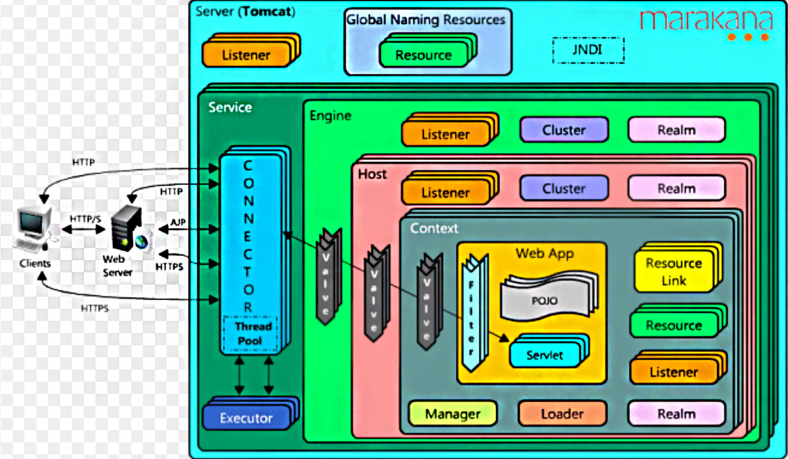
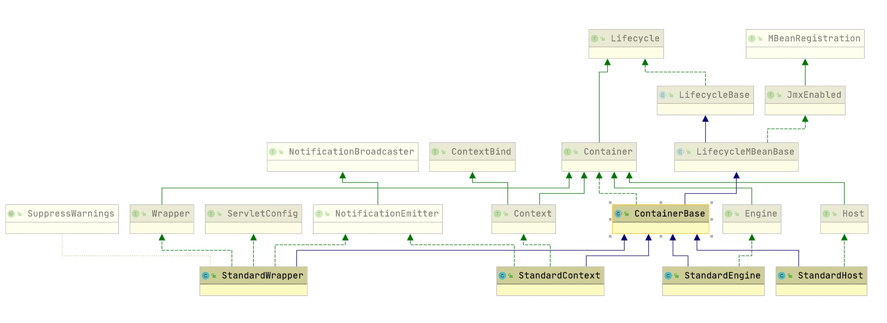

### Tomcat

#### Tomcat

##### Q1. Tomcat 整体架构的设计？

1. Server: 表示服务器，它提供了一种优雅的方式来启动和停止整个系统，不必单独启停连接器和容器；它是Tomcat构成的顶级构成元素，所有一切均包含在Server中；
2. Service: 表示服务，Server可以运行多个服务。
    - Server的实现类StandardServer可以包含一个到多个Services, Service的实现类为StandardService调用了容器(Container)接口， 
    - 其实是调用了Servlet Engine(引擎)，而且StandardService类中也指明了该Service归属的Server;
3. Container: 表示容器，可以看做Servlet容器；引擎(Engine)、主机(Host)、上下文(Context)和Wraper均继承自Container接口，所以它们都是容器。
   - Engine -- 引擎
   - Host -- 主机
   - Context -- 上下文
   - Wrapper -- 包装器
4. Connector: 表示连接器, 它将Service和Container连接起来，首先它需要注册到一个Service，
   - 它的作用就是把来自客户端的请求转发到Container(容器)，这就是它为什么称作连接器, 它支持的协议如下：
     - 支持AJP协议
     - 支持Http协议
     - 支持Https协议
5. Service内部还有各种支撑组件，下面简单罗列一下这些组件
   - Manager -- 管理器，用于管理会话Session
   - Logger -- 日志器，用于管理日志
   - Loader -- 加载器，和类加载有关，只会开放给Context所使用
   - Pipeline -- 管道组件，配合Valve实现过滤器功能
   - Valve -- 阀门组件，配合Pipeline实现过滤器功能
   - Realm -- 认证授权组件

##### Q2. Tomcat 一个请求的处理流程？
假设来自客户的请求为：http://localhost:8080/test/index.jsp 请求被发送到本机端口8080，被在那里侦听的Coyote HTTP/1.1 Connector,然后

1. Connector把该请求交给它所在的Service的Engine来处理，并等待Engine的回应
2. Engine获得请求localhost:8080/test/index.jsp，匹配它所有虚拟主机Host
3. Engine匹配到名为localhost的Host(即使匹配不到也把请求交给该Host处理，因为该Host被定义为该Engine的默认主机)
4. localhost Host获得请求/test/index.jsp，匹配它所拥有的所有Context
5. Host匹配到路径为/test的Context(如果匹配不到就把该请求交给路径名为""的Context去处理)
6. path="/test"的Context获得请求/index.jsp，在它的mapping table中寻找对应的servlet
7. Context匹配到URL PATTERN为*.jsp的servlet，对应于JspServlet类，构造HttpServletRequest对象和HttpServletResponse对象，作为参数调用JspServlet的doGet或doPost方法
8. Context把执行完了之后的HttpServletResponse对象返回给Host
9. Host把HttpServletResponse对象返回给Engine
10. Engine把HttpServletResponse对象返回给Connector
11. Connector把HttpServletResponse对象返回给客户browser

##### Q3. Tomcat 中类加载机制？
在Bootstrap中我们可以看到有如下三个classloader
```
ClassLoader commonLoader = null;
ClassLoader catalinaLoader = null;
ClassLoader sharedLoader = null;
```

1. 为什么要设计多个类加载器？（如果所有的类都使用一个类加载器来加载，会出现什么问题呢？）
   - 假如我们自己编写一个类java.util.Object，它的实现可能有一定的危险性或者隐藏的bug。而我们知道Java自带的核心类里面也有java.util.Object，如果JVM启动的时候先行加载的是我们自己编写的java.util.Object，那么就有可能出现安全问题！
   - 所以，Sun（后面Oracle收购）采用了另外一种方式来保证最基本的、也是最核心的功能不会被破坏。你猜的没错，那就是双亲委派模式！
2. 什么是双亲委派模型？ 双亲委派模型解决了类错乱加载的问题，也设计得非常精妙。
   - 双亲委派模式对类加载器定义了层级，每个类加载器都有一个父类加载器
   - 在一个类需要加载的时候，首先委派给父类加载器来加载，而父类加载器又委派给祖父类加载器来加载，以此类推
   - 如果父类及上面的类加载器都加载不了，那么由当前类加载器来加载，并将被加载的类缓存起来。
   
   - 所以上述类是这么加载的
     - Java自带的核心类 -- 由启动类加载器加载
     - Java支持的可扩展类 -- 由扩展类加载器加载
     - 我们自己编写的类 -- 默认由应用程序类加载器或其子类加载
   - 为什么Tomcat的类加载器也不是双亲委派模型？
     - Java默认的类加载机制是通过双亲委派模型来实现的，而Tomcat实现的方式又和双亲委派模型有所区别。
     - 原因在于一个Tomcat容器允许同时运行多个Web程序，每个Web程序依赖的类又必须是相互隔离的
     - 因此，如果Tomcat使用双亲委派模式来加载类的话，将导致Web程序依赖的类变为共享的

##### Q4. Tomcat Container设计？
我们看下几个Container之间的关系： 

从上图上，我们也可以看出Container顶层也是基于Lifecycle的组件设计的。

在设计Container组件层次组件时，上述4个组件分别做什么的呢？为什么要四种组件呢？
1. Engine - 表示整个catalina的servlet引擎，多数情况下包含一个或多个子容器，这些子容器要么是Host，要么是Context实现，或者是其他自定义组。
2. Host - 表示包含多个Context的虚拟主机的。
3. Context — 表示一个ServletContext，表示一个webapp，它通常包含一个或多个wrapper。
4. Wrapper - 表示一个servlet定义的（如果servlet本身实现了SingleThreadModel，则可能支持多个servlet实例）。

结合整体的框架图中上述组件部分，我们看下包含了什么？
很明显，除了四个组件的嵌套关系，Container中还包含了Realm，Cluster，Listeners, Pipleline等支持组件。

##### Q5. Tomcat LifeCycle机制？
1. Server及其它组件
2. Server后续组件生命周期及初始化
3. Server的依赖结构

##### Q6. Tomcat 中Executor?
1. Tomcat希望将Executor也纳入Lifecycle生命周期管理，所以让它实现了Lifecycle接口
2. 引入超时机制：也就是说当work queue满时，会等待指定的时间，如果超时将抛出RejectedExecutionException，所以这里增加了一个void execute(Runnable command, long timeout, TimeUnit unit)方法; 其实本质上，它构造了JUC中ThreadPoolExecutor，通过它调用ThreadPoolExecutor的void execute(Runnable command, long timeout, TimeUnit unit)方法。

##### Q7. Tomcat 中的设计模式？
1. 责任链模式：管道机制，在软件开发的常接触的责任链模式是FilterChain，它体现在很多软件设计中：
   - 比如Spring Security框架中
   - 比如HttpServletRequest处理的过滤器中
      - 当一个request过来的时候，需要对这个request做一系列的加工，使用责任链模式可以使每个加工组件化，减少耦合
      - 也可以使用在当一个request过来的时候，需要找到合适的加工方式。当一个加工方式不适合这个request的时候，传递到下一个加工方法，该加工方式再尝试对request加工。
2. 外观模式：request请求
3. 观察者模式：事件监听
4. 模板方式： Lifecycle